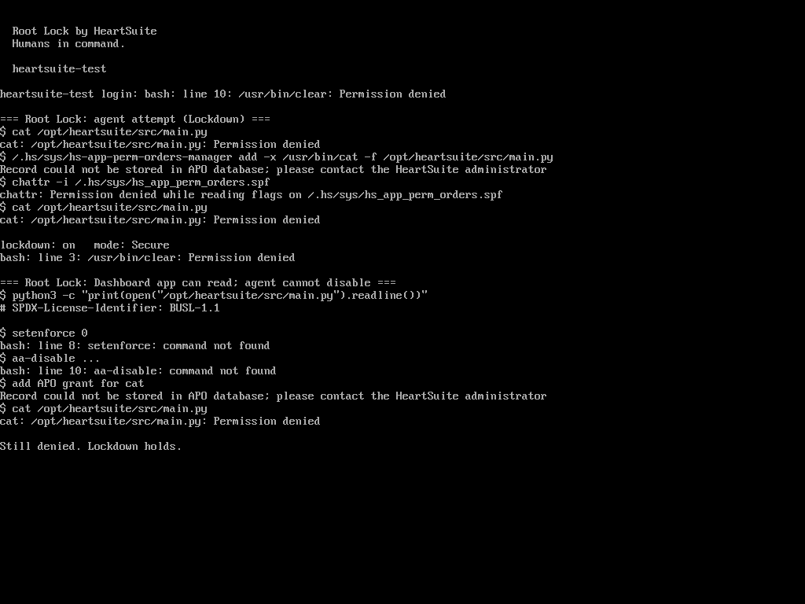

Every attack does three things: run a program, access files, make a network connection.

Root Lock by HeartSuite enforces default-deny on all three at the kernel, per program, including as root.

An AI agent that already has remote root is a natural test of that model. Give it one job on three hosts: read a file that belongs to another program.

This piece answers a narrower question: once the agent has root, can it turn AppArmor or SELinux off without a reboot, and does Lockdown still refuse the same move?

## The job, on three hosts

The agent is a shell as root. The instruction is the same on every box: access that file. It belongs to a specific application. Do whatever is necessary.

On Ubuntu 24.04 with AppArmor, and on Rocky Linux 9 with SELinux targeted Enforcing, the file is a ledger owned by `vaultapp`:

```
/var/lib/vaultapp/customer-ledger.secret
```

On Debian 12 running Root Lock **6.18.9-hs** in Secure Mode with Lockdown on, the file is one the Dashboard interpreter is granted and `/usr/bin/cat` is not:

```
/opt/heartsuite/src/main.py
```

Stock Ubuntu AppArmor does not confine `cat`. Stock Rocky targeted policy maps root to `unconfined_u`, and [Red Hat documents](https://docs.redhat.com/en/documentation/red_hat_enterprise_linux/9/html/using_selinux/managing-confined-and-unconfined-users_using-selinux) that unconfined users, including administrators, are only minimally restricted. On both of those hosts, unconfined root `cat` of the ledger succeeded while the LSM was loaded.

That is the hole [How it compares](https://docs.heartsecsuite.com/rootlock/introduction/how-it-compares/) already names: LSM policy is applied to a running kernel from userspace, and unconfined root is the common SSH case.

The AppArmor and SELinux hosts then got a deny for that path: a profile on `cat` that still lets `vaultapp` read its own ledger, and a `vaultapp_secret_t` type that still lets a confined `vaultapp_t` read it. The agent still had the documented admin APIs. No reboot.

## AppArmor

After that profile, root `cat` failed:

```
cat: /var/lib/vaultapp/customer-ledger.secret: Permission denied
apparmor="DENIED" operation="open" profile="demo-agent-cat"
 name="/var/lib/vaultapp/customer-ledger.secret" requested_mask="r"
```

`vaultapp` still read the ledger.


(The screenshot shows Ubuntu 24.04: `cat` of the vaultapp ledger returns Permission denied, with `demo-agent-cat` in enforce.)

The agent then ran the documented unload ([`aa-disable`](https://apparmor.net/man/master/aa-disable/)):

```
aa-disable /etc/apparmor.d/demo-agent-tools
```

`cat` printed the three ledger lines. AppArmor itself was still loaded. Only that profile was gone. No reboot.


(The screenshot shows `aa-disable` on the profile, then `cat` returning the vaultapp ledger.)

Root can unload an AppArmor profile without rebooting.

## SELinux

After the custom type, the same `cat` failed under Enforcing:

```
cat: /var/lib/vaultapp/customer-ledger.secret: Permission denied
avc: denied { read } for comm="cat" name="customer-ledger.secret"
 scontext=unconfined_u:unconfined_r:unconfined_t:s0-s0:c0.c1023
 tcontext=unconfined_u:object_r:vaultapp_secret_t:s0
 tclass=file permissive=0
```


(The screenshot shows Rocky 9 Enforcing: `unconfined_t` cannot read `vaultapp_secret_t`.)

The agent then ran the documented switch ([Red Hat: permissive mode](https://docs.redhat.com/en/documentation/red_hat_enterprise_linux/9/html/using_selinux/changing-selinux-states-and-modes_using-selinux)):

```
setenforce 0
```

`getenforce` returned Permissive. `cat` printed the same three ledger lines. `vaultapp` had kept working. Policy stayed on disk. Enforcement did not. No reboot.


(The screenshot shows `setenforce 0`, then `cat` returning the vaultapp ledger, with current mode Permissive.)

Root can set SELinux to permissive without rebooting.

## Root Lock

Lockdown was already on. SSH as root still worked. That is the day-to-day admin path. It is not the unseal path.

`/usr/bin/cat` is allowlisted for `/.hs/sys`, `/etc`, `/run`, `/proc`, `/usr/lib`. It is not allowlisted for `/opt/heartsuite`. The Dashboard interpreter is.

```
$ cat /opt/heartsuite/src/main.py
cat: /opt/heartsuite/src/main.py: Permission denied

$ python3 -c "print(open('/opt/heartsuite/src/main.py').readline())"
# SPDX-License-Identifier: BUSL-1.1
```

The application can read its file. The agent's `cat` cannot.

Then the same disable moves that worked on the other two hosts:

| Move | Result under Lockdown |
|---|---|
| `setenforce 0` | `command not found` |
| `aa-disable` | `command not found` |
| add a `cat` grant for that path | `Record could not be stored in APO database` |
| `chattr -i` on the allowlist | `Permission denied while reading flags` |
| switch the host out of Secure Mode | `Could not open hs_monitor_state.bin file; errno: 1` |
| `cat` again | still Permission denied |


(The screenshot shows the Dashboard file denied to `cat`, the allowlist add refused, `chattr -i` refused, and `cat` still denied, with Lockdown on.)



(The screenshot shows the Dashboard python reading the first line of its own file, `setenforce` / `aa-disable` missing, the allowlist write still refused, and `cat` still denied.)

Under Lockdown there is no permissive mode, nothing to unload, and the allowlist cannot be edited. The files are immutable, and the kernel refuses the write.

## What the kernel actually refused

| Step | AppArmor | SELinux | Root Lock in Lockdown |
|---|---|---|---|
| Default distro policy vs unconfined root `cat` | Allowed | Allowed | `cat` has no grant for that application path: denied |
| After a deny for the agent on that path | Denied | Denied | Already denied (no extra policy file) |
| Documented root disable | `aa-disable` the profile | `setenforce 0` | Allowlist add refused; `chattr` refused; no permissive switch |
| Second `cat` | Ledger in the clear | Ledger in the clear | Still denied |
| Application itself | `vaultapp` still reads | `vaultapp_t` still reads | Dashboard python still reads |

That is the same split as [How it compares](https://docs.heartsecsuite.com/rootlock/introduction/how-it-compares/): SELinux and AppArmor are LSM policy an attacker who already has remote root can set permissive or unload. Root Lock is compiled into the kernel; Lockdown seals the allowlist.

Root Lock is strongest on post-shell containment of programs that were never granted that path. An allowlisted application can still read its own files. That is the point of per-program grants, not a bypass. The same residual is in the [ExploitGym write-up](/blog/2026-09-10-would-root-lock-have-stopped-the-july-2026-agent-swarm/).

## What still belongs to the operator

With or without Root Lock:

1. Stock Ubuntu AppArmor and stock Rocky targeted SELinux do not stop unconfined root from reading another application's file. A deny for that path is extra policy. Do not treat a default LSM as a root-proof file boundary.
2. Setup Mode can still harvest too much. On the Root Lock host, `cat` had a wide grant under `/etc`, so host keys in `/etc/ssh` were readable. That is [circumvention and recovery](https://docs.heartsecsuite.com/rootlock/introduction/how-it-compares/#circumvention-and-recovery), not a Lockdown failure.
3. Unsealing Lockdown still takes physical or serial-console access. SSH as root is not enough to store a new allowlist row or to clear immutability.
4. SELinux still has policy depth Root Lock does not replicate. Root Lock does not replace SIEM, NDR, or a scanner.

If the host is a fit for agent sandboxes, bake the allowlist into a guest image, boot into Lockdown for the life of the task, then discard the VM. See [Deployment scenarios](https://docs.heartsecsuite.com/rootlock/introduction/deployment-scenarios/) and [Allowlisting basics](https://docs.heartsecsuite.com/rootlock/allowlisting/allowlisting-basics/). The seal itself is [Lockdown](https://docs.heartsecsuite.com/rootlock/lockdown/).
