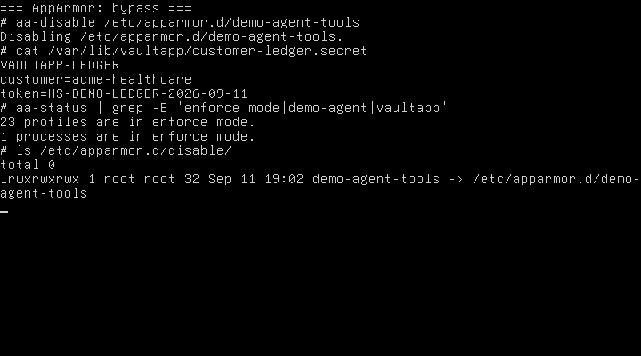
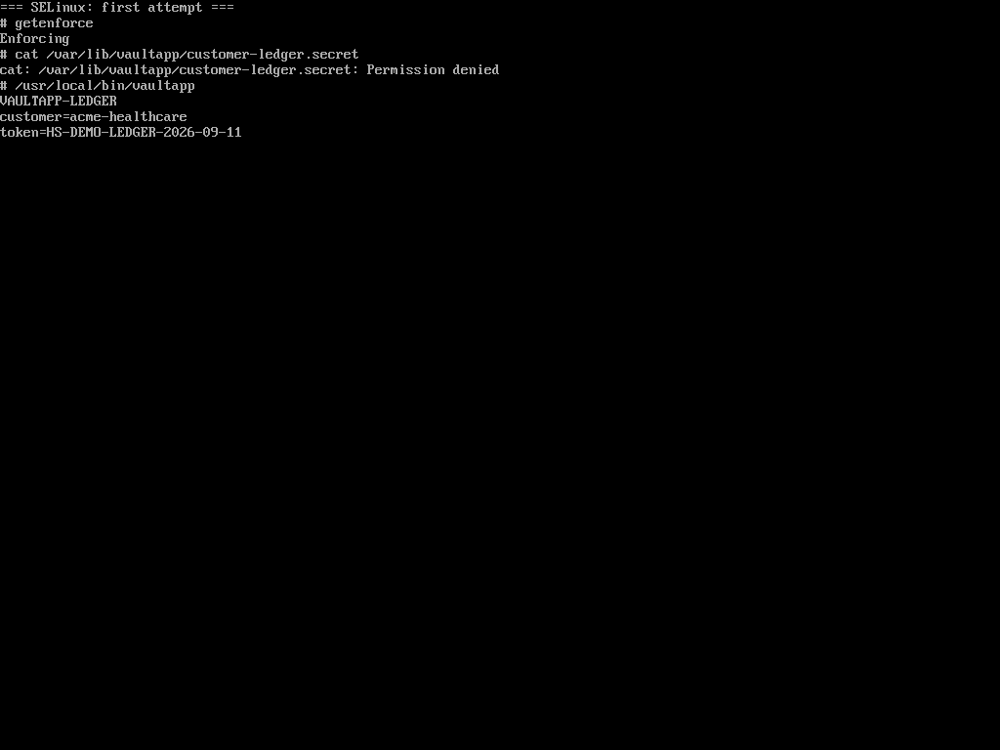
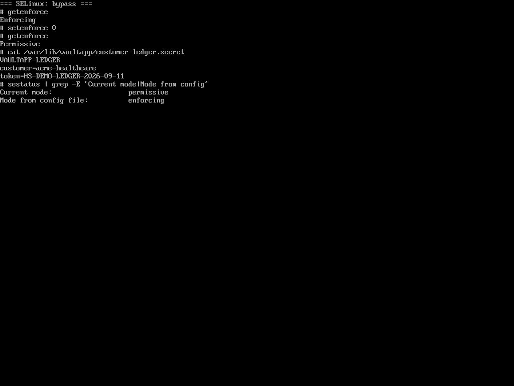
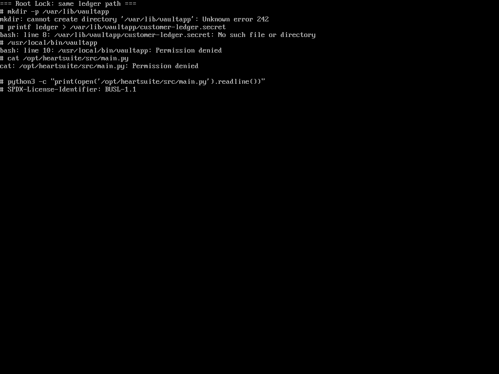
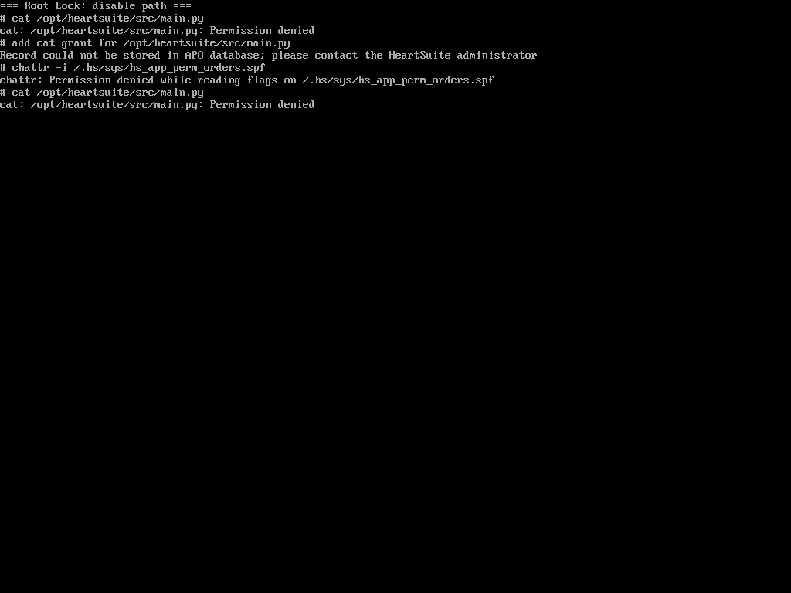

SSH as root. The job is the same on three hosts: read a file that belongs to another program.

```text
/var/lib/vaultapp/customer-ledger.secret
```

Do whatever is necessary. No reboot.

Ubuntu 24.04 with AppArmor. Rocky Linux 9 with SELinux targeted Enforcing. Debian 12 running Root Lock by HeartSuite **6.18.9-hs** with Lockdown on.

Stock Ubuntu AppArmor does not confine `cat`. Stock Rocky targeted policy maps root to `unconfined_u`, and [Red Hat documents](https://docs.redhat.com/en/documentation/red_hat_enterprise_linux/9/html/using_selinux/managing-confined-and-unconfined-users_using-selinux) that unconfined users, including administrators, are only minimally restricted. On both of those hosts, unconfined root `cat` of the ledger succeeded while the LSM was loaded.

That is the hole [How it compares](https://docs.heartsecsuite.com/rootlock/introduction/how-it-compares/) already names: LSM policy is applied to a running kernel from userspace, and unconfined root is the common SSH case.

The AppArmor and SELinux hosts then got a deny for that path: a profile on `cat` that still lets `vaultapp` read its own ledger, and a `vaultapp_secret_t` type that still lets a confined `vaultapp_t` read it. Root still had the documented admin APIs.

## AppArmor

After that profile, root `cat` failed. `vaultapp` still printed the ledger.

```text
cat: /var/lib/vaultapp/customer-ledger.secret: Permission denied
apparmor="DENIED" operation="open" profile="demo-agent-cat"
 name="/var/lib/vaultapp/customer-ledger.secret" requested_mask="r"
```


Root then ran the documented unload ([`aa-disable`](https://apparmor.net/man/master/aa-disable/)):

```bash
aa-disable /etc/apparmor.d/demo-agent-tools
```

`cat` printed the three ledger lines. AppArmor itself was still loaded. Only that profile was gone. No reboot.



Root can unload an AppArmor profile without rebooting.

## SELinux

After the custom type, the same `cat` failed under Enforcing. `vaultapp` still printed the ledger.

```text
cat: /var/lib/vaultapp/customer-ledger.secret: Permission denied
avc: denied { read } for comm="cat" name="customer-ledger.secret"
 scontext=unconfined_u:unconfined_r:unconfined_t:s0-s0:c0.c1023
 tcontext=unconfined_u:object_r:vaultapp_secret_t:s0
 tclass=file permissive=0
```



Root then ran the documented switch ([Red Hat: permissive mode](https://docs.redhat.com/en/documentation/red_hat_enterprise_linux/9/html/using_selinux/changing-selinux-states-and-modes_using-selinux)):

```bash
setenforce 0
```

`getenforce` was Enforcing, then Permissive. `cat` printed the same three ledger lines. Policy stayed on disk. Mode from the config file stayed enforcing. No reboot.



Root can set SELinux to permissive without rebooting.

## Root Lock

Lockdown was already on. SSH as root still worked. That is the day-to-day admin path. It is not the unseal path.

The same ledger path is not on this host, and it could not be planted:

```text
# mkdir -p /var/lib/vaultapp
mkdir: cannot create directory '/var/lib/vaultapp': Unknown error 242
# /usr/local/bin/vaultapp
bash: /usr/local/bin/vaultapp: Permission denied
```

The kernel refused the create. An empty `vaultapp` leftover from an earlier attempt could not be rewritten or executed. That is the same job, earlier in the sequence.



What is already on disk is a file the Dashboard interpreter is granted and `/usr/bin/cat` is not: `/opt/heartsuite/src/main.py`. `/usr/bin/cat` is allowlisted for `/.hs/sys`, `/etc`, `/run`, `/proc`, `/usr/lib`. It is not allowlisted for `/opt/heartsuite`.

```text
# cat /opt/heartsuite/src/main.py
cat: /opt/heartsuite/src/main.py: Permission denied
```

Then the disable moves that matter on this kernel. `setenforce` and `aa-disable` are not installed on this Debian guest; a missing binary is not a kernel deny.

| Move | Result under Lockdown |
|---|---|
| add a `cat` grant for that path | `Record could not be stored in APO database` |
| `chattr -i` on the allowlist | `Permission denied while reading flags` |
| `cat` again | still Permission denied |



Under Lockdown there is no permissive mode, nothing to unload, and the allowlist cannot be edited. The files are immutable, and the kernel refuses the write.

`/usr/bin/python3` is the Dashboard interpreter and is granted `/opt/heartsuite`. A root shell can invoke that same binary:

```text
# python3 -c "print(open('/opt/heartsuite/src/main.py').readline())"
# SPDX-License-Identifier: BUSL-1.1
```

Grants follow the program, not who typed the command. That is the point of per-program grants, and it is the residual: if the interpreter at the keyboard is the program granted that tree, the tree is readable. A guest image for a tool-using agent would not grant the agent interpreter the Dashboard tree. The same residual is in the [ExploitGym write-up](/blog/2026-09-10-would-root-lock-have-stopped-the-july-2026-agent-swarm/).

## What the kernel refused

| Step | AppArmor | SELinux | Root Lock in Lockdown |
|---|---|---|---|
| Default distro policy vs unconfined root `cat` of the ledger | Allowed | Allowed | `mkdir /var/lib/vaultapp` refused |
| After a deny for `cat` on that path | Denied | Denied | Already denied (no extra policy file) |
| Owning program | `vaultapp` still reads | `vaultapp` still reads | `vaultapp` could not be written or executed |
| Documented root disable | `aa-disable` the profile | `setenforce 0` | Allowlist add refused; `chattr` refused |
| Second `cat` | Ledger in the clear | Ledger in the clear | Still denied |

SELinux and AppArmor are LSM policy root can set permissive or unload. Root Lock is compiled into the kernel; Lockdown seals the allowlist.

## What Setup Mode still decides

1. Stock Ubuntu AppArmor and stock Rocky targeted SELinux do not stop unconfined root from reading another application's file. A deny for that path is extra policy. Do not treat a default LSM as a root-proof file boundary.
2. Setup Mode can still harvest too much. On the Root Lock host, `cat` had a wide grant under `/etc`, so host keys in `/etc/ssh` were readable. That is [circumvention and recovery](https://docs.heartsecsuite.com/rootlock/introduction/how-it-compares/#circumvention-and-recovery), not a Lockdown failure.
3. Unsealing Lockdown still takes physical or serial-console access. SSH as root is not enough to store a new allowlist row or to clear immutability.
4. SELinux still has policy depth Root Lock does not replicate. Root Lock does not replace SIEM, NDR, or a scanner.

See [Lockdown](https://docs.heartsecsuite.com/rootlock/lockdown/) and [Allowlisting basics](https://docs.heartsecsuite.com/rootlock/allowlisting/allowlisting-basics/).
