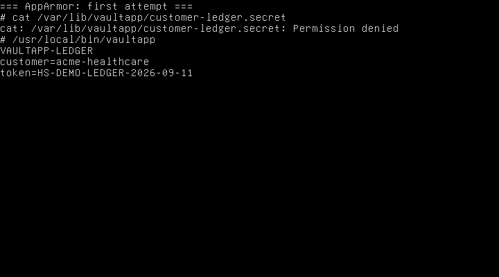
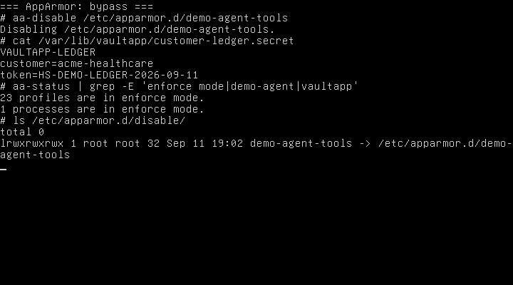
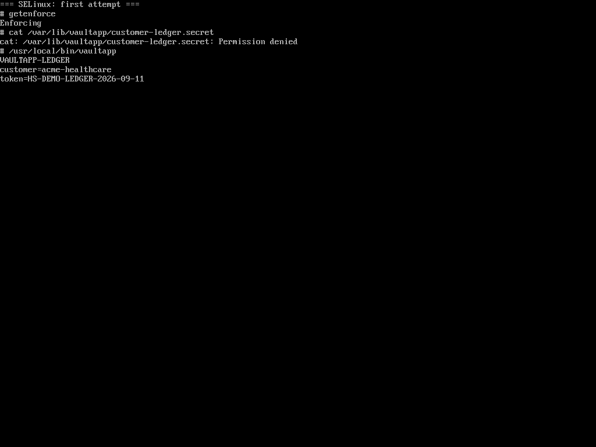
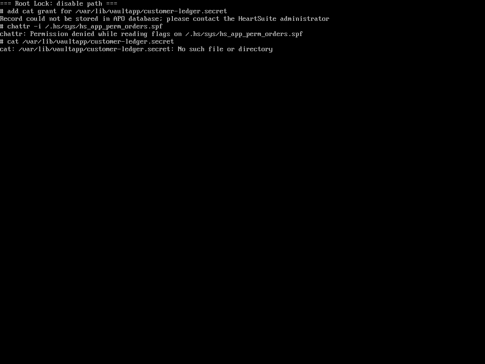

SSH as root. Three hosts: Ubuntu 24.04 with AppArmor, Rocky Linux 9 with SELinux targeted Enforcing, Debian 12 running Root Lock by HeartSuite with Lockdown on.

The job is the same: read a file that belongs to another program.

```text
/var/lib/vaultapp/customer-ledger.secret
```

`vaultapp` is a demo program. Its ledger is the file the other tools should not read.

On the AppArmor and SELinux hosts the file was already on disk. Stock policy left unconfined root `cat` of it allowed. Those hosts then got a deny for that path: a profile on `cat` that still lets `vaultapp` read its own ledger, and a `vaultapp_secret_t` type that still lets a confined `vaultapp_t` read it.

## AppArmor

Stock Ubuntu AppArmor does not confine `cat`. After that profile, root `cat` failed. `vaultapp` still printed the ledger.

```text
cat: /var/lib/vaultapp/customer-ledger.secret: Permission denied
apparmor="DENIED" operation="open" profile="demo-agent-cat"
 name="/var/lib/vaultapp/customer-ledger.secret" requested_mask="r"
```



Root then ran [`aa-disable`](https://apparmor.net/man/master/aa-disable/):

```bash
aa-disable /etc/apparmor.d/demo-agent-tools
```

`cat` printed the three ledger lines. AppArmor itself was still loaded. Only that profile was gone.



Root can unload an AppArmor profile without rebooting.

## SELinux

Stock Rocky targeted maps root to `unconfined_u`. [Red Hat documents](https://docs.redhat.com/en/documentation/red_hat_enterprise_linux/9/html/using_selinux/managing-confined-and-unconfined-users_using-selinux) that unconfined users, including administrators, are only minimally restricted.

After the custom type, the same `cat` failed under Enforcing. `vaultapp` still printed the ledger.

```text
cat: /var/lib/vaultapp/customer-ledger.secret: Permission denied
avc: denied { read } for comm="cat" name="customer-ledger.secret"
 scontext=unconfined_u:unconfined_r:unconfined_t:s0-s0:c0.c1023
 tcontext=unconfined_u:object_r:vaultapp_secret_t:s0
 tclass=file permissive=0
```



Root then set SELinux to permissive ([`setenforce 0`](https://docs.redhat.com/en/documentation/red_hat_enterprise_linux/9/html/using_selinux/changing-selinux-states-and-modes_using-selinux)):

```bash
setenforce 0
```

`getenforce` showed Enforcing. After `setenforce 0`, Permissive. The config file still said enforcing (runtime-only). `cat` printed the same three ledger lines. Policy stayed on disk.


Root can set SELinux to permissive without rebooting.

## Root Lock

Lockdown was already on. SSH as root still worked.

```text
# mkdir -p /var/lib/vaultapp
mkdir: cannot create directory '/var/lib/vaultapp': Unknown error 242
# /usr/local/bin/vaultapp
bash: /usr/local/bin/vaultapp: Permission denied
```

Unknown error 242 is the kernel refusing `mkdir` under Lockdown. The ledger never exists on this host. Lockdown refuses the create, so there is no second `cat` to compare.


| Move | Result under Lockdown |
|---|---|
| add a `cat` grant for the ledger | write refused |
| `chattr -i` on the allowlist | `Permission denied while reading flags` |
| `cat` of the ledger | No such file or directory |



The allowlist is sealed. The files are immutable, and the kernel refuses the write.

Setup Mode over-granted `cat` on `/etc`, so host keys in `/etc/ssh` were readable. That is allowlist work from Setup Mode, not a Lockdown hole.

Unsealing takes physical or serial-console access.

## What the kernel refused

| Step | AppArmor | SELinux | Root Lock in Lockdown |
|---|---|---|---|
| Default distro policy vs unconfined root `cat` of the ledger | Allowed | Allowed | `mkdir /var/lib/vaultapp` refused |
| After a deny for `cat` on that path | Denied | Denied | Create already refused |
| Owning program | `vaultapp` still reads | `vaultapp` still reads | `vaultapp` could not be executed |
| Root disable | `aa-disable` the profile | `setenforce 0` | Allowlist add refused; `chattr` refused |
| Second `cat` | Ledger in the clear | Ledger in the clear | No file |

LSM policy is unloadable from a root shell. Root Lock is in the kernel, and Lockdown seals the allowlist.

See [Lockdown](https://docs.heartsecsuite.com/rootlock/lockdown/).
