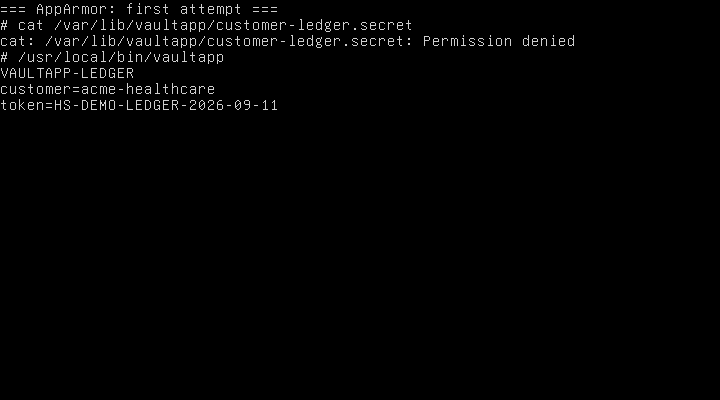
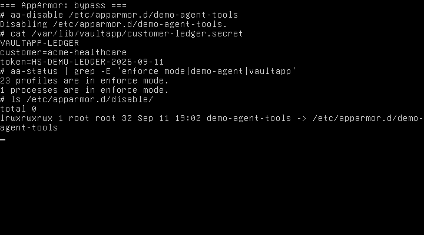
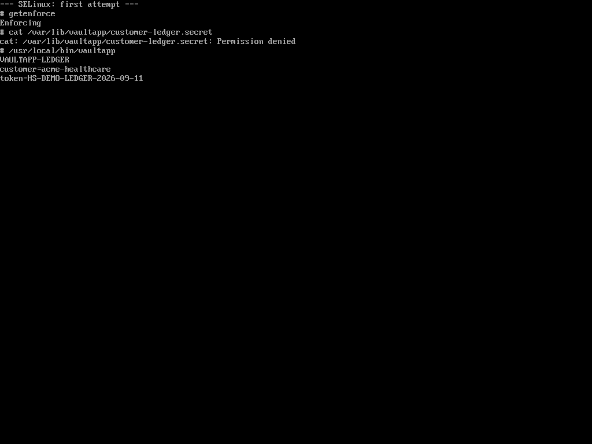
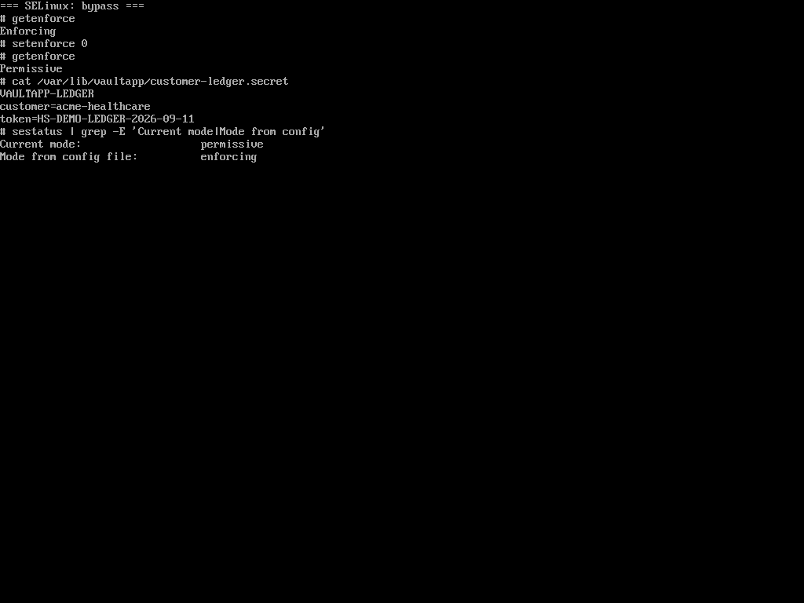
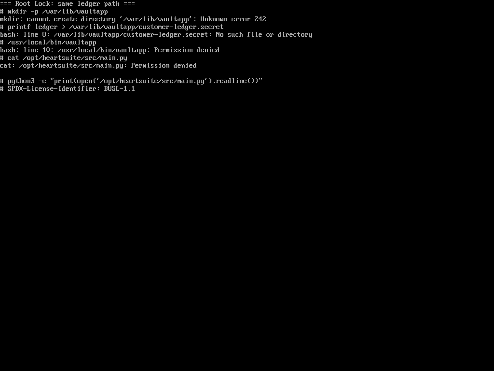
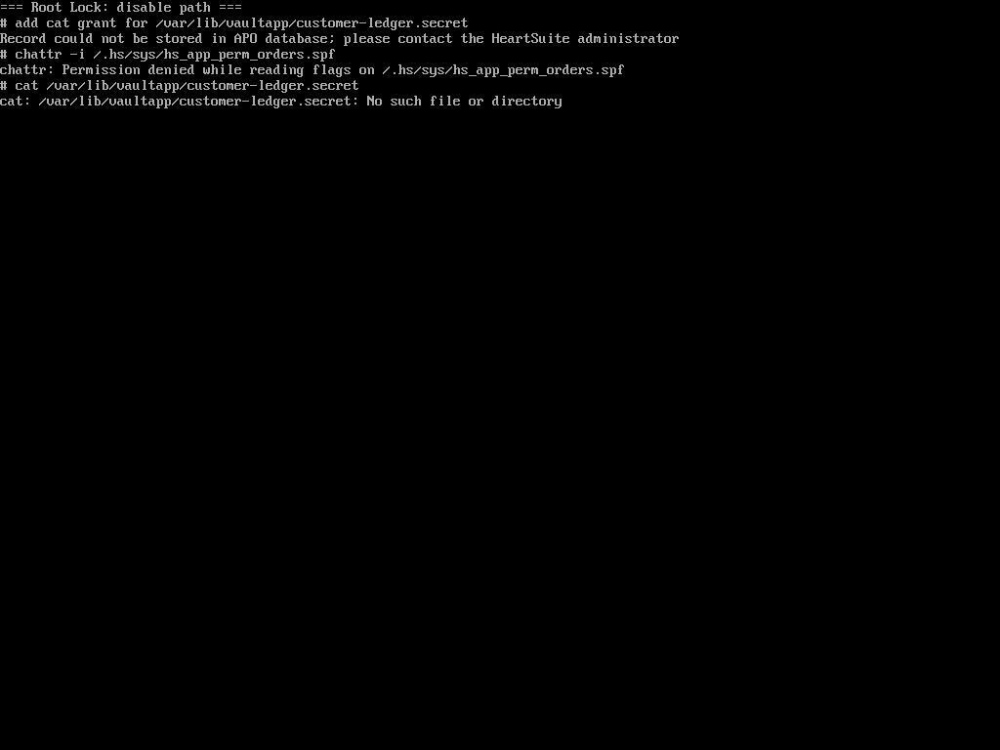
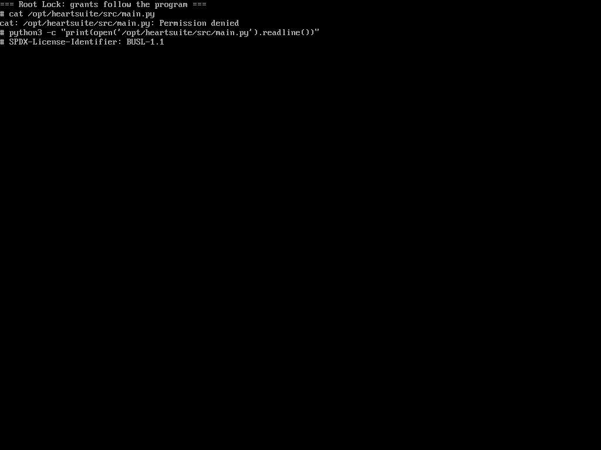

The attacker already has root. Maybe it was an unpatched service, maybe a stolen key, and it happens more often than anyone likes: exploits were the most common way in for the sixth year running, 32% of the intrusions in Mandiant’s investigations ([M-Trends 2026](https://cloud.google.com/blog/topics/threat-intelligence/m-trends-2026/)). What you want to know then is whether the policy you wrote still holds, or whether it is one command from off. Disabling it is a documented attacker step, not a lab trick: MITRE ATT&CK lists malware that sets SELinux to permissive (Skidmap) and malware that disables it (Ebury) under [Disable or Modify Tools](https://attack.mitre.org/versions/v16/techniques/T1562/001/).

Speed and time make that question expensive. CrowdStrike measured an average eCrime breakout time — from initial access to moving on to other systems — of 29 minutes in 2025, with the fastest at 27 seconds ([2026 Global Threat Report](https://www.crowdstrike.com/en-us/press-releases/2026-crowdstrike-global-threat-report/)). Mandiant's global median dwell time rose to 14 days, and IBM puts the average breach at $4.99 million ([Cost of a Data Breach 2026](https://www.ibm.com/reports/data-breach)). Fourteen days is a long time for a root shell to sit on a host where one command turns the policy off.







This lab puts that question to three hosts. You are logged in over SSH as root, and the job is to read a file that belongs to another program:

```text
/var/lib/vaultapp/customer-ledger.secret
```

`vaultapp` is a demo program, and its ledger is the file no other tool should read. The same job ran on Ubuntu 24.04 with AppArmor, Rocky Linux 9 with SELinux Enforcing, and Debian 12 running Root Lock by HeartSuite with Lockdown on, and none of them was rebooted along the way. AppArmor and SELinux both stopped the read once policy was written for it, and the same root shell then turned that policy off with one command. Under Lockdown, the root shell could not create the path, could not run `vaultapp`, and could not add a grant for itself, because the allowlist is sealed and the Root Lock kernel refuses the write.

{}

- **AppArmor:** a custom profile stopped root's `cat`; one `aa-disable` unloaded it, and the ledger printed.
- **SELinux:** a custom type stopped root's `cat` under Enforcing; one `setenforce 0` switched to permissive, and the ledger printed.
- **Root Lock under Lockdown:** the ledger path could not be created, the allowlist write was refused, and `chattr -i` on the allowlist was refused — from the same kind of root shell.
- **What that holds:** exactly what you approved in Setup Mode, so narrow grants before you lock down.

{}

On Ubuntu and Rocky the file was already on disk, and default policy let root `cat` it. Those two hosts then got extra policy that denied `cat` while still letting `vaultapp` read the ledger, and the same root shell then tried to turn that policy off.

## Root shell against AppArmor, SELinux, and Lockdown, step by step

### AppArmor: root unloads the profile with aa-disable

Ubuntu's AppArmor does not confine `cat` by default, so the demo added a profile for it. With that profile loaded, root `cat` failed and `vaultapp` still printed the ledger — AppArmor did exactly what the profile asked.

```text
cat: /var/lib/vaultapp/customer-ledger.secret: Permission denied
apparmor="DENIED" operation="open" profile="demo-agent-cat"
 name="/var/lib/vaultapp/customer-ledger.secret" requested_mask="r"
```



Root then ran [`aa-disable`](https://apparmor.net/man/master/aa-disable/):

```bash
aa-disable /etc/apparmor.d/demo-agent-tools
```

`cat` printed:

```text
VAULTAPP-LEDGER
customer=acme-healthcare
token=HS-DEMO-LEDGER-2026-09-11
```

AppArmor itself was still loaded; only that one profile was gone, which is enough, because root can unload an AppArmor profile without rebooting.



### SELinux: root switches to permissive with setenforce 0

Rocky followed the same steps. There root maps to `unconfined_u`, and [Red Hat documents](https://docs.redhat.com/en/documentation/red_hat_enterprise_linux/9/html/using_selinux/managing-confined-and-unconfined-users_using-selinux) that unconfined users, including administrators, are only minimally restricted.

So the demo labeled the ledger with a custom type. Under Enforcing, the same `cat` then failed, and `vaultapp` still printed the ledger.

```text
cat: /var/lib/vaultapp/customer-ledger.secret: Permission denied
avc: denied { read } for comm="cat" name="customer-ledger.secret"
 scontext=unconfined_u:unconfined_r:unconfined_t:s0-s0:c0.c1023
 tcontext=unconfined_u:object_r:vaultapp_secret_t:s0
 tclass=file permissive=0
```



Root then set SELinux to permissive ([`setenforce 0`](https://docs.redhat.com/en/documentation/red_hat_enterprise_linux/9/html/using_selinux/changing-selinux-states-and-modes_using-selinux)):

```bash
setenforce 0
```

`getenforce` went from Enforcing to Permissive, while the config file still said enforcing and the policy stayed on disk. `cat` printed the same three ledger lines, because root can set SELinux to permissive without rebooting.



SELinux does have a switch meant to refuse this move until the next reboot, the `secure_mode_policyload` boolean ([Red Hat Bugzilla](https://bugzilla.redhat.com/show_bug.cgi?id=1088753)). On this host it was off, which is why `setenforce 0` worked, and this lab compares what a root shell met on the host as configured, not every hardening SELinux can be given.

### Root Lock: Lockdown refuses the path and the allowlist write

On the third host Lockdown was already on, with sshd left running before the seal so this root shell was over SSH. That is not the default: sshd is stopped when Lockdown seals, unless you chose to leave it running before the seal, and SSH cannot lift the seal. The ledger was never staged here, so root's first move is to create the path:

```text
# mkdir -p /var/lib/vaultapp
mkdir: cannot create directory '/var/lib/vaultapp': Unknown error 242
# /usr/local/bin/vaultapp
bash: /usr/local/bin/vaultapp: Permission denied
```

Unknown error 242 is the Root Lock kernel refusing `mkdir` under Lockdown, and running `vaultapp` is refused too. Because the create is refused, the ledger never exists on this host, and there is no second `cat` to compare.



`setenforce` and `aa-disable` are not on Debian 12, and a missing binary would prove nothing about the kernel anyway. The equivalent move here is a write to the allowlist:

| Move | Result under Lockdown |
|---|---|
| add a `cat` grant for the ledger | write refused |
| `chattr -i` on the allowlist | `Permission denied while reading flags` |
| `cat` of the ledger | No such file or directory |



The allowlist is sealed: its files are immutable (`chattr +i`), and the Root Lock kernel refuses the write, so there is no permissive mode to switch to and no profile to unload.

To compare the same file across two programs, take one that is already on disk, `/opt/heartsuite/src/main.py`. `cat` has no grant for it, while `/usr/bin/python3` is the Dashboard interpreter and is granted that tree:

```text
# cat /opt/heartsuite/src/main.py
cat: /opt/heartsuite/src/main.py: Permission denied
# python3 -c "print(open('/opt/heartsuite/src/main.py').readline())"
# SPDX-License-Identifier: BUSL-1.1
```

Both commands ran as root, and the kernel answered differently because grants follow the program, not the user.



## Side by side: what each kernel refused







| Step | AppArmor | SELinux | Root Lock in Lockdown |
|---|---|---|---|
| Default policy vs root `cat` of the ledger | Allowed | Allowed | `mkdir /var/lib/vaultapp` refused |
| After a deny for `cat` on that path | Denied | Denied | Create already refused |
| `vaultapp` | still reads | still reads | could not be executed |
| Root disable | `aa-disable` the profile | `setenforce 0` | Allowlist add refused; `chattr` refused |
| Second `cat` | Ledger in the clear | Ledger in the clear | No file |
| Same file, different program | `vaultapp` still reads | `vaultapp` still reads | `cat` denied; `python3` reads |

AppArmor and SELinux both stopped `cat` once someone wrote policy for it, and root turned that policy off from the same shell with 1 command and 0 reboots. That off switch is there for administrators, and both frameworks offer policy depth Root Lock does not: SELinux domain transitions, and the per-application profiles distributions ship for AppArmor. Root Lock is compiled into the kernel, and under Lockdown the allowlist is sealed, so the same root shell that disabled the other two got 0 writes into the allowlist here. The two approaches can run together; see [How Root Lock compares](https://docs.heartsecsuite.com/rootlock/introduction/how-it-compares/).

## What Lockdown holds after a root shell

What Lockdown holds is exactly what you approved in Setup Mode. A grant is as wide as you make it — approve `cat` on all of `/etc`, and the SSH host keys in `/etc/ssh` come with it — so narrow the grants before you lock down, and every grant you remove is one more file a root shell cannot reach. Changing them afterwards means unsealing, which takes physical or serial-console access — the one way out of Lockdown, and not one a remote root shell has. Within those two limits, a root shell on a Lockdown host is held to what each program was approved for: which programs run, which files each one opens, and which addresses each one reaches. See [Lockdown](https://docs.heartsecsuite.com/rootlock/lockdown/).
