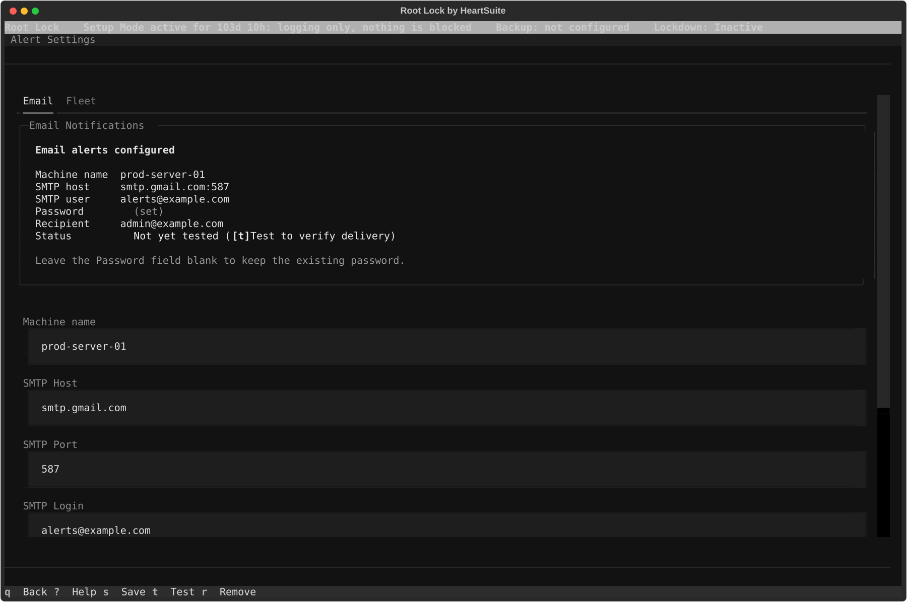

**Overview**: In Lockdown, Root Lock by HeartSuite blocks any execution, file access, or network connection not on the allowlist — whether or not anyone is connected to the Dashboard. Without alerts, a blocked program fails silently.

Alerts notify you of these blocks and of state changes the moment they happen. On a stable host with a complete allowlist, alerts are rare — most weeks you receive none at all. An alert means something unexpected happened.

## For fleet and enterprise scale

Single-host setup is on this page (Dashboard → Alerts). For production fleets and compliance programs, use the dedicated guides:

- [SIEM and Fleet Integration](siem-integration/) — Syslog, webhook, and status JSON for Splunk, Elastic, PagerDuty, and similar tools. The recommended path when you manage many servers without per-host TUI toil.
- [Central Policy Management and External Control](central-policy-management/) — Drive allowlist policy from Ansible, Terraform, ServiceNow, GitOps, and custom automation; consume syslog, JSONL approval logs, status.json, and webhooks for central visibility.



## When alerts fire

Alerts are a push channel for blocks and state changes that warrant immediate attention. They are not a replacement for the Dashboard.

By default, Setup Mode logs without sending alerts — alerting on expected teaching activity would be constant noise. Alerts become active when Lockdown is active. On the Fleet tab, **Setup Mode Alerts** (*Send security alerts while in Setup Mode*) sends the same block alerts during Setup Mode. Leave that switch off unless you need those Setup Mode alerts.

## Configuring alerts

From the Dashboard, select Alerts (`[e]`). That opens **Alert Settings**, which has two tabs: **Email** and **Fleet**.

### Email tab

Configure SMTP credentials to receive email alerts directly. Fields, in the order they appear:

- **Machine name** — defaults to the system hostname; set a recognisable identifier (for example `prod-web-03`) so email subjects identify the source host. The JSON and syslog field for this value is `node_id`.
- **SMTP Host**
- **SMTP Port** (default 587)
- **SMTP Login**
- **Password** (masked on entry; never displayed after saving)
- **Your email** — the recipient address

Save (`[s]`) requires **SMTP Host** and **Your email**. Root Lock validates those fields but does not attempt a live connection at save time. Test (`[t]`) sends a test email — that is the only moment SMTP connectivity is verified. If the test fails, the Result panel states what went wrong and what to try next. SMTP banners and authentication codes are not shown.

Once configured, the Email Status panel lists the stored values with the password shown as `(set)`. The form stays visible — there is no Edit step. Leave **Password** blank to keep the stored password. Remove (`[r]`) deletes the stored SMTP credentials and turns email alerts off. Syslog and webhook are not affected.

### Fleet tab

Configure syslog and webhook delivery for fleet and SIEM integrations. Channels are independent — enable any combination.

**Setup Mode Alerts** — A switch labelled *Send security alerts while in Setup Mode*. Off by default. When on, previously unseen programs, network bursts, and protected-file modifications alert in Setup Mode as well as Lockdown.

**Syslog** — A switch labelled *Send alerts to /dev/log (LOG_AUTH facility)*. When enabled, Root Lock writes alerts to the local journal with identifier `heartsuite`, facility `LOG_AUTH`, and severity warning. The message text begins with `heartsuite-alert:`. No syslog server field is on this tab — you forward from the host with rsyslog or a shipper. After you save with syslog on, the Result panel shows an rsyslog forwarding rule example.

Verify syslog delivery with:

```bash
journalctl -t heartsuite --since "1 minute ago"
```

To forward to a SIEM, add an rsyslog output rule in `/etc/rsyslog.d/heartsuite.conf`:

```
:programname, isequal, "heartsuite" @@your-siem-host:514
```

See the [rsyslog omfwd forwarding module documentation](https://www.rsyslog.com/doc/configuration/modules/omfwd.html) for forwarding syntax, and your SIEM's own documentation for the receiving end:

- [Splunk — Get data from TCP and UDP ports](https://docs.splunk.com/Documentation/Splunk/latest/Data/Monitornetworkports)
- [Elastic — Filebeat syslog input](https://www.elastic.co/guide/en/beats/filebeat/current/filebeat-input-syslog.html)

Test Syslog (`[t]`) writes a test event to the journal.

**Webhook** — Field label **Webhook URL (must be HTTPS)**. Root Lock POSTs a JSON payload to this URL on every alert. HTTP (non-TLS) URLs are rejected. When the URL contains `pagerduty.com`, **PagerDuty routing key (Events API v2 integration key)** appears. When the URL contains `opsgenie.com`, **OpsGenie API key (Authorization: GenieKey …)** appears. Other HTTPS URLs receive the generic payload below. Test Webhook (`[w]`) sends a test POST.

Example generic payload (a Lockdown block):

```json
{
  "node_id":            "prod-web-03",
  "event_type":         "new_program_blocked",
  "timestamp":          "2026-03-31T14:22:00Z",
  "mode":               "Secure Mode",
  "lockdown":           true,
  "tier":               2,
  "paths":              ["/tmp/dropper", "/tmp/payload"],
  "count":              2,
  "message":            "2 previously unseen programs blocked.",
  "subscription":       "Active",
  "total_pending":      2,
  "pending_programs":   2,
  "pending_file_r":     0,
  "pending_file_w":     0,
  "pending_network":    0,
  "enrich_failed":      false
}
```

`tier` is `1` when you switch Setup Mode or Lockdown, and for allowlist, backup-coverage, and kernel-module config changes. It is `2` for denied programs, files, and network. `mode` is the on-disk token (`"Setup Mode"` or `"Secure Mode"`). The Dashboard label for `"Secure Mode"` is Lockdown. `lockdown` is the separate seal boolean.

To receive this payload, create an integration in your incident management tool and paste the endpoint URL into **Webhook URL (must be HTTPS)**:

- [PagerDuty — Events API v2](https://developer.pagerduty.com/api-reference/f80f5db9acbe3-pager-duty-v2-events-api)
- [OpsGenie — Incoming webhook integration](https://support.atlassian.com/opsgenie/docs/integrate-opsgenie-with-webhook/)
- [Slack — Incoming webhooks](https://api.slack.com/incoming-webhooks)

**Status JSON** — A passive monitoring surface at `~/.cache/heartsuite/status.json`, updated every 60 seconds. Ansible, Nagios, and [Zabbix](https://www.zabbix.com/documentation/current/en/manual/config/items/itemtypes/ssh_checks) can read this file via SSH pull. No Fleet setting turns it on or off — it is written whenever the alert daemon is running. This is read-only; it does not push notifications.

At fleet scale, enable syslog on every node, forward via rsyslog to your SIEM, and alert from the SIEM's own rule engine. Webhook covers incident management tools (PagerDuty, OpsGenie). Status JSON covers Ansible health checks. Email is for a single host or as a supplementary channel.

For production examples (Filebeat/Elastic, rsyslog forwarding, webhook targets, verification commands) and the scale path for larger teams, see [SIEM and Fleet Integration](siem-integration/). That page also covers policy and posture data for allowlist tables and drift views in Kibana/Elastic — that export is not a Fleet-tab switch.

To own and apply allowlist policy from Ansible, Terraform, GitOps, ServiceNow, or custom scripts — including pre-seeding, harvest, and consumption of status.json / JSONL approval logs / syslog / webhook — see [Central Policy Management and External Control](central-policy-management/). The Dashboard is the surface for a single host.

When at least one push channel is configured, the Dashboard unlocks Lockdown.

## What triggers an alert

### Switching Setup Mode and Lockdown

These fire immediately when you switch between Setup Mode and Lockdown — no 5-minute window, no digest. The same immediate path covers allowlist changes while Lockdown is active, backup coverage loss, and kernel-module config changes:

| Alert | When it fires |
|-------|---------------|
| Mode switch | You leave Setup Mode for Lockdown, or leave Lockdown for Setup Mode |
| Lockdown activated or deactivated | Immediately when the seal goes on or off |
| Allowlist modified while Lockdown is active | On detection |
| Backup coverage disabled or reduced | When protected backup directories disappear |
| Kernel-module config modified | When a kmod load/blacklist file under the watched paths changes |

### Blocks in Lockdown

These blocks apply a threshold filter. They fire in Lockdown, and also in Setup Mode when **Setup Mode Alerts** is on:

| Block | Trigger condition |
|-------|------------------|
| Previously unseen program blocked | A program path appears that has never appeared in any prior log session |
| Network burst to new destinations | A program generates denied connections to previously unseen destinations within a 2-hour window |
| Protected file modified | A new backup version is created for a file under `/etc/`, `/bin/`, `/usr/bin/`, `/sbin/`, `/lib/`, or `/usr/lib/` |

**Not alerted:**

- Setup Mode activity while **Setup Mode Alerts** is off
- Repeated blocks of the same program–destination pair already seen in the current session
- File version activity under `/tmp/`, `/var/tmp/`, or `/dev/shm/`
- Dashboard sessions opened or closed
- Successful allowlist approvals

## Email, syslog, and webhook timing

### Email — 5-minute accumulation window

Blocks are grouped before delivery. A dropper that installs 40 payloads in 90 seconds produces one email — subject *Root Lock — 40 unknown programs blocked — prod-web-03* — not 40 individual messages. Volume and velocity are the attack signal; 40 separate emails fragment that signal into noise.

- The 5-minute window starts on the first block of a given type
- Additional blocks of the same type within that window are added to the pending bundle
- At window close, one email is dispatched covering all accumulated blocks
- Blocks of different types accumulate independently — a network burst does not delay a file modification alert

**Digest mode:** After 3 block emails in a single hour, further blocks are queued and delivered as one digest email at the hour's end. Switching Setup Mode or Lockdown is never held — those emails go out immediately, as do the other events in the table above.

The 5-minute window and hourly cap apply to email only. They are fixed, not user-configurable.

### Syslog and webhook — immediate

Syslog and webhook emit every alert immediately, without grouping or windowing. SIEM platforms (Splunk, Elastic) and incident management tools (PagerDuty, OpsGenie) apply their own correlation and deduplication — grouping alerts before they reach these systems removes information they need.

If a configured channel is silent in Setup Mode, check **Setup Mode Alerts**. Off (the default) means that silence is expected, not a misconfiguration.

With at least one push channel configured, the Dashboard unlocks Lockdown. Follow the Suggested Next Step to [activate Lockdown](../mode-switching/).
