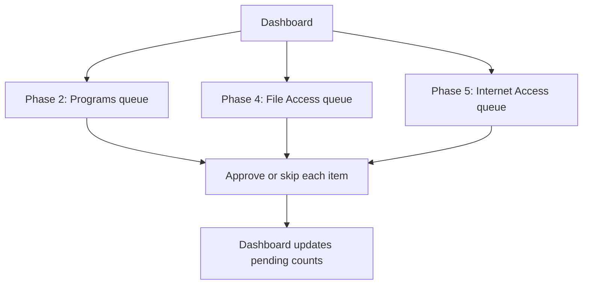

**Overview**: Allowlisting defines what each program is permitted to do — whether it can run, which files it can access, and which network destinations it can reach. The Dashboard guides you through each allowlisting phase and tracks your progress.

Allowlisting spans three phases of the HeartSuite Core Secure setup process:

- **Phase 2 -- Program Allowlisting** (`[p]`): Approve which programs are permitted to execute.
- **Phase 4 -- File Access Allowlisting** (`[f]`): Approve which files and directories each program can read or write.
- **Phase 5 -- Internet Access Allowlisting** (`[i]`): Approve which outbound internet destinations each program can reach.

Start from the Dashboard — it shows how many items are waiting in each queue and the Suggested Next Step directs you to whichever needs attention. The review queues manage volume through intelligent grouping, not blind bulk approval.

## Key Guides

- [Allowlisting Basics](allowlisting-basics/) -- Core procedures for reviewing and approving programs, file access, and network connections.
- [Batch Allowlisting Tools](batch-allowlisting-tools/) -- Activity log format and CLI tools for scripted allowlisting workflows.
