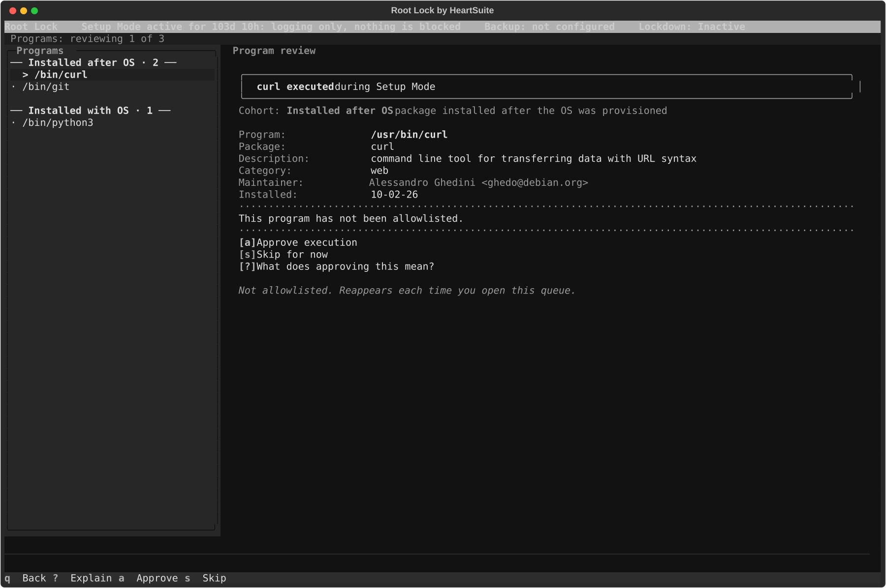
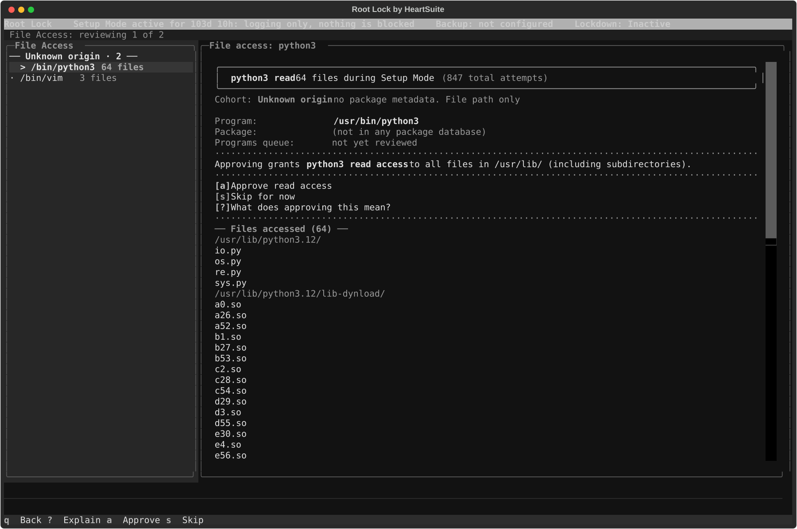
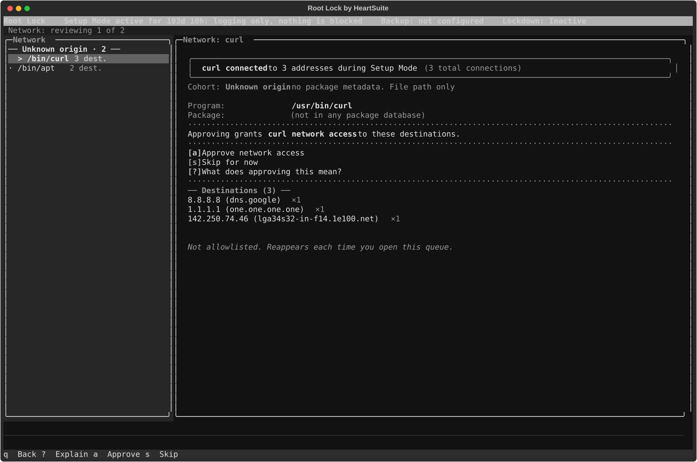

**Overview**: A program running without restrictions on a server can read any file, write anywhere, and connect to any destination. Root Lock by HeartSuite requires every program to be approved to execute, to access files, and to make network connections — each independently.

Even a legitimate tool already on your allowlist — curl, python, a system utility — can only reach the files and network destinations its allowlist entry approves. The Dashboard review queues walk you through each approval.

## The three review queues

In Setup Mode, Root Lock logs every program execution, file access, and outbound network connection without blocking anything. These populate three review queues visible from the Dashboard:

- **Programs queue** (`[p]`) — programs that executed without an allowlist entry
- **File Access queue** (`[f]`) — programs that already have an allowlist entry and read or wrote files not yet granted
- **Internet Access queue** (`[i]`) — programs that already have an allowlist entry and reached destinations not yet granted

The Dashboard shows pending counts for each queue and provides a Suggested Next Step. When Programs is empty, that screen suggests File Access (`[f]`). After you return to the Dashboard, the Suggested Next Step opens Secure Script Launchers (`[s]`) if interpreters are pending, otherwise the next queue that still has items.

The three queues are independent lists. Suggested Next Step prefers Programs when that count is non-zero, then Secure Script Launchers, then File Access, then Internet Access — that is suggestion order, not a lock. `[p]`, `[f]`, and `[i]` stay on the Dashboard; you can open Internet Access while Programs still has pending items.

Programs that already have an allowlist entry (from initial setup, install grants, a previous approve, or `[p]`) can appear in File Access and Internet Access as soon as they read a file or reach an address that is not yet approved. A binary with no allowlist entry yet is listed under Programs. Its file reads and connections are not listed until it has an entry and runs again.

## Working through a queue

### Starting a review

The Dashboard displays pending counts for each queue. The Suggested Next Step directs you to the queue that needs attention first. Select a queue to begin reviewing.

### Single-key actions

The footer shows the primary actions available at any point:

| Key | Action |
|-----|--------|
| `[a]` | Approve |
| `[s]` | Skip for now (defer without approving) |
| `[n]` | Navigate to the next denied item — Lockdown only |
| `[?]` | Explain — what this approval means |
| `[q]` | Return to the Dashboard |

Two additional keys appear contextually, not in the footer:

| Key | When available |
|-----|---------------|
| `[u]` | Undo — available until the next approve or skip; cancels the last approval and returns the item to the queue |

### Metadata shown in review

Every review item displays metadata directly in the primary prompt — you do not need to press a key to see it. The fields shown include:

| Field | Description |
|-------|-------------|
| Package | Package name and version from the distro database |
| Description | One-line package summary |
| Category | Package section (e.g., "editors", "web", "python") |
| Maintainer | Package maintainer string |
| Homepage | Package homepage URL |
| Installed | Date the package was installed or last updated |

When a program has no entry in any package database, Root Lock displays the raw file path with "(no package)" in the metadata fields. Missing metadata is never hidden — the absence of information is itself a signal.

## Individual and grouped review

The review queues handle large volumes without requiring blind bulk approval. Volume is managed through intelligent grouping, not through approving things you cannot see.

### Individual review

Each item is presented one at a time with full metadata. Example for a program execution:

```text
/usr/bin/nano executed during Setup Mode.
Package:     nano 7.2-1 -- small, friendly text editor
Attempts:    3

This program has not been allowlisted.

[a] Approve execution
[s] Skip for now
[?] What does approving this mean?
```

### Grouped review

Related items are grouped together (e.g., "847 file reads from /usr/lib/python3/"). Root Lock shows a sample of the grouped items so you can confirm the grouping makes sense before approving.

### Queue summary

When the volume of remaining items is large, Root Lock presents a summary of what is ahead — total counts and a breakdown by program — before you begin reviewing. This is an orientation view, not an approval surface. Press `[a]` or `[Enter]` to proceed into individual review.

> [!NOTE]
> Review grouping and sort order are independent dimensions. A program in any group may appear in any grouping presentation. For example, a program with no package entry that generated 200 file reads would appear in the "Unknown origin" group (sorted first) but could be presented as a grouped review (because the items are groupable by directory).

## Programs queue

When a program executes without an allowlist entry, Root Lock logs it. The Programs queue presents it for review.

### What the groups mean

Programs are grouped into sections in the program list on the left. These groups determine the order items appear, placing items that need the most investigation first:

| Group | Meaning |
|--------|---------|
| Unknown origin | Program has no entry in any known package database. No metadata beyond the file path. |
| Installed after OS | Program belongs to a package installed after the OS provisioning date. |
| Installed with OS | Program belongs to a package whose install date matches the inferred OS provisioning date. |
| Root Lock | File path falls under `/.hs/`. Origin is known; no investigation needed. Sorted last. |

The sort order is a workflow convenience that determines which programs appear first. It is not a trust ranking and does not affect the approval mechanism. Every program receives the same approve and skip options.

From the Dashboard, select the Programs queue (`[p]`). Each program is presented with its package metadata. Press `[a]` to approve execution or `[s]` to skip.



## File Access queue

Once you approve a program's execution, Root Lock begins logging every file it accesses. Programs typically access shared libraries, configuration files, and data files. The File Access queue presents them with two distinct permission levels:

- **Read access** — the default first approval level when approving a file read.
- **Write access** — always includes read access. Granted when approving a file write.

Example review prompt for a file read:

```text
/usr/bin/python3 read during Setup Mode:
/usr/lib/python3/dist-packages/apt/__init__.py
Program:     python3 3.11.2-1 -- interactive high-level object-oriented language
File owner:  python3-apt 2.6.0
Attempts:    12

This file access has not been allowlisted.

[a] Approve read access
[s] Skip for now
[?] What does approving this mean?
```

Example review prompt for a file write:

```text
/usr/bin/journald wrote during Setup Mode:
/var/log/journal/machine-id/system.journal
Program:     systemd 252-19 -- system and service manager
File owner:  systemd 252-19
Attempts:    3

This file access has not been allowlisted.

[a] Approve read and write access
[s] Skip for now
[?] What does approving this mean?
```

From the Dashboard, select the File Access queue (`[f]`).



> [!TIP]
> Grouped review handles the common case where a program reads many files from the same directory (e.g., `/usr/lib/python3/`). Root Lock groups these together and shows a sample, so you can approve directory-level access without reviewing each file individually.

> [!NOTE]
> Some files shown in the queue may be labelled **(no longer exists)** in dimmed text. These are files the program accessed during Setup Mode that have since been deleted — temporary files, build artefacts, and similar. They are shown rather than filtered out because approving directory-level access now prevents the program from being blocked when it recreates the same file later. The summary line shows the breakdown: "8 still exist; 34 have been removed since".

## Internet Access queue

Programs that make outbound internet connections are logged with the destination IP address and reverse DNS hostname. The Internet Access queue presents these for review.

Example review prompt:

```text
Network: reviewing 1 of 2

curl connected to 3 addresses during Setup Mode  (3 total connections)

Approving grants curl network access to these destinations.

[a] Approve network access
[s] Skip for now
[?] What does approving this mean?

── Destinations (3) ──
  8.8.8.8 (dns.google)                         ×1
  1.1.1.1 (one.one.one.one)                    ×1
  142.250.74.46 (lga34s32-in-f14.1e100.net)    ×1
```

From the Dashboard, select the Internet Access queue (`[i]`).



## Progress and completion

While working through a queue, a progress indicator shows your position:

```text
Programs: reviewing 3 of 7  ───────────────────────────────
```

When a queue is empty:

```text
All Programs events reviewed.
Suggested: Review pending File Access events
```

Allow several days to a week of observation in Setup Mode so systemd timers, cron jobs, and infrequent services appear in the queues before you activate Lockdown.

## Review queues in Lockdown

In Lockdown the review queues are read-only. `[a]` and `[s]` do nothing — you cannot approve items while in Lockdown. The queues show **denied** items (actions Root Lock blocked), not pending items awaiting approval.

Use `[n]` to navigate through denied items one by one. To approve a denied program, file access, or network destination, enter a maintenance period first via the Maintenance (`[m]`) — this switches to Setup Mode where the review queues become interactive again.

> [!NOTE]
> Denied items in Lockdown are a normal part of operation, not failures. A denied item means Root Lock blocked something that was not on the allowlist. Review it to decide whether to approve it or leave it blocked.

## CLI access for scripting and automation

For scripting and automation workflows that run without the Dashboard, `/.hs/sys/hs-app-perm-orders-manager` browses and edits existing allowlist entries (`/.hs/sys` is not on `PATH`). See its built-in help:

```bash
# /.hs/sys/hs-app-perm-orders-manager --help
```

The Dashboard is the supported path for normal use.

After you return to the Dashboard with Programs empty, the Suggested Next Step directs you to [Secure Script Launchers](../../script-launchers/) (`[s]`) if interpreters are pending — or to File Access (`[f]`) if launchers are complete or not applicable. The Lockdown Checklist tracks the remaining rows and always shows what needs attention next.
