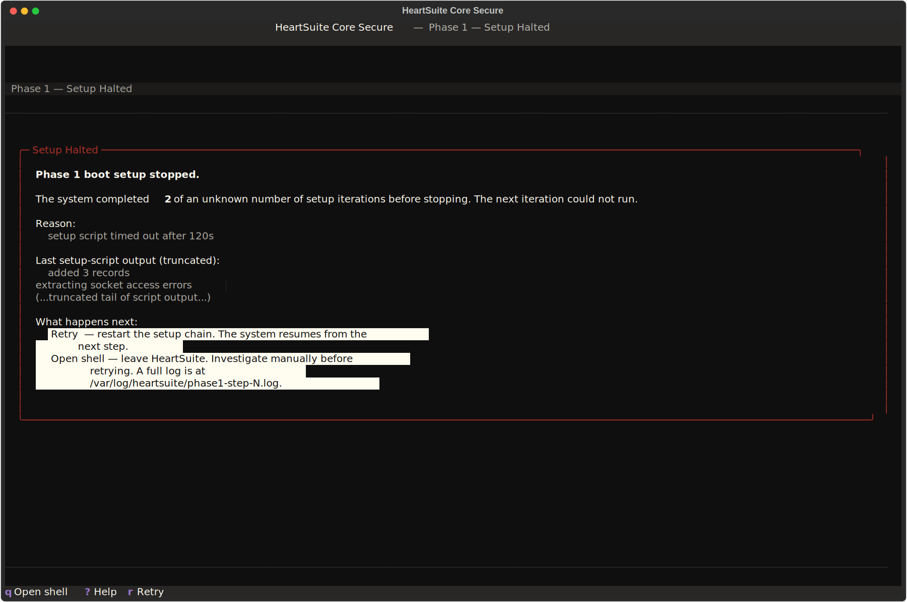

**Overview**: No commands are needed after the first boot into the HeartSuite Core Secure kernel. HeartSuite Core Secure reads the startup and shutdown logs and adds the programs it finds to the allowlist — the Dashboard appears when this is complete and directs you into Phase 2 (Program Allowlisting).

> [!NOTE]
> Cloud users skip this step. On a pre-configured cloud instance, the Dashboard confirms Phase 1 (System Verification) is complete on first boot.

## What Happens After the First Boot

HeartSuite Core Secure reads the startup and shutdown logs, adds the programs it finds to the allowlist, and reboots. This repeats until no new programs are found — typically three to five passes, depending on the distribution.

**While setup is running, you will see:**

- **Over SSH**: each time you reconnect, the login shows a brief status line and drops you at a regular shell — no action needed:
  ```
  HeartSuite Phase 1 is running — step N of unknown total.
  The system reboots automatically. Reconnect in a few minutes.
  ```

- **On the serial console** (`virsh console`, AWS/Azure/GCP serial console, IPMI SOL): attach and press Enter — the console autologs in and shows the current step. No action needed.

The first time you connect and the Dashboard appears, setup is complete. The Dashboard shows the reboot history and the Suggested Next Step directs you into Phase 2 (Program Allowlisting).

## If the Dashboard Does Not Appear

If setup is still running, SSH reconnects show the status line above instead of the Dashboard. Wait a few minutes and reconnect.

If repeated reconnects still show the status line rather than the Dashboard:

1. Open the serial console (`virsh console <vm>` for KVM, AWS/Azure/GCP serial console, IPMI SOL) and press Enter to see the current step. If it has not advanced across reboots, run `journalctl -u heartsuite-phase1` to see the setup output.
2. Verify the HeartSuite Core Secure kernel is loaded:
   ```bash
   uname -r
   ```
   Expected output ends in `HeartSuite` (for example, `6.18.23-HeartSuite-1.0`).
3. If the wrong kernel booted, reboot and select the HeartSuite kernel from the GRUB menu manually.

## If Setup Stops With an Error

If something goes wrong during setup, the next login shows an error with the reason and the last output from the setup process.



Two options are available:

- **`[r]` Retry** — restarts the setup from where it stopped.
- **`[q]` Open shell** — drops you to a shell to investigate before retrying.

> [!WARNING]
> The boot setup must complete before you switch to Secure Mode. If the initial allowlist is incomplete, the system may hang on boot or shutdown after the mode switch.
