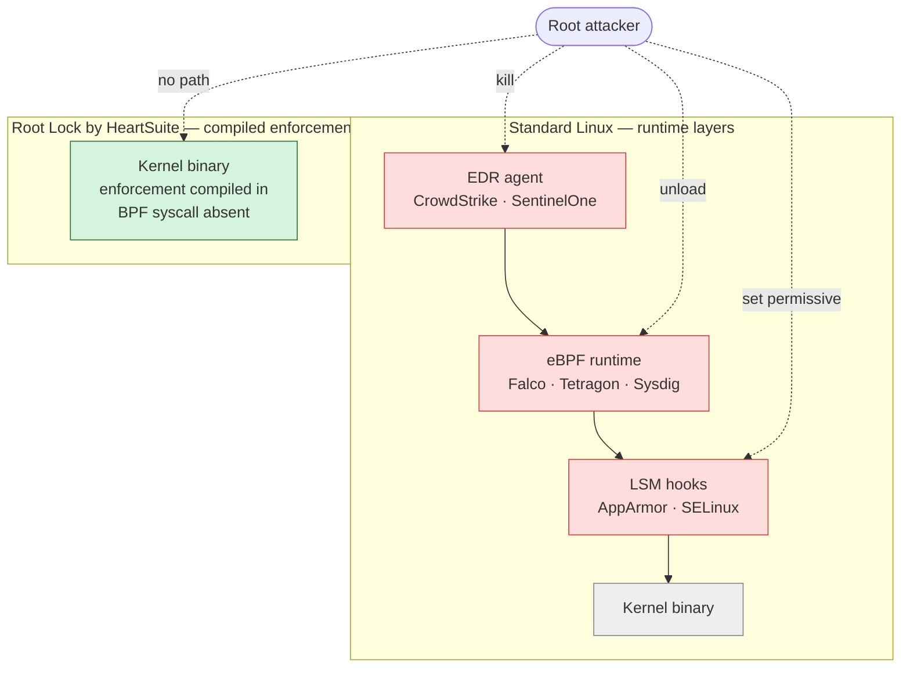
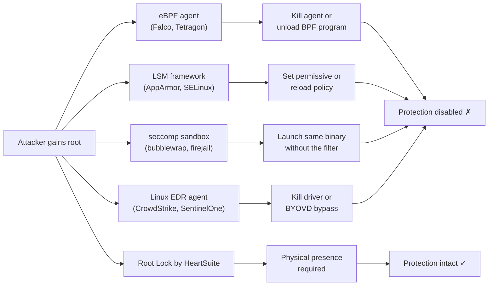

**Overview**: Root Lock by HeartSuite controls per program whether it can execute, which files it can read or write, and which network connections it can make — including for programs running as root. Standard operating systems grant these rights to users. Ken Thompson built Unix that way in 1969 on an unused PDP-7 at Bell Labs — designed for a small group of trusted researchers, not for networked infrastructure or a world with malware. Every operating system since inherited the decision unchanged. Root Lock by HeartSuite does not. It replaces a set of runtime-confinement and kernel-observability tools whose enforcement can be disabled by an attacker with root. It does not replace your SIEM, network detection, vulnerability scanner, or HIDS — those answer different questions and should be run alongside.

## Kernel architecture

| Standard Linux | Root Lock by HeartSuite |
|---|---|
| Wide kernel + security agent watching it | Minimal kernel — features removed at build time |
| BPF programs enforce blocking policy | BPF syscall is not compiled in — nothing to unload |
| Kernel module driver provides telemetry | No agent module — no module to kill |
| OverlayFS and FUSE enabled for containers | Compiled out — the CVE class disappears with them |
| Config file: 12,000+ lines, audited by tooling | Config file: 5,050 lines, readable by a person |
| Blocking depends on runtime configuration | Blocking is compiled into the binary itself |

Standard Linux security tools are runtime layers an attacker with root can reach and disable. Root Lock by HeartSuite compiles enforcement into the kernel binary itself — the BPF syscall is absent, so there is no eBPF layer to unload, no agent to kill.

Every published Linux kernel CVE comes with the same question: is that kernel feature compiled into your hosts? For the features Root Lock by HeartSuite has compiled out, the answer is always no — without patching, without policy, without an agent checking.

Most runtime security products sit at Layer 3 (LSM hooks such as SELinux and AppArmor) or Layer 5 (userspace EDR agents such as CrowdStrike Falcon and SentinelOne). Root Lock by HeartSuite sits at Layer 2: enforcement is compiled into the kernel binary itself, not applied to it from outside. That placement is why every bypass in the table below requires physical presence rather than a remote privilege escalation. For the full taxonomy with all products mapped by layer, see [Layer Analysis](../layer-analysis/).

## Security as economics

For an analysis of attacker cost, defender operational cost, and ROI comparison against SELinux, EDR, Zafran, and CTEM programs, see [Security as Economics](../security-as-economics/).

## What Root Lock by HeartSuite replaces

The comparison below is scoped to preventive enforcement; telemetry, behavioural analytics, and incident response are addressed separately in [What Root Lock by HeartSuite Complements](#what-root-lock-by-heartsuite-complements). These products provide runtime confinement or kernel-level enforcement of some kind. Each has a known bypass path. The Root Lock by HeartSuite row is included in the same format for direct comparison — see [Circumvention and Recovery](#circumvention-and-recovery) below for detail.

| Product | What it does | How it can be disabled | How Root Lock by HeartSuite compares |
|---|---|---|---|
| **Falco, Cilium Tetragon, Sysdig Secure, Tracee, bpftrace** (eBPF-based runtime detection) | Attach BPF programs to kernel hooks, watch syscall patterns, alert on suspicious behaviour | An attacker with root can unload the BPF program, kill the agent, or disable the BPF syscall | Root Lock by HeartSuite removes the BPF syscall entirely from the kernel. There is no agent to kill and no hook to unload. Enforcement is compiled in. |
| **AppArmor, SELinux, SMACK, Landlock** (userspace LSM frameworks) | Per-process MAC profiles limiting filesystem and capability access | Root with the right capability can set SELinux to permissive, unload an AppArmor profile, or modify the policy file | Root Lock by HeartSuite's allowlist is stored in configuration files made immutable under Lockdown, and the Root Lock by HeartSuite kernel will not let any program change them while it's running. Even root cannot edit it. |
| **seccomp-bpf sandboxes** (systemd services, browser sandboxes, bubblewrap, firejail) | Per-process syscall filters set by the process itself or its parent | A parent with equivalent privilege can spawn the same binary without the filter. Filters are scoped to a process tree, not to the program identity | Root Lock by HeartSuite gates by program identity, not process lineage. A program's allowlist applies every time it runs, regardless of who spawned it. |
| **gVisor** (userspace kernel for container sandboxing) | Intercepts container syscalls in a userspace kernel, reducing exposure to the host kernel | Runs as a userspace process; a compromise of the gVisor process itself, or a bug in its syscall emulation, can allow escape | Root Lock by HeartSuite *is* the kernel — one layer instead of two, with nothing to unload. Used as a guest kernel inside a microVM, it provides kernel-level enforcement for the workload. |
| **Linux EDR agents** (CrowdStrike Falcon, SentinelOne, Microsoft Defender for Endpoint, FortiEDR) | Kernel module or eBPF agent providing telemetry, detection, and response | Root can kill the agent process, unload the kernel module, or tamper with the driver. Many breaches include "disable EDR" as an early step | Root Lock by HeartSuite has no agent and no module to unload — it is the kernel. When attackers use legitimate tools rather than new malware — the pattern in most modern breaches — EDR detects the suspicious behavior. Root Lock by HeartSuite constrains it differently: even a legitimate tool can only reach the files and network destinations its allowlist entry approves. Note: EDR provides telemetry and response Root Lock by HeartSuite does not. Treat Root Lock by HeartSuite as a replacement for the preventive-enforcement dimension only; for detection and response, see the complementary table below. EDR agents that deploy via eBPF cannot attach on-host — the BPF syscall is not present on the HS kernel. Under Lockdown, agents that install as kernel modules are blocked without an allowlist entry — the same gate that applies to every other program. Both HS syslog streams — per-decision enforcement events and aggregated alerts — reach the EDR ingestion pipeline via a single rsyslog forwarding rule, with no external tooling required. Detection and response coverage continues through the log pipeline without an on-host sensor. |

**The common pattern.** Every product in this table can be disabled by an attacker who has already reached root. Root Lock by HeartSuite cannot — its enforcement is compiled into the kernel and its allowlist is sealed by filesystem immutability under Lockdown. This requires a different operational model, discussed in [Circumvention and Recovery](#circumvention-and-recovery).

**What each tool does best.** Bypass surface is one dimension of comparison, not the whole picture. Each product above retains strengths Root Lock by HeartSuite does not replicate.

*eBPF observers* — Falco, Cilium Tetragon, Sysdig Secure, Tracee, and bpftrace — ship mature rule libraries, Kubernetes-aware context, and fleet-wide runtime telemetry. For behavioural alerting on Kubernetes nodes — particularly autoscaled clusters where Root Lock by HeartSuite does not fit — those tools remain the right answer, and they can observe a Root Lock by HeartSuite host from adjacent infrastructure via network taps or log forwarding.

*Userspace LSM frameworks* — AppArmor, SELinux, SMACK, Landlock — offer policy capabilities Root Lock by HeartSuite does not replicate: SELinux refpolicy and domain transitions, AppArmor's distribution-shipped per-application profiles, Landlock's per-application self-confinement primitive. Root Lock by HeartSuite's value is the sealed boundary — `chattr +i` immutability plus a running kernel that refuses runtime changes — not richer policy syntax. Migrating from AppArmor requires no cleanup: `CONFIG_SECURITY_APPARMOR` is compiled out of the HS kernel and existing profiles cease to apply at the first HS kernel boot.

*seccomp-bpf sandboxes* in systemd services, browser sandboxes, bubblewrap, and firejail sit closer to the syscall surface than Root Lock by HeartSuite can. A Chromium renderer's own seccomp filter is genuine defence-in-depth from inside the program; Root Lock by HeartSuite does not replace it, and both layers are worth keeping.

*gVisor* addresses a different threat model — host protected from untrusted guest, via a userspace syscall-emulating kernel. Root Lock by HeartSuite addresses workloads protected from compromised root inside the kernel they run on. The two compose: Root Lock by HeartSuite as the guest kernel inside a gVisor-isolated container is a coherent stack.

*Linux EDR* — CrowdStrike Falcon, SentinelOne, Microsoft Defender for Endpoint, FortiEDR — provides telemetry, behavioural analytics, fleet-wide correlation through a SOC console, threat intelligence, and incident response. Root Lock by HeartSuite provides none of those. The honest position is *prevention versus detection*; most regulated environments run both, with HS block events forwarded to the EDR ingestion pipeline via the syslog channel rather than an on-host sensor.

## Capability-based confinement

*Capsicum* (FreeBSD) operationalizes the same core thesis as Root Lock by HeartSuite: ordinary programs should not have unrestricted default access to the global OS namespace. It is the most architecturally principled approach to that problem outside of Root Lock by HeartSuite, and the comparison is worth being direct about.

**How Capsicum works.** After `cap_enter()`, any syscall that traverses a global namespace — `open()` with an absolute path, `kill()` with a PID — returns `ECAPMODE` immediately. Default access paths through the OS are severed at the syscall boundary. Per-FD rights masks then control what operations each open file descriptor permits. The design enforces this directly: no path through the global namespace means no access.

**What structural elimination costs.** Every sandboxed application — or a wrapper around it — must be rewritten. The application calls `cap_enter()`, pre-opens every file descriptor it will ever need before that call, and uses `openat(fd, …)` relative to those FDs thereafter. Sandboxing OpenSSH under Capsicum required explicit modifications to `sandbox-capsicum.c`. Libcasper exists specifically to handle operations that cannot be pre-opened — DNS lookups, `/etc/passwd` reads — via a dedicated delegation channel. For software you write yourself, the model is clean. For a fleet of existing Linux binaries you did not write, it means modifying every program you want to protect — or not protecting it.

**How HS reaches the same goal without application changes.** VFS hook points in `namei.c`, `open.c`, `exec.c`, and `exit.c` intercept path traversal and check the calling process's allowlist entry against the path. Network hooks in `socket.c` check outbound routable connections — both `connect()` calls and `sendto()` calls with an explicit destination address — against the program's IP allowlist; local IPC over UNIX domain sockets and NETLINK is exempt by design. Default access paths are filtered rather than severed. Existing Linux binaries run without modification; Root Lock by HeartSuite observes what they do and enforces the allowlist against it. Root Lock by HeartSuite makes this choice — hook-at-VFS rather than cap_enter-before-first-access — precisely to enable application transparency: no binary needs to be rewritten to be protected.

**The Setup Mode gap.** Capsicum has no learning phase. Policy lives in application source code, written at development time by the developer who wrote the application. There is no "observe what this binary actually needs at runtime, then derive its allowlist" workflow. For any environment running software it did not write — which is most production infrastructure — HS's Setup Mode is the practical path: record what the binary does, review, approve, then lock. Capsicum offers no equivalent.

**The policy-integrity gap.** Because Capsicum's policy is application code, there is no runtime policy database to protect after deployment. Root Lock by HeartSuite maintains an allowlist database, and Lockdown seals it — `chattr +i` across the relevant paths plus a kernel flag that blocks `chattr` via the ioctl hook at runtime, so no running program can remove the immutability. That second layer — protecting the policy itself from an attacker who has already reached root — has no analogue in Capsicum's design, because Capsicum never needed it. Root Lock by HeartSuite needs it precisely because its policy is something an attacker would want to modify.

**Platform.** Capsicum is primary on FreeBSD. Linux support is incomplete. HS targets Linux 5.19.6 and 6.18 natively.

The two designs make opposite choices: modify the application, or maintain a policy database. For a Linux fleet running software you did not write, Root Lock by HeartSuite's approach — maintain the database, get transparency and the full Setup → Lockdown lifecycle — is the one that covers the workload.

## Formally verified microkernels

*seL4* is the benchmark for machine-checked security guarantees in an OS kernel. Its proofs establish that every syscall behaves exactly as specified, that no information can pass between components without an explicit connection, and that these properties hold in the compiled binary on select platforms. Root Lock by HeartSuite and seL4 share the same goal — prevent programs from reaching resources they were not explicitly granted access to — and diverge on almost everything else.

**How seL4 works.** seL4 is a microkernel of roughly 10,000 lines of C backed by machine-checked proofs. Every kernel object — memory region, communication channel, thread control block — is named and accessed through an unforgeable token. A process starts with exactly the tokens its creator delegates, nothing more. To reach a file, a process must hold a token for that file's underlying storage. To message another process, it must hold a token for the communication channel. There is no global path namespace to traverse: if you do not hold the token, the kernel rejects the call before any check fires.

**What those guarantees require in practice.** seL4's proofs depend on keeping the kernel small enough that every line can be verified — roughly 10,000 lines of C. That means seL4 contains no file system, no network stack, no device drivers. Every service that exists in a standard Linux installation — SSH, package management, web server, any application — must be rebuilt as a userspace component with explicit token grants. Existing Linux software does not run on seL4 without a full OS porting effort. For a commercial server running standard software, deploying seL4 means replacing the entire software environment, not just the kernel.

**How Root Lock by HeartSuite enforces the same principle on existing software.** Root Lock by HeartSuite installs as a modified Linux kernel on a host already running standard software. Root Lock by HeartSuite controls whether each program can execute, which files it can read or write, and which network connections it can make — the existing binaries run without modification. Root Lock by HeartSuite observes what each binary does during Setup Mode; you build the allowlist through the Dashboard queues, review and approve, then engage Lockdown. The guarantee is a kernel-enforced allowlist on the software the host already runs.

**The Setup Mode gap.** seL4 has no learning phase. Token grants are designed at system build time by the developer who builds the system. There is no "observe what this service actually needs at runtime, then derive its policy" workflow. Root Lock by HeartSuite's Setup Mode is the practical answer for standard infrastructure: run the system, record every access in the Dashboard queues, review and approve, then engage Lockdown. For any environment running standard Linux software, Root Lock by HeartSuite's Setup Mode provides the observe-and-build path that seL4 cannot offer.

**The policy-integrity gap.** seL4 has no policy database; authority is the token set, which is structural. Root Lock by HeartSuite maintains an allowlist database, and Lockdown seals it: `chattr +i` across the relevant paths plus a kernel flag that blocks `chattr` via the ioctl hook at runtime, preventing any running program from modifying the allowlist. The two approaches defend at different layers: seL4 makes authority impossible to forge; Root Lock by HeartSuite makes the allowlist impossible to modify after Lockdown engages.

**Platform.** seL4 is not a Linux kernel; standard Linux software requires a full porting effort to run on it. Root Lock by HeartSuite targets Linux 5.19.6 and 6.18 and is installed by replacing the kernel on an existing host.

The two approaches make opposite foundational choices: build the OS from a proof up, or enforce on the software stack that already exists. For commercial infrastructure running standard Linux software, Root Lock by HeartSuite is the option that ships.

## Object-capability operating systems

*Fuchsia* (Google) is a production operating system built on Zircon — a microkernel where every resource is accessed through an unforgeable handle. Like seL4, its security model is structural: no handle means no access, at the kernel boundary, before any policy database is consulted. Fuchsia adds two architectural properties that seL4 does not emphasize: per-component private namespaces and cryptographic verification of every executable.

**Private namespaces.** In Fuchsia, each component receives an explicitly assembled filesystem view — its `/svc/`, `/data/`, and `/pkg/` entries are handle-routed by the Component Framework. There is no global root filesystem visible to all components. A compromised component cannot traverse upward to discover paths it was not given handles to; those paths do not exist in the component's view. Root Lock by HeartSuite enforces on a global Linux filesystem. Root Lock by HeartSuite controls whether a program can access a given path, but the path still exists and an access attempt returns an error rather than silence. Root Lock by HeartSuite's global filesystem is what makes existing Linux software run unchanged — the same choice that allows deployment on any existing Linux server.

**Cryptographic integrity.** Fuchsia verifies every executable through BlobFS — a storage layer where each file is identified by its hash and verified before execution. Replacing a binary silently is structurally impossible. Root Lock by HeartSuite seals the allowlist database and critical system paths at Lockdown with `chattr +i` filesystem immutability plus a kernel flag that blocks any running program from clearing those flags — no program, including root, can modify the allowlist or the protected system paths while Lockdown is active. Full cryptographic verification at boot requires building the OS around content-addressed storage from scratch. Root Lock by HeartSuite's Lockdown provides runtime tamper-resistance on the Linux infrastructure already in production.

**The Setup Mode gap.** Fuchsia has no learning phase and no operator-facing allowlist tooling for standard server software — because standard server software does not run on Fuchsia. Root Lock by HeartSuite's Setup Mode records what each binary does; you review and approve through the Dashboard queues, then engage Lockdown. The workflow exists because Root Lock by HeartSuite deploys on the software stack already running in production.

**Platform.** Fuchsia targets embedded devices and consumer hardware. It is not a Linux kernel and has no server deployment path. Root Lock by HeartSuite targets Linux 5.19.6 and 6.18 server deployments and is installed by replacing the kernel on an existing host.

Fuchsia's security architecture is more restrictive at every layer: per-component namespaces, cryptographic verification, handle-only access, userspace drivers. Root Lock by HeartSuite provides enforced per-program allowlisting on existing Linux deployments without rebuilding the OS. For any organization running Linux infrastructure today, Root Lock by HeartSuite is the option that deploys.

## Trust boundaries and bypass surface

Three questions cut to the core of any enforcement mechanism: *who is trusted to set the policy, who is gated at runtime, and what does a bypass look like?*

The table below answers each question in full for the main enforcement mechanisms alongside Root Lock by HeartSuite.

| Mechanism | Trusted during setup | Untrusted at runtime | How enforcement is bypassed |
|---|---|---|---|
| eBPF observation and enforcement (Falco, Cilium Tetragon, Sysdig Secure, Tracee, bpftrace) | Admin who writes the rules | Processes the agent observes (Tetragon and Sysdig can kill in-kernel) | Root unloads the BPF program, kills the agent, or disables the BPF syscall |
| Userspace LSM frameworks (AppArmor, SELinux, SMACK, Landlock) | Admin who authors the policy files | Processes labelled or confined by policy | Root sets the framework permissive, reloads a relaxed policy, or edits the policy file |
| seccomp-bpf sandboxes (bubblewrap, firejail, systemd, browser sandboxes) | The parent process that sets the filter | The child process the filter applies to | A sibling process launched without the filter is unaffected — filters are scoped to a process tree, not a program identity |
| gVisor | Container runtime administrator | Syscalls from inside the sandboxed container | Compromise the gVisor sentry process, or exploit a syscall-emulation bug |
| Linux EDR agents (CrowdStrike Falcon, SentinelOne, Microsoft Defender for Endpoint, FortiEDR) | SOC team via a cloud console | Monitored processes | Root kills the agent, unloads the driver, or exploits a BYOVD bypass |
| **Root Lock by HeartSuite** | **You in Setup Mode; allowlist sealed by Lockdown** | **Every program, including those running as root** | **Physical presence required to boot the Non-HS kernel — no remote path** |

**Two differences carry the position.** Every mechanism above narrows the runtime trust boundary to a subset of processes — one container, one labelled domain, one process tree, one observed program. Root Lock by HeartSuite narrows it to *every* program via a system-wide allowlist, root included. And where every competitor's bypass is something an attacker can do remotely once they have root, Root Lock by HeartSuite's bypass requires physical presence at the console. Those two shifts are the substance of the Root Lock by HeartSuite position.

The May 2026 TanStack npm attack illustrated the trust-boundary distinction from the supply chain direction. The attacker operated inside a legitimate build pipeline using valid credentials — SLSA provenance, OIDC, and 2FA all functioned as designed. No credential check or trust-chain verification registered anything to block. Root Lock by HeartSuite's per-program network allowlist bounds what pipeline processes can reach from the host regardless of credential validity; connections to unapproved destinations are refused at the kernel.

## What Root Lock by HeartSuite complements

These products do not overlap with Root Lock by HeartSuite. They answer different questions, and mature security programs run both.

| Category | Representative products | What they do | Where they take over |
|---|---|---|---|
| **SIEM / SOAR** | Splunk Enterprise Security, Microsoft Sentinel, Elastic Security, IBM QRadar, Sumo Logic, Graylog, Wazuh, Cortex XSOAR, FortiSIEM, FortiSOAR | Ingest logs from hosts and applications across a fleet, correlate events, alert analysts, drive playbook-based response | Root Lock by HeartSuite blocks and logs on a single host. Fleet correlation, cross-host alerting, and playbook response are what SIEM is built for — and Root Lock by HeartSuite's activity log is a direct input to it. Block events reach a SIEM via two RFC 5424 syslog streams, both delivered to `/dev/log` with APP-NAME `heartsuite` — one rsyslog rule forwards both: `:programname, isequal, "heartsuite" @@your-siem:514`. The enforcement stream emits one datagram per kernel decision (MSGID `HS-PROG-DENY`, `HS-FILE-DENY`, `HS-FILE-WDENY`, `HS-NET-DENY`; structured data carries `type`, `prog`, and `target`; lag ≤1 second). The alert stream carries aggregated events (`new_program_blocked`, `network_burst`, and others). For push notifications, an HTTPS webhook (JSON; native PagerDuty Events API v2 and OpsGenie Alert API adapters) delivers alert-level events only — webhook and email timestamps reflect alert evaluation time, not kernel event time; when correlating across sources, account for up to the daemon poll interval (typically 30–60 s). |

Every allowlist approval action (programs, file paths, and network destinations) is written to a dedicated, persistent JSONL log that records timestamp, uid, and tty. This gives a machine-readable, session-attributable history of policy changes. An always-on rotating application audit log records UI and core operational events and errors. Lockdown advisories are generated from verdict logic with direct provenance back to the underlying allowlist state and decision records rather than from unfiltered event dumps. The combination of the per-decision enforcement stream, the dedicated approval log, and the application audit log produces a reconstructible record that security teams and auditors can use to trace what the system did, when, and why.
| **NDR / NTA** | Darktrace, ExtraHop Reveal(x), Vectra AI, Corelight, Cisco Secure Network Analytics, FortiNDR | Passive network sensing, behavioural flow analysis, lateral-movement detection, encrypted-traffic fingerprinting | Root Lock by HeartSuite controls which programs reach which destinations. Traffic content, behavioural flow analysis, and cross-host correlation are what NDR is built for. |
| **Vulnerability management** | Tenable Nessus, Qualys VMDR, Rapid7 InsightVM, Greenbone, Wiz, Orca | Enumerate installed packages and services, match against CVE databases, produce a prioritised patch list | Root Lock by HeartSuite reduces the blast radius of an unpatched CVE — a vulnerable but allowlist-bounded program cannot escalate beyond its allowlist. Mapping what needs patching is what vulnerability scanners are built for, and SOC 2, PCI DSS, and ISO 27001 require them as a distinct control. Agent-based scanners (Tenable Nessus Agent, Qualys Cloud Agent) run as allowlisted programs — run the scanner during Setup Mode so HS logs its programs and file access paths, then review and approve the entries through the Dashboard queues. Network-based scans from an external host reach the HS system over its normal network stack without special configuration. |
| **HIDS / FIM** | OSSEC, AIDE, Tripwire, Samhain, Wazuh | File-integrity monitoring, log-based intrusion detection, rootkit signatures | Root Lock by HeartSuite enforces file integrity via Lockdown; HIDS adds independent alerting on unexpected change. Redundancy matters — different products have different failure modes. |

Root Lock by HeartSuite makes a class of attacks impossible rather than merely visible. Your SIEM, NDR, and VA scanner work on what remains — a smaller, more focused set of events.

## Where a separate kernel is required

Some software depends on kernel features the Root Lock by HeartSuite kernel does not include. Those workloads run on the Non-HS kernel or a separate system:

- **Kubernetes nodes where new containers start or pods reschedule after Lockdown engages** — running many instances of the same binary across pods is explicitly supported: one allowlist entry covers all instances, with no per-pod overhead. Root Lock by HeartSuite installs on Kubernetes nodes (EKS, GKE, AKS) without modification. The limitation is container lifecycle events after Lockdown: HPA scale-out, pod rescheduling after node failure, and new container starts each require mount operations that Lockdown refuses. If the pod set is fixed before Lockdown engages and doesn't change between maintenance windows, the Container-host install supports that; see [Deployment Scenarios → Container Hosts](../deployment-scenarios/#container-hosts)
- **Falco, Cilium Tetragon, bpftrace, and similar eBPF tools** — the BPF syscall is not compiled in; removing it is what prevents an attacker from unloading these tools. They can still observe the HS host from adjacent infrastructure via network taps or log forwarding
- **Hypervisor hosts running virtual machines via KVM** — KVM host mode is not a supported configuration; the kernel features KVM requires have been compiled out to reduce the features attackers can reach. Root Lock by HeartSuite runs as a VM guest on KVM and other hypervisors — it does not host them.
- **Systems that require rootless containers (unprivileged user namespaces)** — unprivileged user namespaces are not compiled in; they are a path to privilege escalation without credentials. Workloads requiring rootless containers should run on a separate host.

See [System Requirements → Software Compatibility Notes](../system-requirements/#software-compatibility-notes) for the full list.

For CISO and procurement evaluation of the HS kernel itself in enterprise fleets (including operational models, Secure Boot roadmap, and alternatives), see the [Kernel Hardening → Enterprise Adoption Guide](../../kernel-hardening/enterprise-adoption-guide/).

## Circumvention and recovery

Every security system has a known way to be taken out of the picture. Being explicit about it is how customers evaluate fit.

Root Lock by HeartSuite's allowlist can be changed through one path only:

1. **Maintenance window** — you switch to Setup Mode, make changes, and re-engage Lockdown. Logged and intentional.
2. **Lockdown recovery** — when Lockdown is active, the allowlist cannot be edited even by root on the Root Lock by HeartSuite kernel. Recovery requires booting the Non-HS kernel, using the Dashboard's Maintenance (`[m]`) to remove the seal, and rebooting back. Booting the Non-HS kernel requires **physical presence** — a keyboard and monitor at the machine, a serial port, or your cloud provider's serial console. An attacker without physical presence cannot take this path.

What this means for security:

- Remote root alone is not sufficient to defeat enforcement. There is no agent to kill, no kernel module to unload, no LSM policy to set permissive, and no way to remotely force a reboot into the Non-HS kernel.
- Defeating Root Lock by HeartSuite requires physical presence — a keyboard and monitor at the machine, a serial port, or your cloud provider's serial console. SSH access, regardless of privilege level, is not sufficient.
- Physical presence always returns control to you — no software applied to the system can prevent it.

Compare this to the products in the first table: in most of them, remote root is sufficient to disable enforcement. Root Lock by HeartSuite is deliberately not in that category.

Nothing the attacker ran survives a reboot.

To see the three enforcement mechanisms tested against real attacks — including what happens when attackers stay within approved boundaries — see [When Root Isn't Enough](../in-practice/).

**The compliance answer.** SOC 2, PCI DSS, and ISO 27001 each include a privileged-access control question: can an administrator, or an attacker who has compromised one, remotely disable security controls? Under Lockdown, no remote path — including root — can modify the allowlist or disable enforcement. Bypass requires the physical presence described above. Every product in the bypass table earlier in this page can be disabled by an attacker with remote root; Root Lock by HeartSuite cannot. For managed security providers, this is the answer they give to auditors — the same for every HeartSuite-protected server they manage in financial services, healthcare, and defence.
