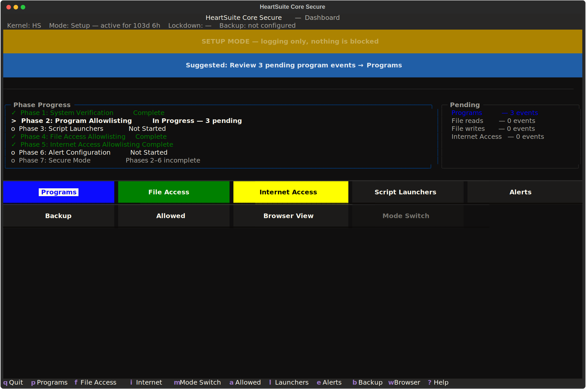
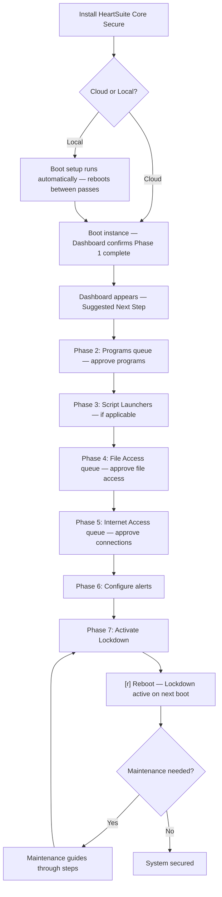

**Overview**: HeartSuite Core Secure must complete a guided setup journey in Setup Mode before it can enforce security in Lockdown.

## Why Setup Mode Is Necessary

HeartSuite Core Secure enforces a default-deny policy: every program must be explicitly approved to execute, to access files, and to make network connections — including programs running as root. Immediately after installation, the allowlist is empty. If the system activated Lockdown at this point, it would block the programs required for boot and shutdown, rendering the system inoperable.

Setup Mode solves this problem. In Setup Mode, HeartSuite Core Secure logs all activity without blocking anything. You review activity through the Dashboard queues, approve programs and their access, and build an allowlist that reflects the system's actual workload. Once the allowlist is complete, you activate Lockdown.

Setup Mode is the default after installation. HeartSuite Core Secure's automated backup also operates during Setup Mode, capturing versions of protected directories so files can be restored even before Lockdown is active.

## The 7 Phases

HeartSuite Core Secure organizes the setup journey into seven phases. The Dashboard tracks progress through each phase and always displays a Suggested Next Step.

| Phase | Name | Description |
|-------|------|-------------|
| 1 | System Verification | Confirms the HeartSuite Core Secure kernel is active and the system is in Setup Mode. Auto-completes on Cloud instances. |
| 2 | Program Allowlisting | Review and approve programs detected during observation from the Dashboard's Programs queue (`[p]`). |
| 3 | Script Launchers | Configure Secure Script Launchers for interpreted scripts from the Dashboard's Launchers (`[l]`), if applicable. |
| 4 | File Access Allowlisting | Review and approve file reads and writes from the Dashboard's File Access queue (`[f]`). |
| 5 | Internet Access Allowlisting | Review and approve internet connections from the Dashboard's Internet Access queue (`[i]`). |
| 6 | Alert Configuration | Configure at least one push channel (email, syslog, or webhook) from the Dashboard's Alert Settings (`[e]`). |
| 7 | Lockdown | Locked until phases 2 through 6 are complete. Activate via the Dashboard's Lockdown button (`[m]`). |

## Cloud vs. Local Path

### Cloud Path

Users who launch a pre-installed HeartSuite Core Secure cloud instance (AWS AMI, GCP image) boot directly into Setup Mode. The Dashboard confirms Phase 1 is complete. The Dashboard appears on first login with the current system state and a Suggested Next Step. No manual verification is required.

### Local Path

Users who install HeartSuite Core Secure on bare-metal or custom VMs follow a longer path:

1. Download and extract the installation package.
2. Prepare GRUB and install the HeartSuite Core Secure kernel.
3. HeartSuite Core Secure reads the startup and shutdown logs automatically, rebooting between passes until all startup and shutdown programs are in the allowlist.
4. After Phase 1 is complete, the Dashboard appears and the journey merges with the Cloud path.

Both paths converge at the Dashboard after Phase 1. From that point forward, the workflow is identical.

## From Installation to Lockdown

The following diagram shows the path from installation to Lockdown, including the maintenance cycle.

## Activating Lockdown

> [!WARNING]
>
> Complete all allowlisting phases in Setup Mode before activating Lockdown. If boot and shutdown programs have not been approved, the system will fail to start or shut down correctly.

When phases 2 through 6 are complete, the Dashboard unlocks Phase 7. The Suggested Next Step will prompt you to activate Lockdown. Activating Lockdown requires typing `YES` (case-sensitive) to confirm and displays an allowlist summary and pre-condition checklist before proceeding.

After activating Lockdown, the Dashboard offers one reboot option: `[r]` Reboot — Lockdown active on next boot. Lockdown is engaged automatically on every HeartSuite kernel boot.

## Maintenance in Lockdown

To perform system maintenance after activating Lockdown, select Maintenance (`[t]`) from the Dashboard. The immutable seal is active by default — the Maintenance guides you through a 3-step process across two reboots: removing immutable flags on the Non-HS kernel, making changes, then returning to the HeartSuite Core Secure kernel to review new activity. The Dashboard resumes at the correct step after each reboot.

For full details, see [Protecting During Maintenance](../../maintenance/protecting-during-maintenance/).
