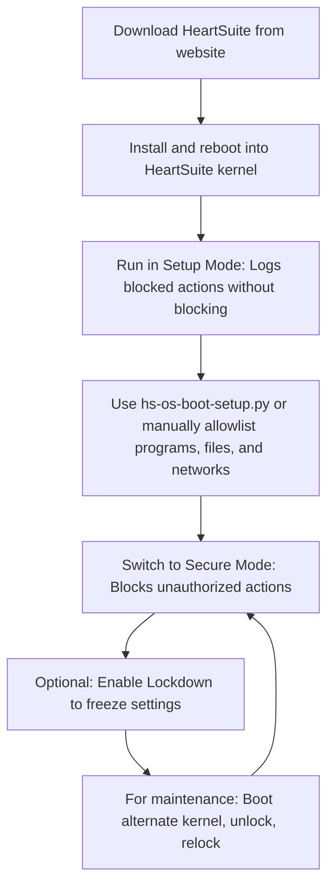

## Setup Overview

### Why Setup Mode is Necessary

Immediately after it is installed, HeartSuite is not yet ready to enter Secure mode due to the fact that HeartSuite neither discriminates between programs nor considers user privileges. It prevents necessary and useful startup programs, as well as shutdown programs, from being executed because no allowlist entry exists for such programs. Accordingly, these programs must first be identified and added to a allowlist entry in the HeartSuite allowlist database, along with their preferred access privileges, before HeartSuite can deploy a practical defense without interfering with legitimate operations.

Consequently, HeartSuite must be launched initially in Setup mode. In Setup Mode, the guided journey and review queues surface events from the Dashboard without raw logs. Thus, Setup mode serves as the observations to build your allowlist safely. Nonetheless, HeartSuite version backup also operates in this mode. Hence, even if one is merely watching the activity of a server using setup mode, HeartSuite provides some level of assurance through use of continuous automated backups.

To assure that HeartSuite is launched in this mode, the installation routine sets setup mode as the default. Once the configuration of allowlist entries has been completed, an administrative user uses the Dashboard and hs-review-programs (or equivalent) to change the mode to Secure.

### Switching to Secure Mode

> [!WARNING]
Finish setup in Setup Mode before switching to Secure Mode, or your system won't boot/shut down!

### Setup Workflow Diagram

