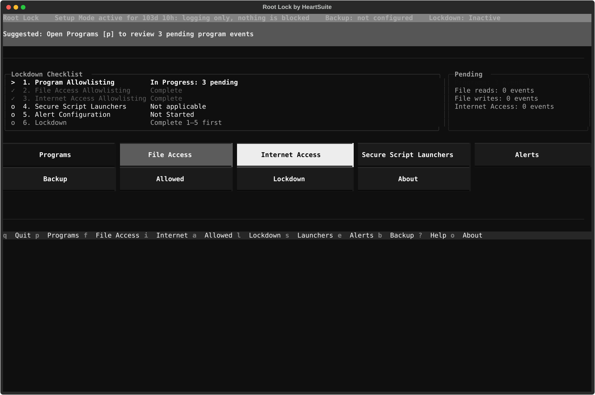
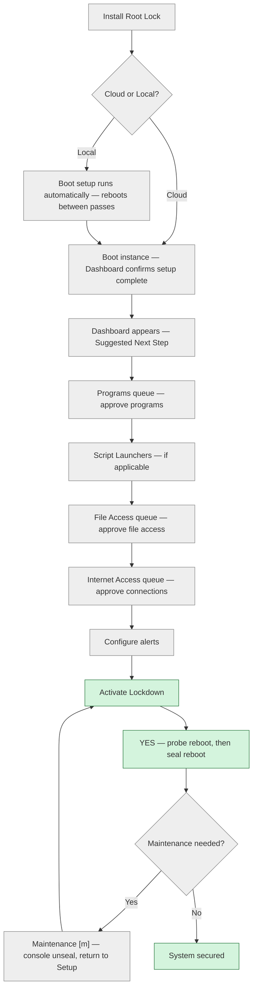

**Overview**: Immediately after install the allowlist is empty. Root Lock by HeartSuite logs in Setup Mode so you can review and approve programs, file access, and network connections — including as root — before Lockdown blocks everything else.

## Why Setup Mode is necessary

If Lockdown engaged with an empty allowlist, boot and shutdown programs would be blocked.

In Setup Mode, Root Lock logs activity without blocking it. You review that activity through the Dashboard queues, approve programs and their access, and build an allowlist that matches the workload. Then you activate Lockdown.

Setup Mode is the default after installation. Automated backup also runs in Setup Mode, so you can restore protected directories before Lockdown is active.

## Initial setup, then the Dashboard checklist

Initial setup runs unattended after you boot the Root Lock kernel. It reads startup and shutdown activity, adds those programs to the allowlist, and reboots as needed.

Cloud images already finished this at image-prep time. The Dashboard appears when that chain is complete.

| Checklist | Description |
|-----------|-------------|
| 1. Program Allowlisting | Review and approve programs from the Dashboard's Programs queue (`[p]`). |
| 2. File Access Allowlisting | Review and approve file reads and writes from the File Access queue (`[f]`). |
| 3. Internet Access Allowlisting | Review and approve internet connections from the Internet Access queue (`[i]`). |
| 4. Secure Script Launchers | Configure Secure Script Launchers from Launchers (`[s]`), if applicable. |
| 5. Alert Configuration | Configure at least one push channel (email, syslog, or webhook) from Alert Settings (`[e]`). |
| 6. Lockdown | Locked until the earlier checklist items are complete. Activate from Lockdown (`[l]`). Review the checklist, then type `YES` (case-sensitive). |

On the Dashboard, the Suggested Next Step can open Launchers (`[s]`) after Programs if interpreters are pending, even though that row sits at 4.

## Cloud Path and Local Path



Pre-installed on AWS, Google Cloud, Azure, DigitalOcean, Linode, and other providers. The Dashboard appears on first login.


Download from heartsecsuite.com, install, and boot the Root Lock kernel. Initial setup runs unattended. Once the Dashboard appears, both paths merge.



[Getting Started](../../getting-started/) covers both paths.

## From installation to Lockdown

The following diagram shows the path from installation to Lockdown, including the maintenance cycle.

```mermaid
graph TD
    A[Install Root Lock] --> B{Cloud or Local?}
    B -- Cloud --> C[Boot instance — Dashboard confirms setup complete]
    B -- Local --> D["Boot setup runs automatically — reboots between passes"]
    D --> C
    C --> E[Dashboard appears — Suggested Next Step]
    E --> F["Programs queue — approve programs"]
    F --> G["Script Launchers — if applicable"]
    G --> H["File Access queue — approve file access"]
    H --> I["Internet Access queue — approve connections"]
    I --> J["Configure alerts"]
    J --> K["Activate Lockdown"]
    K --> L["YES — probe reboot, then seal reboot"]
    L --> M{Maintenance needed?}
    M -- Yes --> N["Maintenance [m] — console unseal, return to Setup"]
    N --> K
    M -- No --> O[System secured]

    style A fill:#eee,stroke:#888
    style B fill:#eee,stroke:#888
    style C fill:#eee,stroke:#888
    style D fill:#eee,stroke:#888
    style E fill:#eee,stroke:#888
    style F fill:#eee,stroke:#888
    style G fill:#eee,stroke:#888
    style H fill:#eee,stroke:#888
    style I fill:#eee,stroke:#888
    style J fill:#eee,stroke:#888
    style M fill:#eee,stroke:#888
    style N fill:#eee,stroke:#888
    style K fill:#d4f4dd,stroke:#2a7a40
    style L fill:#d4f4dd,stroke:#2a7a40
    style O fill:#d4f4dd,stroke:#2a7a40
```

## Activating Lockdown

> [!WARNING]
>
> Complete all allowlisting in Setup Mode before activating Lockdown. If boot and shutdown programs have not been approved, the host will fail to start or shut down correctly.

Activating Lockdown shows an allowlist summary and a precondition checklist. Type `YES` (case-sensitive) to confirm. That starts a probe reboot; a second reboot applies the seal. See [Lockdown](../../mode-switching/) for the activation flow.

After Lockdown, the startup script re-engages the seal on every Root Lock kernel boot.

## Maintenance in Lockdown

To change a sealed allowlist, open Maintenance (`[m]`) from the Dashboard. After the seal is applied, reboot from a physical or serial console and select **Maintenance: unseal and return to Root Lock**. The seal lifts automatically and you return to Setup Mode. Review new activity, then lock down again.

See [Protecting During Maintenance](../../maintenance/protecting-during-maintenance/).
