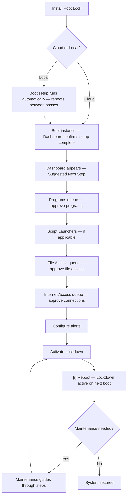

**Overview**: Root Lock by HeartSuite must complete a guided setup journey in Setup Mode before it can enforce security in Lockdown.

## Why Setup Mode is necessary

Root Lock enforces a default-deny policy: every program must be explicitly approved to execute, to access files, and to make network connections — including programs running as root. Immediately after installation, the allowlist is empty. If the system activated Lockdown at this point, it would block the programs required for boot and shutdown, rendering the system inoperable.

Setup Mode solves this problem. In Setup Mode, Root Lock logs all activity without blocking anything. You review activity through the Dashboard queues, approve programs and their access, and build an allowlist that reflects the system's actual workload. Once the allowlist is complete, you activate Lockdown.

Setup Mode is the default after installation. Root Lock's automated backup also operates during Setup Mode, capturing versions of protected directories so files can be restored even before Lockdown is active.

## Initial setup, then the Dashboard checklist

Initial setup runs unattended after you boot the Root Lock kernel. It reads startup and shutdown activity, adds those programs to the allowlist, and reboots as needed. Cloud images already finished this at image-prep time. The Dashboard does not appear until initial setup is complete.

The Dashboard then tracks the remaining checklist and always displays a Suggested Next Step.

| Checklist | Description |
|-----------|-------------|
| Program Allowlisting | Review and approve programs detected during observation from the Dashboard's Programs queue (`[p]`). |
| Script Launchers | Configure Secure Script Launchers for interpreted scripts from the Dashboard's Launchers (`[s]`), if applicable. |
| File Access Allowlisting | Review and approve file reads and writes from the Dashboard's File Access queue (`[f]`). |
| Internet Access Allowlisting | Review and approve internet connections from the Dashboard's Internet Access queue (`[i]`). |
| Alert Settings | Configure at least one push channel (email, syslog, or webhook) from the Dashboard's Alert Settings (`[e]`). |
| Lockdown | Locked until the earlier checklist items are complete. Activate via the Dashboard's Lockdown button (`[l]`). Review the checklist, then type `YES` (case-sensitive). |

## Cloud Path and Local Path



Users who launch a pre-installed Root Lock cloud instance (AWS AMI, GCP image) boot directly into Setup Mode. The Dashboard confirms setup is complete. The Dashboard appears on first login with the current system state and a Suggested Next Step. No manual verification is required. Installer logs from the cloud image build are accessible via the provider's serial console.


Users who install Root Lock on bare-metal or custom VMs follow a longer path:

1. Download and extract the installation package.
2. Prepare GRUB and install the Root Lock kernel.
3. Root Lock reads the startup and shutdown logs automatically, rebooting between passes until all startup and shutdown programs are in the allowlist.
4. After setup is complete, the Dashboard appears and the journey merges with the Cloud Path.



Both paths converge at the Dashboard after setup. From that point forward, the workflow is identical.

## From installation to Lockdown

The following diagram shows the path from installation to Lockdown, including the maintenance cycle.

```mermaid
graph TD
    A[Install Root Lock] --> B{Cloud or Local?}
    B -- Cloud --> C[Boot instance — Dashboard confirms setup complete]
    B -- Local --> D["Boot setup runs automatically — reboots between passes"]
    D --> C
    C --> E[Dashboard appears — Suggested Next Step]
    E --> F["Programs queue — approve programs"]
    F --> G["Script Launchers — if applicable"]
    G --> H["File Access queue — approve file access"]
    H --> I["Internet Access queue — approve connections"]
    I --> J["Configure alerts"]
    J --> K["Activate Lockdown"]
    K --> L["[r] Reboot — Lockdown active on next boot"]
    L --> M{Maintenance needed?}
    M -- Yes --> N["Maintenance guides through steps"]
    N --> K
    M -- No --> O[System secured]
```

## Activating Lockdown

> [!WARNING]
>
> Complete all allowlisting phases in Setup Mode before activating Lockdown. If boot and shutdown programs have not been approved, the system will fail to start or shut down correctly.

When phases 2 through 6 are complete, the Dashboard unlocks Phase 7. The Suggested Next Step will prompt you to activate Lockdown. Activating Lockdown displays an allowlist summary and a precondition checklist, then requires typing `YES` (case-sensitive) to confirm. See [Mode Switching and Lockdown](../../mode-switching/) for the activation flow.

After activating Lockdown, the Dashboard offers one reboot option: `[r]` Reboot — Lockdown active on next boot. Lockdown is engaged automatically on every Root Lock kernel boot.

## Maintenance in Lockdown

To perform system maintenance after activating Lockdown, select Maintenance (`[m]`) from the Dashboard. The immutable seal is active by default — the Maintenance guides you through a 3-step process across two reboots: removing immutable flags on the maintenance kernel, making changes, then returning to the Root Lock kernel to review new activity. The Dashboard resumes at the correct step after each reboot.

For full details, see [Protecting During Maintenance](../../maintenance/protecting-during-maintenance/).
