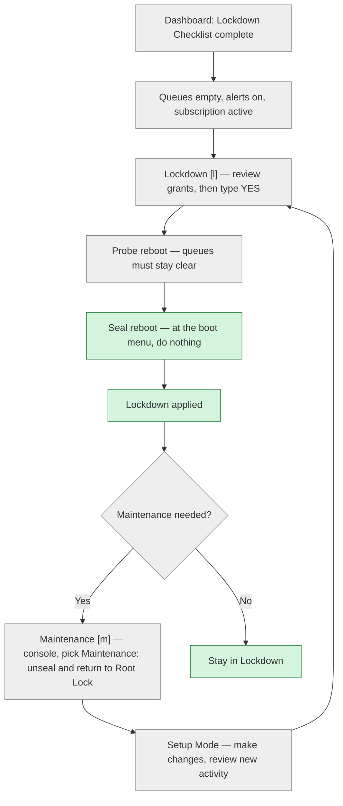
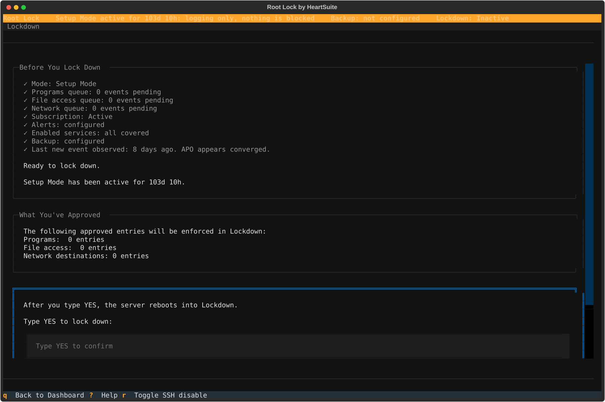

**Overview**: When you lock down from Setup Mode, Root Lock by HeartSuite blocks every program not on the allowlist, including any you forgot to approve, including as root.

The Dashboard guides activation through a precondition checklist and a typed `YES`. Lockdown then seals the allowlist with filesystem immutability (`chattr +i`): no program or user, including root, can modify it while the server is running.

## System states

Root Lock has two modes: Setup Mode and Lockdown. Both run on the Root Lock kernel. Lockdown is one event: blocking turns on and the configuration is sealed.

Booting the original maintenance kernel is not a Root Lock mode. It is the machine running without Root Lock.

| | Root Lock kernel loaded | Blocking | Logging | Backups | Dashboard |
|---|---|---|---|---|---|
| **Setup Mode** | Yes | No: logs only | Yes | Yes | Dashboard and all features available |
| **Lockdown** | Yes | Yes: blocks | Yes | Yes | Dashboard available; configuration sealed with filesystem immutability |
| **maintenance kernel** *(not a Root Lock mode)* | No: Root Lock absent | No | No | No | File-only tools only (see [Protecting During Maintenance](../maintenance/protecting-during-maintenance/)) |

The indicator at the top of the Dashboard shows the current protection state, and the Suggested Next Step tells you what to do next.

If the strip says **Lockdown not applied** while programs are already being blocked, that is not a chosen posture. It is a broken or unfinished seal. Open Maintenance (`[m]`).

### Trust graduation across modes

Each mode defines a different trust boundary.

In Setup Mode, you are trusted to teach the allowlist — anything not on the allowlist is logged but not blocked.

In Lockdown, trust is withdrawn from running programs regardless of which user runs them. Any program, including one running as root, must be on the allowlist. Your ability to change that allowlist at runtime is also withdrawn — configuration is sealed until Maintenance unseals it so you can install software or edit files.

> [!NOTE]
> Removing Lockdown takes physical or serial-console access. SSH is not enough.

### Protection state

The indicator at the top of the Dashboard reflects the current protection state:

| State | Indicator text |
|---|---|
| Setup Mode | **Root Lock    Setup Mode: logging only, nothing is blocked** … **Lockdown: Inactive** |
| Lockdown | **Root Lock    Lockdown applied** |
| Seal missing after Lockdown | **Root Lock    Lockdown not applied** |
| maintenance kernel | **maintenance kernel: Root Lock not active    No blocking · No logging · No backups** |

## Setup Mode and Lockdown

Lockdown activation stays locked until the earlier checklist items are complete. The Dashboard tracks progress and shows Lockdown as the Suggested Next Step when it is available.

The Dashboard prevents Lockdown activation until the review queues are empty, alerts are configured, the subscription is active, `heartsuite.service` is enabled, and the allowlist has been quiet for three days (no newly discovered programs, file paths, or network destinations). If any precondition is not satisfied, Lockdown (`[l]`) displays "Lockdown is not available yet" and lists what remains. `[s]` skips the three-day settling countdown only. Pending review queues must still be empty.

If you have not added the necessary access permissions or network address permissions to allowlist entries, Root Lock will block programs from accessing those files and network addresses when you activate Lockdown.

Once setup is complete, stay in Setup Mode for several days. File and network activity continues to appear in the review queues, so you can approve a more complete allowlist before Lockdown.

When installing new software, return to Setup Mode first. The Debian package manager `dpkg` creates temporary directories during installation. In Lockdown, that write fails and the installation halts. The temporary directory is gone before it can be added to an allowlist entry.

Open Maintenance (`[m]`) before using `dpkg`, add any additional access permissions needed, then lock down again from Lockdown (`[l]`).

One host can run many approved programs under Lockdown. Replacing those program files, or installing packages that write new files, still takes Setup Mode — the same Maintenance path, once. Many locked hosts reprovision from an updated image instead; see [Maintenance](../maintenance/) and [Enterprise Adoption Guide](../kernel-hardening/enterprise-adoption-guide/#operational-model-for-fleets).

## Switching between modes

### Dashboard-first Lockdown activation

The Dashboard is where you activate Lockdown. When all preconditions are met, the Suggested Next Step offers Lockdown activation. The precondition checklist includes:

- All review queues are empty (Programs `[p]`, File Access `[f]`, Internet Access `[i]`)
- Earlier checklist items are complete (Program Allowlisting through Alert Settings)
- Subscription is active
- `heartsuite.service` is enabled so the seal can engage on the next boot
- Three days with no newly discovered programs, paths, or destinations — or `[s]` to skip that countdown

### Activating Lockdown

From the Dashboard, select Lockdown (`[l]`). The Dashboard shows a precondition checklist, an observation period summary, and a review of your allowlist. Before you type `YES`, you can still change specific grants:

- `[u]` undo auto-narrowed install write grants (HeartSuite install tree only)
- `[m]` undo auto-narrowed kmod directory grants
- `[b]` undo auto-narrowed broad write grants
- `[g]` undo auto-narrowed file-write tool (GTFOBins) grants
- `[y]` undo auto-narrowed root grants on `/`
- `[t]` opt out of restricting `rm`, `cp`, and `mv` to the directories they used during Setup
- `[c]` add HeartSuite install paths to the Lockdown seal
- `[x]` exclude specific write-conflict paths from the seal; `[n]` put an excluded path back
- `[d]` undo a recursive seal on a broad directory
- SSH hardening (`[h]`) and SSH during Lockdown (`[r]` / `[j]`)
- inbound permit selection (`[o]` / `[a]`); `[k]` removes recorded permits

The commitment summaries and, after Lockdown, the Lockdown Inventory (`[l]`) are read-only. Change grants on the activation view, not on the inventory. When all preconditions are met, type `YES` (case-sensitive) to confirm.

(The screenshot shows the checklist and the `YES` field. Grant changes use the keys listed above.)

`YES` does not seal the machine on this boot. It starts a **probe reboot**. The Dashboard copy is "Probe reboot. Verifying queues stay clear." At that boot menu, do nothing. Wait. Do not select Maintenance.

If the queues stay clear, Root Lock finalizes Lockdown and reboots again to apply the seal. When the Dashboard is still open after finalize, it offers:

- `[r]` **Reboot now: Lockdown will be applied**

That second reboot is the seal. Again: at the boot menu, do nothing. Default is Root Lock. Do not select Maintenance.

Lockdown then persists on every Root Lock kernel boot. To make changes, use Maintenance (`[m]`).

> [!NOTE]
> **Serial console after these reboots (and after Maintenance return):** open the serial console (for example AWS EC2 Serial Console, `virsh console`, or your provider's serial). When you see **Press Enter to start.** (you may also see `[press ENTER to login]`), press **Enter once**. The Dashboard opens. That key does not confirm Lockdown or Maintenance — the mode change already finished at boot. Waiting with no key is normal; the machine is ready.

### After Lockdown: Lockdown Inventory

Once Lockdown is applied, Lockdown (`[l]`) opens the **Lockdown Inventory**. It is read-only. It answers what is sealed. It does not return you to Setup Mode.

### Making changes after Lockdown

From the Dashboard, open Maintenance (`[m]`). After Lockdown, that path requires physical or serial-console access.

1. Reboot from the **console**, not over SSH.
2. At the boot menu, select **Maintenance: unseal and return to Root Lock**.
3. The seal lifts automatically. The machine returns to the Root Lock kernel in Setup Mode. You do not stay on the maintenance kernel, and you do not press a key to remove flags.
4. Make your changes. New activity appears in the review queues.
5. Lock down again from Lockdown (`[l]`).

See [Protecting During Maintenance](../maintenance/protecting-during-maintenance/) for the safety checklist and isolation choices.

Do not use Lockdown (`[l]`) to remove Lockdown. That key opens the inventory.

## Lockdown: sealing the system

Lockdown seals Root Lock's configuration with filesystem immutability, so a compromised root account cannot tamper with the allowlist while the machine runs. The seal is system-wide: configuration, system files, accounts, scheduled tasks, and the maintenance tools themselves — all sealed in one step.

| | Setup Mode | Lockdown |
|---|---|---|
| Blocks unauthorised programs, file access, and network access | No — logs only | Yes |
| Logging | Yes | Yes |
| Backups | Yes | Yes |
| Can root edit allowlist entries or Root Lock config files? | Yes | **No** — immutable; writes are blocked until Maintenance removes the seal |
| Are file editors and broadly-scoped tools (`rm`, `cp`, `mv`) restricted? | No | **Yes**. Editors are sealed; `rm`, `cp`, and `mv` are replaced with restricted copies scoped to the paths your system uses them on. Restored when Maintenance unseals. |
| How long does the seal last? | N/A | Until Maintenance unseals. The seal persists across reboots and re-engages automatically on every Root Lock kernel boot. |
| How do you remove Lockdown? | N/A | Maintenance (`[m]`) — console, then **Maintenance: unseal and return to Root Lock**. Physical or serial-console access is required. |

### What Lockdown seals

Once Lockdown is engaged, Root Lock seals these categories at once, using `chattr +i`. Before you confirm, the Dashboard shows the paths that will be sealed, grouped by category with counts. The list is for review only.

- **Installation integrity** — HeartSuite install paths under `/opt/heartsuite`, plus allowlist files and the mode state. Defends against allowlist tampering and replacing Root Lock code that runs as root at login.
- **System integrity** — shared libraries (`/usr/lib/`), `/boot`, systemd unit directories, the SSH server config, and sudo policy. Defends against shared-library injection, malicious systemd units, and SSH or sudo policy weakened by a brief root compromise.
- **Authentication** — the account database (`/etc/passwd`, `/etc/shadow`, `/etc/group`) and no-login shells. Defends against an attacker who already has root creating accounts, changing passwords, or converting service accounts into interactive logins.
- **Boot-window persistence** — cron and anacron configuration, environment defaults, and root's shell profiles. Defends against an attacker scheduling a script to run after a reboot but before Lockdown re-engages, and against bash-profile backdoors that run on the next root login.
- **Maintenance tools** — file editors (`nano`, `vim`, `sed`, `ed`) made non-executable, and `rm`/`cp`/`mv` replaced with restricted copies whose write access is limited to the paths Root Lock saw those tools used for during Setup Mode. Defends against a compromised approved program leveraging admin tools that run with their own broad scope, not the caller's.

Lockdown also seals every program on the allowlist, so those binaries cannot be swapped while the machine is running.

After Maintenance unseals and you are back in Setup Mode, the Dashboard and `hs-manage-allowlist` may show temporary write grants covering some of the paths that Lockdown normally seals. Those grants exist only while the seal is lifted. The exact paths sealed by default appear in the inventory shown during activation, or in the [Compliance Quick Reference](../compliance-quick-reference/). Adjust grants before you type `YES`, not on the inventory.

If the Root Lock kernel fails to load, the startup script isolates the primary network interface and removes all immutable flags. The machine is then without Root Lock protection and without network access. Recovery requires booting to the maintenance kernel from physical or serial-console access, repairing or replacing the failed kernel, and locking down again.

Once Lockdown is on, root cannot change the immutability flags. The kernel disables `chattr`. This means no allowlist entries, configuration files, or protected directories can be modified, deleted, or added while Lockdown is active.

Lockdown persists across reboots — the startup script re-engages it automatically each time the Root Lock kernel starts. There is no Dashboard toggle to leave that automatic re-engagement on a normal install.

The filesystem immutability applied by Lockdown via `chattr +i` is a flag stored on disk, not in kernel memory. Immutable flags therefore persist across reboots, including a reboot that reaches the maintenance kernel, until Maintenance (or `HS_unlock.sh` in recovery) clears them.

### What this closes off

Two of the seals close attacks that are easy to miss.

**Compromised programs cannot borrow another program's tools.** When an approved web server runs `rm`, the deletion uses `rm`'s permissions, not the web server's. `rm` legitimately needs broad access during maintenance — so its allowlist is broad.

A compromised approved program could otherwise borrow that breadth. Lockdown replaces `rm` with `limited_rm`, whose own write paths cover only what was observed using `rm` during Setup Mode. Same for `cp` and `mv`. Opt out of that restriction with `[t]` before `YES` if you must.

**Nothing planted before the reboot survives it.** Lockdown engages after boot — there is a brief gap between the machine coming up and the seal taking hold.

Without sealing cron, anacron, environment defaults, and root's shell profiles, an attacker who already had root before a reboot could plant a script to run in that gap. With those files sealed during the prior Lockdown, the script never reaches them — and on the next boot, nothing has changed.

### Automatic Lockdown on boot

By default, the startup script re-engages Lockdown automatically on every Root Lock kernel boot. Once active, rebooting the Root Lock kernel will engage Lockdown before you can prevent it.

To install software or edit sealed files, boot the Maintenance entry from the console as described above. That procedure is in [Protecting During Maintenance](../maintenance/protecting-during-maintenance/).

### Restoring mutability after Lockdown

You can make files and directories mutable again once Lockdown is no longer active. Maintenance (`[m]`) does this automatically when you select **Maintenance: unseal and return to Root Lock** at the console. For recovery outside the Dashboard, run `HS_unlock.sh`.

If you try to write to an immutable file without removing the flags first, you will encounter the error "could not open <filename> file; errno:1."

If automatic GRUB configuration does not apply (Alpine or an unsupported bootloader), the Dashboard displays the exact entry to select manually. That selection requires physical or serial-console access.

### Lockdown commands

These are the actual scripts Lockdown uses. Most users never invoke them directly — the Dashboard's Lockdown (`[l]`) and Maintenance (`[m]`) run them for you.

- **`HS_lockdown.sh`** — runs when Lockdown is applied, and automatically on every Root Lock kernel boot after that. It seals Root Lock's configuration with `chattr +i`, disables file editors, then engages Lockdown via the kernel. Restricted `rm`/`cp`/`mv` copies are prepared during finalize, then sealed by this script.
- **`HS_unlock.sh`** — reverses `HS_lockdown.sh`. Maintenance runs this for you on the unseal path. Run it yourself only for recovery outside the Dashboard.
- **`hs-unlock-progs`** — internal helper called by `HS_unlock.sh`. Not invoked directly in normal use.

There is no separate CLI for changing mode. Use Lockdown (`[l]`) and Maintenance (`[m]`) on the Dashboard.

Setup is complete. When you need to install software or recover from Lockdown, see [Maintenance](../maintenance/). To replace the Root Lock kernel, see [Updating Root Lock](../maintenance/updating-heartsuite/).
