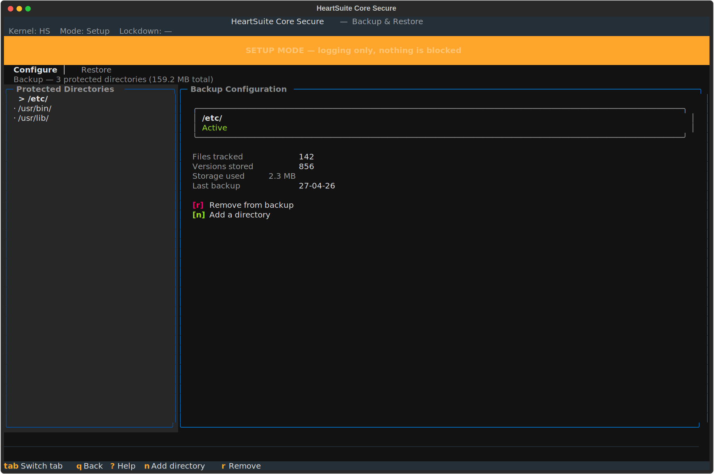

**Overview**: Allowlisting controls what programs can run, but an approved program that malware takes over can still write files — ransomware running inside an approved process can encrypt whatever that process can reach. Modern ransomware targets backup systems first — shadow copies and backup agents are typically deleted before files are encrypted. HeartSuite Core Secure automatically creates a versioned backup every time a file in a protected directory is written, and under Lockdown the kernel itself prevents any program from reaching those backups. No other program, including malware running as root, can read or destroy them. Versions are never automatically deleted.

## Automatic Versioning

HeartSuite Core Secure monitors a list of protected directories. When any file in those directories (including subdirectories) is written, HeartSuite Core Secure silently creates a new versioned backup before the write completes. This runs automatically in both Setup Mode and Secure Mode — protection begins from first boot, before you have reviewed a single item.

Enterprise backup tools back up on a schedule — hourly, nightly, weekly. An attack that completes between backup windows has nothing to recover from. HeartSuite Core Secure backs up on every write. There is no window. Other security products that offer rollback on Linux — including endpoint products with a rollback feature — rely on volume shadow copies or scheduled snapshots. The same gap exists: an attack that completes between snapshot intervals has nothing to recover from.

CVE-2024-40711 — Veeam Backup & Replication, unauthenticated RCE — shows the sharper problem: the backup product itself is the target. An attacker who reaches a Veeam host can execute code without authentication, destroy backups, then encrypt production files. HeartSuite Core Secure's backups have no running agent to exploit — under Lockdown, the kernel itself prevents any program from reaching them.

By default, `/home` is configured for backup. You can add or remove directories from the Dashboard's Backup.

## Configuring Protected Directories

From the Dashboard, select Backup (`[b]`). The Dashboard shows your current backup configuration — which directories are protected and when they were last backed up.



From here you can:

- **Add directories** (`[n]`) — protect additional directories (e.g., `/var/www`, `/etc`, `/usr/lib`)
- **Remove directories** (`[r]`) — stop backing up a directory (removing a directory does not delete existing backups; existing versions are retained)

Recommended directories include those containing user documents, executable files, configuration, and shared libraries. Avoid high-churn directories like log directories — backup creates a new version on every write.

> [!NOTE]
> Backup is optional. You can remove all directories, disabling backup entirely. Mode Switch does not require backup to be configured.

## Restoring File Versions

If a file is compromised — for example, encrypted by ransomware — the Dashboard's Backup lets you browse version history and restore any previous version of any file in a protected directory. The Backup offers two browse modes:

- **File-first** (`[f]`) — navigate by directory and file, then view versions of the selected file
- **Timeline** (`[t]`) — navigate by date, showing all files modified on a given day

To restore a single file, select it and choose the version to restore. Each version shows its timestamp and file size.

For ransomware recovery where many files were modified on the same date, use the Timeline view (`[t]`), press `[d]` to filter by date, review the affected files, and press `[b]` to batch restore all of them in one operation.

## Lockdown and Backup

When Lockdown is active, the backup configuration file is sealed — no user or program, including root, can add or remove directories. This prevents an attacker who compromises a running process from silently disabling backup. To change the backup configuration, enter a maintenance period first (see [Protecting During Maintenance](../protecting-during-maintenance/)).

## CLI Access for Scripting and Automation

For scripting and automation workflows that run without the Dashboard, the following CLI tools are available:

```bash
# hs-backup-config-manager add /var/www
# hs-backup-config-manager remove /home
# hs-backup-config-manager list
# hs-version-manager list /home/user/document.txt
# hs-version-manager restore /home/user/document.txt --version 2023-11-01
```

The Dashboard is the supported path for normal use.
