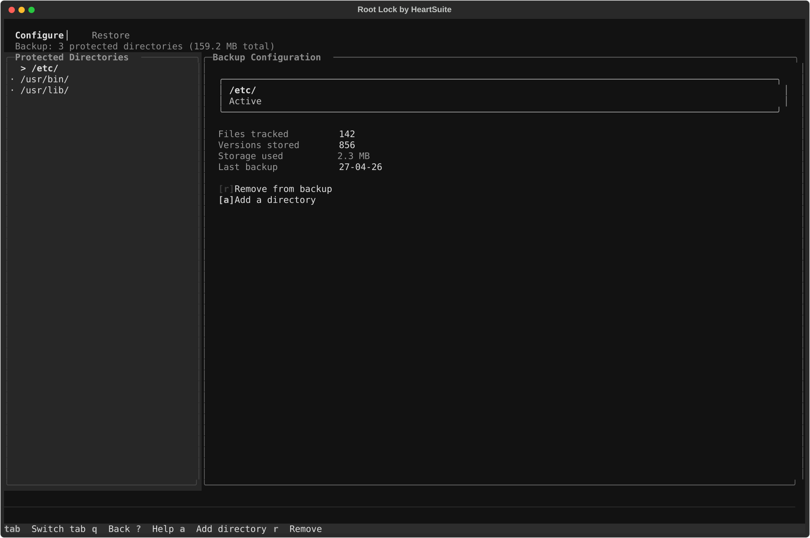

**Overview**: Allowlisting controls what programs can execute, but an approved program that malware takes over can still write files. Ransomware running inside an approved process can encrypt whatever that process can reach.

Modern ransomware targets backup systems first — shadow copies and backup agents are typically deleted before files are encrypted.

Root Lock by HeartSuite creates a versioned backup every time a file in a protected directory is written. Versioning runs on the Root Lock kernel in both Setup Mode and Lockdown. Backup is a recovery store, not a prevention control: it does not stop the first write.

Root Lock's backups are not permission-protected: no program, including malware running as root, can read or destroy them. Versions are never automatically deleted.

## Automatic versioning

Root Lock monitors a list of protected directories. When any file in those directories (including subdirectories) is written, Root Lock silently creates a new versioned backup before the write completes. This runs automatically in both Setup Mode and Lockdown — versioning begins from first boot, before you have reviewed a single item.

Enterprise backup tools back up on a schedule — hourly, nightly, weekly. An attack that completes between backup windows has nothing to recover from.

Root Lock backs up on every write. There is no window.

Other security tools that offer rollback on Linux — including endpoint tools with a rollback feature — rely on volume shadow copies or scheduled snapshots. The same gap exists: an attack that completes between snapshot intervals has nothing to recover from.

CVE-2024-40711 — Veeam Backup & Replication, unauthenticated RCE — shows the sharper problem: the backup tool itself is the target. An attacker who reaches a Veeam host can execute code without authentication, destroy backups, then encrypt production files. Root Lock's backups have no running agent to exploit — under Lockdown, the kernel itself prevents any program from reaching them.

By default, `/home` is configured for backup. You can add or remove directories from the Dashboard's Backup.

## Configuring protected directories

From the Dashboard, select Backup (`[b]`). Backup has two tabs: **Configure** and **Restore**. Configure shows which directories are protected and when they were last versioned.



From Configure you can:

- **Add a directory** (`[a]`) — protect additional directories (for example `/var/www`, `/etc`, `/usr/lib`)
- **Remove from backup** (`[r]`) — stop backing up a directory. Existing versions are retained until the retention window expires.

`[n]` on Backup is Cancel, not add.

Recommended directories include those containing user documents, executable files, configuration, and shared libraries. Avoid high-churn directories like log directories — backup creates a new version on every write.

> [!NOTE]
> Backup is optional. You can remove all directories, disabling backup entirely. Lockdown does not require backup to be configured.

## Restoring file versions

If a file is compromised — for example, encrypted by ransomware — the Dashboard's Backup lets you browse version history and restore any previous version of any file in a protected directory. The Backup offers two browse modes:

- **File-first** (`[f]`) — navigate by directory and file, then view versions of the selected file
- **Timeline** (`[t]`) — navigate by date, showing all files modified on a given day

To restore a single file, select it and choose the version to restore. Each version shows its timestamp and file size.

For ransomware recovery where many files were modified on the same date, use Timeline (`[t]`), press `[d]` to filter by date, review the affected files, and press `[b]` to batch restore all of them in one operation.

## Lockdown and backup

When Lockdown is active, the backup configuration file is sealed — no user or program, including root, can add or remove directories. This prevents an attacker who compromises a running process from silently disabling backup. To change the backup configuration, enter a maintenance period first (see [Protecting During Maintenance](../protecting-during-maintenance/)).

## Backup encryption

Root Lock backup files are versioned filesystem copies. They are not encrypted by Root Lock. If your environment requires data-at-rest encryption — for example, to meet GDPR, HIPAA, or PCI DSS requirements — configure full-disk encryption (dm-crypt/LUKS) at the OS level. LUKS encryption covers the backup files automatically, since they reside on the same filesystem as the rest of the host.

## CLI access for scripting and automation

For scripting and automation that runs without the Dashboard:

```bash
# hs-backup-config-manager list
# hs-backup-config-manager add -d /var/www
# hs-backup-config-manager del -d /home
# hs-version-manager list /home/user/document.txt
# hs-version-manager replace /home/user/document.txt <token>
```

The Dashboard is the supported path for normal use.
