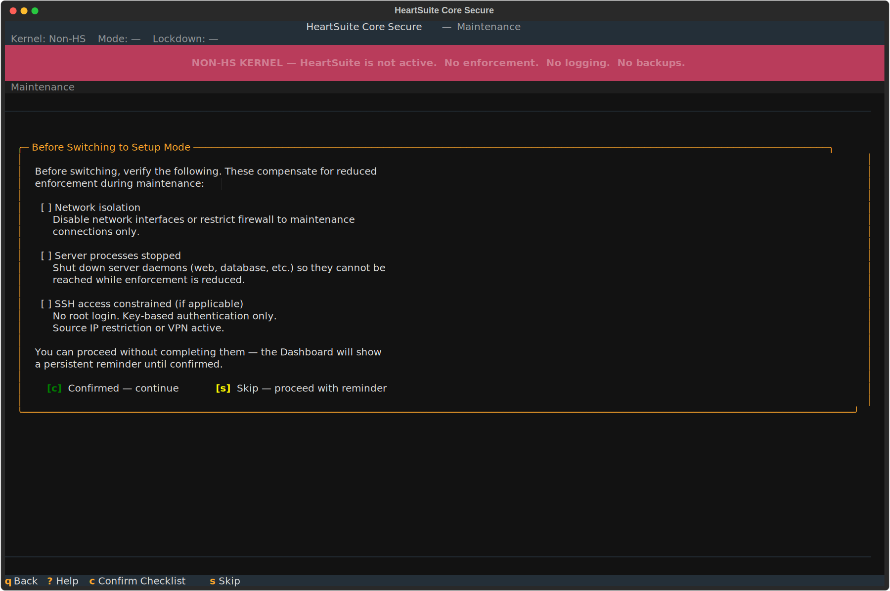

**Overview**: Every maintenance window is an attack window — blocking is temporarily suspended, and anything an attacker can reach during that period is unprotected. Maintenance — such as installing packages, editing files, or applying updates — is the period during which you temporarily reduce HeartSuite Root Lock's protection to make changes. The Dashboard's Maintenance (`[t]`) guides you through the entire process, from safety preparation to re-engaging Lockdown. The Maintenance appears only when the system is in Lockdown, Lockdown+sealed, or on the Non-HS kernel — it is not shown in Setup Mode, because in Setup Mode you are already in the maintenance-ready state.

Most maintenance uses **Option 1** below — a single reboot that stays on the HeartSuite Root Lock kernel in Setup Mode. No GRUB interaction and no old kernel required. **Option 2** (booting the Non-HS kernel) is only needed when the immutable seal is active, which is the less common path.

## Starting maintenance

From the Dashboard in Lockdown, select Maintenance (`[t]`). The Dashboard automatically detects whether the immutable seal is active and presents the correct path — you do not need to determine this yourself.

### Safety checklist

Before any mode change, Maintenance presents a safety checklist. The Dashboard auto-detects system state where possible and shows the status of each item:

- **Network isolation** — disable network interfaces or restrict firewall rules to prevent remote access during maintenance
- **Server processes** — shut down daemons (e.g., web servers) to close attack vectors
- **SSH access** — no root login, key-based auth only, source IP restriction

The Dashboard shows green checkmarks for items that pass and amber warnings for items that need attention. Press `[c]` Confirmed to proceed or `[s]` Skip to continue without completing the checklist. If you skip, the Dashboard displays a persistent reminder throughout the maintenance period — it does not disappear until you re-engage Lockdown.

> [!NOTE]
> The safety checklist is more critical for the Lockdown path (Option 2), where HeartSuite Root Lock will be completely absent. For the standard path (Option 1), HeartSuite Root Lock continues logging and running backups.

## Option 1: switch to Setup Mode (no Lockdown)

This is the standard maintenance path. The HeartSuite Root Lock kernel stays active. Logging and backups remain fully operational.

After completing the safety checklist, the Maintenance explains what will change:

- HeartSuite Root Lock switches from blocking to logging only
- The HeartSuite Root Lock kernel remains active
- Backups continue running
- The existing allowlist is preserved
- New activity is logged, not blocked — it will appear in the review queues when you re-engage Lockdown

Type `YES` (case-sensitive) to confirm the switch. The Dashboard reboots to apply the mode change.

After rebooting, the Dashboard shows Setup Mode is active with a Suggested Next Step. If the safety checklist was skipped, a persistent reminder appears. Make your changes — install packages, edit configuration, update software. HeartSuite Root Lock logs all new activity silently.

When finished, re-engage Lockdown from the Dashboard. New activity from the maintenance period appears in the review queues. Review and approve them through the standard allowlisting flow before Lockdown resumes.

## Option 2: boot the Non-HS Kernel (Lockdown active)

> [!NOTE]
> This path requires physical presence at the machine — a keyboard and monitor, a serial port, or your cloud provider's serial console (AWS EC2 Serial Console, GCP Serial Console, Azure Serial Console, DigitalOcean Console). Confirm that access before you start.

When Lockdown is active, the Maintenance does not offer the Setup Mode switch. Instead, it explains the situation and guides you through a 3-step process. This is the most complex journey in the product — it involves two reboots, a kernel selection at GRUB where the Dashboard cannot guide you, and a period where HeartSuite Root Lock is completely absent.

### Step 1 of 3: boot Non-HS Kernel and remove immutable flags

After the safety checklist and typing `YES` to confirm, the Dashboard prepares you for the GRUB boot menu — the one moment where it cannot provide guidance. It shows the exact Non-HS kernel name to select and warns you not to select the HeartSuite Root Lock kernel. Press `[r]` to reboot.

The Dashboard saves your maintenance session state before rebooting. This state persists across reboots and kernel changes — the step counter ("Step X of 3") follows you throughout the process.

After selecting the Non-HS kernel from GRUB, the Dashboard resumes automatically on login. It detects the absence of the HeartSuite Root Lock kernel module and adjusts its interface — actions that require the HeartSuite Root Lock kernel are hidden entirely, not greyed out. The Dashboard shows:

- "Non-HS kernel active. HeartSuite Root Lock is not loaded."
- "No blocking. No logging. No backups."
- "Maintenance step 1 of 3: Remove immutable flags."

Press `[u]` to remove the immutable flags set by Lockdown. After the flags are removed, the Dashboard presents the automatic Lockdown re-engagement choice:

- `[d]` **Disable automatic Lockdown re-engagement** — the startup script will no longer apply Lockdown on boot. You can re-enable this later. This simplifies future maintenance.
- `[k]` **Keep automatic re-engagement** — Lockdown will re-apply on every HeartSuite Root Lock kernel boot. Future maintenance will require this same process.

Both options carry equal weight — neither is recommended over the other. The choice depends on your operational needs.

> [!NOTE]
> If you accidentally select the wrong kernel at GRUB (the HeartSuite Root Lock kernel instead of the Non-HS kernel), the Dashboard detects this and guides you to reboot and select the correct kernel.

### Step 2 of 3: make your changes

The Dashboard transitions to the maintenance workspace:

- "Maintenance step 2 of 3: Make your changes."
- "You are on the Non-HS kernel. HeartSuite Root Lock is not active. Changes made now will not be logged."

Make your changes — install software, update packages, modify configuration files. When finished, press `[f]` to prepare the return to the HeartSuite Root Lock kernel. The Dashboard pre-configures Setup Mode for the next boot.

### Step 3 of 3: boot HeartSuite Root Lock kernel and review

Select the HeartSuite Root Lock kernel from GRUB. The Dashboard appears automatically, showing Setup Mode is active and displaying the maintenance step counter. Software installed during maintenance may generate new entries — these appear in the review queues. Review and approve them, then re-engage Lockdown from the Dashboard. If the immutable seal was previously active and you kept automatic re-engagement, Lockdown will re-apply on the next reboot.

> [!WARNING]
> The Non-HS kernel provides no HeartSuite Root Lock protection whatsoever. The safety checklist is critical for this path.

## Manual recovery outside the Maintenance screen

When Lockdown makes files immutable using `chattr +i`, those flags are stored at the filesystem level and persist across reboots — including reboots to the Non-HS kernel. If you attempt to modify a file that was made immutable during a previous Lockdown session, you will encounter an error such as "could not open <filename> file; errno:1." The Maintenance's `[u]` Remove immutable flags handles this automatically during Step 1 of the Lockdown path. For recovery outside the Dashboard, run `HS_unlock.sh`.
