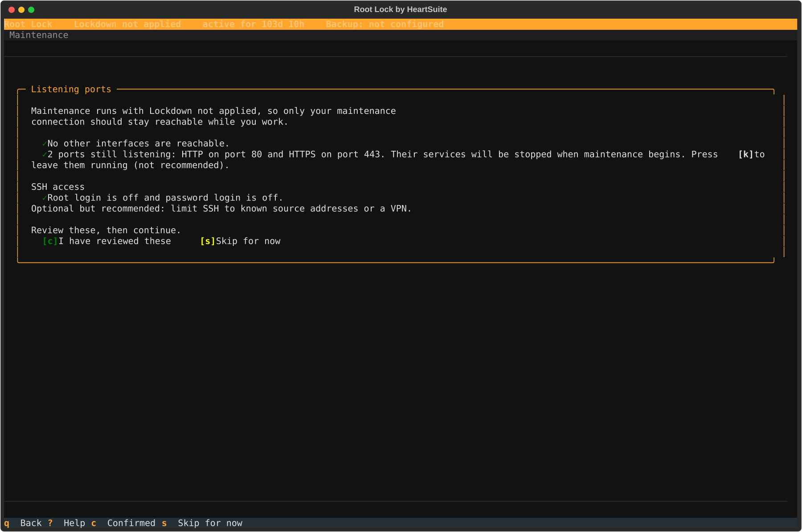

**Overview**: Every maintenance window is an attack window — blocking is temporarily suspended, and anything an attacker can reach during that period is unprotected.

Maintenance is the period when you temporarily reduce Root Lock by HeartSuite's protection to install packages, edit files, or apply updates. The Dashboard's Maintenance (`[m]`) guides you from the safety checklist through re-engaging Lockdown.

After Lockdown, the path is the console. You select **Maintenance: unseal and return to Root Lock** at the boot menu. The seal lifts automatically, and the machine returns to the Root Lock kernel in Setup Mode. You do not stay on the maintenance kernel to remove flags by hand.

A one-reboot switch that stays on the Root Lock kernel applies only when the strip already says **Lockdown not applied** — the seal is missing. That is not the usual path after a completed Lockdown.

## Starting maintenance

From the Dashboard in Lockdown, select Maintenance (`[m]`). The Dashboard detects whether the immutable seal is active and presents the correct path.

### Safety checklist

Before any mode change, Maintenance presents a safety checklist. The Dashboard auto-detects system state where possible and shows the status of each item:

- **Network isolation** — disable network interfaces or restrict firewall rules to prevent remote access during maintenance
- **Server processes** — shut down daemons (e.g., web servers) to close attack vectors
- **SSH access** — no root login, key-based auth only, source IP restriction

The Dashboard shows green checkmarks for items that pass and amber warnings for items that need attention. Press `[c]` Confirmed to proceed or `[s]` Skip to continue without completing the checklist. If you skip, the Dashboard displays a persistent reminder throughout the maintenance period — it does not disappear until you re-engage Lockdown.

The safety checklist matters most when you are about to lift the seal. While you are in Setup Mode with the Root Lock kernel still loaded, logging and backups continue.

## After Lockdown: unseal from the console

This is the path when Lockdown is applied. Physical or serial-console access is required (keyboard and monitor, a serial port, or your cloud provider's serial console — AWS EC2 Serial Console, GCP Serial Console, Azure Serial Console, DigitalOcean Console). Confirm that access before you start. You cannot do this from SSH.

After the safety checklist, Maintenance tells you to reboot from the **console**. It does not offer `[r]` Reboot on this path — the boot-menu choice has to happen at the console.

1. Open the console and restart the machine there.
2. At the boot menu, select **Maintenance: unseal and return to Root Lock**. Do not select the branded Root Lock kernel.
3. The seal lifts automatically (`HS_unlock.sh`). The machine restarts on its own and returns to the Root Lock kernel in Setup Mode.
4. On the serial console, press **Enter** when you see **Press Enter to start.** (see [Lockdown](../../lockdown/)).

The boot menu appears a second time during that automatic return. Let it be: reboot is already in motion and there is nothing to select.

You are then in Setup Mode on the Root Lock kernel:

- Blocking is off; logging and backups are on.
- New activity appears in the review queues.
- Maintenance (`[m]`) is hidden — you can already install software and edit files.

Make your changes — install packages, edit configuration, update software. When finished, lock down again from Lockdown (`[l]`). Review and approve the new queue items before you type `YES`. The activation flow is in [Lockdown](../../lockdown/).

If you accidentally select the Root Lock kernel at the first boot menu instead of the Maintenance entry, the Dashboard detects that and sends you back to reboot and select the correct entry.

> [!WARNING]
> Between selecting the Maintenance entry and the automatic return, Root Lock is not loaded. The safety checklist is the gate for that interval.

## When the seal is not applied

If the strip says **Lockdown not applied**, Maintenance offers a switch to Setup Mode that stays on the Root Lock kernel. Type `YES` (case-sensitive). The Dashboard then offers `[r]` Reboot.

After that reboot:

- Root Lock switches from blocking to logging only
- The Root Lock kernel remains active
- Backups continue running
- The existing allowlist is preserved
- New activity is logged, not blocked — it will appear in the review queues when you lock down again

This path is for an unfinished or drifted seal, not for a host that already shows **Lockdown applied**.

## Manual recovery outside Maintenance

When Lockdown makes files immutable using `chattr +i`, those flags are stored at the filesystem level and persist across reboots — including a reboot that reaches the maintenance kernel.

If you attempt to modify a file that was made immutable during a previous Lockdown session, you will encounter an error such as "could not open <filename> file; errno:1."

The console Maintenance entry runs `HS_unlock.sh` for you. For recovery outside the Dashboard, run `HS_unlock.sh`.
