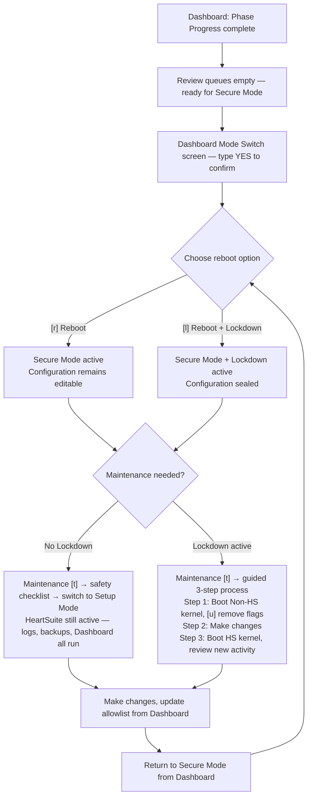

**Overview**: HeartSuite guides you through mode switching via the Dashboard. The system state depends on which kernel is booted and whether Lockdown is applied — the Dashboard shows you the current state and suggests the appropriate next action.

## System States

HeartSuite has two modes: Setup Mode and Secure Mode. Both run on the HeartSuite kernel. Lockdown is a separate decision you make after activating Secure Mode — it seals the configuration with filesystem immutability. Both running Secure Mode without Lockdown and running Secure Mode with Lockdown are valid configurations depending on your threat model. Lockdown can only be applied within Secure Mode; it is not a separate mode. Booting the original non-HS kernel is not a HeartSuite mode at all; it is the system running without HeartSuite.

| | HeartSuite kernel loaded | Enforcement | Logging | Backups | Dashboard and features |
|---|---|---|---|---|---|
| **Setup Mode** | Yes | No — logs only | Yes | Yes | Dashboard and all features available |
| **Secure Mode** | Yes | Yes — blocks | Yes | Yes | Dashboard and all features available |
| **Secure Mode + Lockdown** | Yes | Yes — blocks | Yes | Yes | Dashboard and all features available; configuration sealed with filesystem immutability |
| **Non-HS kernel** *(not a HeartSuite mode)* | No — HeartSuite absent | No | No | No | File-only tools only (see [Protecting During Maintenance](../maintenance/protecting-during-maintenance/)) |

In Setup Mode and Secure Mode, HeartSuite's kernel module is active. Backups, logging, and the Dashboard all function normally in both. Booting the non-HS kernel means HeartSuite is completely absent — the module is not loaded, no enforcement or logging takes place, and backups do not run.

The Dashboard provides orientation for these states. The Safety Banner displays the current state, and the Suggested Next Step guides you toward the appropriate action.

### Safety Banner States

The Dashboard displays a Safety Banner reflecting the current system state:

| State | Safety Banner |
|---|---|
| Setup Mode | **SETUP MODE** — logging only, nothing is blocked |
| Secure Mode (no Lockdown) | **SECURE MODE** — Lockdown not applied |
| Secure Mode + Lockdown | Silent (blank) |
| Non-HS kernel | **NON-HS KERNEL** — HeartSuite is not active. No enforcement. No logging. No backups. |

## Setup vs Secure Mode

At some point, you need to switch to Secure Mode to prevent malicious programs from starting, or to restrict the files and remote computers such programs may access. Secure Mode activation (Phase 7) is locked until all prior phases (2 through 6) are finished. The Dashboard tracks your progress through these phases and will indicate when Secure Mode activation is available as the Suggested Next Step.

> [!NOTE]
> The Dashboard prevents Secure Mode activation until all preconditions are met — including completion of all setup phases and boot configuration via `hs-os-boot-setup`. If any precondition is not satisfied, the Mode Switch screen (`[m]`) displays "Mode switch is not available yet" and lists what remains.

If you have not added the necessary access permissions or network address permissions to allowlist entries, HeartSuite will actively block programs from accessing those files and network addresses when you switch to Secure Mode.

Once HeartSuite has been configured, consider continuing in Setup Mode for several days. During that time, the review queues will capture additional file and network access activity. This information is valuable for further allowlist configuration before activating Secure Mode.

When installing new software, you must return to Setup Mode. For example, the Debian package manager `dpkg` creates temporary directories during installation. In Secure Mode, this generates a permission error and the installation halts. The temporary directory is removed before it can be added to an allowlist entry. Switch to Setup Mode before using `dpkg`, add any additional access permissions needed, then return to Secure Mode.



## Switching Between Modes

### Dashboard-First Mode Switch

The Dashboard is the primary interface for mode switching. When all preconditions are met, the Suggested Next Step will offer Secure Mode activation. The precondition checklist includes:

- All review queues are empty (Programs `[p]`, File Access `[f]`, Internet Access `[i]`)
- Boot configuration is complete (`hs-os-boot-setup`)
- Phase 7 is unlocked (phases 2 through 6 complete)

When preconditions are satisfied, the Dashboard presents the activation option.

### Activating Secure Mode

From the Dashboard, select the Mode Switch screen (`[m]`). The screen displays a precondition checklist, an observation period summary, and a review of your allowlist. When all preconditions are met, type `YES` (case-sensitive) to confirm activation.

After confirming, the Dashboard offers two reboot options:

- `[r]` **Reboot** — enforcement active, configuration remains editable
- `[l]` **Reboot + Lockdown** — enforcement active, configuration sealed with filesystem immutability

Both are valid configurations depending on your threat model. HeartSuite will boot in Secure Mode from that point forward until you switch back to Setup Mode.

### Returning to Setup Mode

From the Dashboard, use the Mode Switch screen (`[m]`) to return to Setup Mode for maintenance. You must return to Setup Mode before installing packages or making configuration changes that Secure Mode would block.

### Advanced: CLI Mode Switch

When booted into a Non-HS kernel (where the Dashboard's mode switch is not available), use the CLI to pre-configure the mode for the next HeartSuite kernel boot:

```bash
# sudo hs-mode-switch setup
```

## Lockdown: Securing Your System in Secure Mode

**Overview**: Lockdown seals HeartSuite's configuration with filesystem immutability, preventing tampering during production operation. The Dashboard displays the current lockdown status and provides the Suggested Next Step for managing it.

Lockdown is a separate decision you make after activating Secure Mode. Both running Secure Mode without Lockdown and running Secure Mode with Lockdown are valid configurations — the choice depends on your threat model. The table below summarises what changes when you apply Lockdown.

| | Secure Mode | Secure Mode + Lockdown |
|---|---|---|
| Blocks unauthorised programs, file access, and network access | Yes | Yes |
| Logging | Yes | Yes |
| Backups | Yes | Yes |
| Can root edit allowlist entries or HeartSuite config files? | Yes | **No** — immutable (attempting to write returns `errno:1`) |
| Can an attacker with root tamper with security settings? | Possible | **No** — protected by immutability |
| Can you modify files made immutable by Lockdown? | Yes | **No** — until `hs-unlock` is run after reboot |
| Maintenance tools (e.g. `rm`) optionally restricted? | No | **Optional** — can be made non-executable for additional hardening (see [Avoiding Configuration Gaps](../maintenance/avoiding-configuration-gaps/)) |
| Can Lockdown be engaged in Setup Mode? | N/A | No — Secure Mode is required first |
| How long does Lockdown last? | N/A | Until the next reboot |
| How do you exit Lockdown? | N/A | Boot the Non-HS kernel, or run `hs-unlock` after a reboot without Lockdown |

### What Lockdown Does

Once Lockdown is engaged, HeartSuite prevents any changes to the allowlist entries and other settings. Lockdown makes HeartSuite configuration files and directories immutable using `chattr +i`. For additional hardening, the lockdown script can optionally be configured to make tools like `rm` non-executable — see [Avoiding Configuration Gaps](../maintenance/avoiding-configuration-gaps/).

Once Lockdown is engaged, the HeartSuite kernel disables `chattr` entirely — no user or program, including root, can change the immutability flags. This means no allowlist entries, configuration files, or protected directories can be modified, deleted, or added while Lockdown is active.

Lockdown lasts until the next time your server is booted; there is no direct way to turn Lockdown off. Lockdown cannot be engaged in Setup Mode; if you attempt to do so, an error message is written to the kernel log. The filesystem immutability applied by Lockdown via `chattr +i` is a filesystem-level attribute, not a kernel-module state. This means that immutable flags set during Lockdown persist across reboots, including reboots into the Non-HS kernel. If you boot the Non-HS kernel for maintenance after Lockdown was active, you must run `hs-unlock` before attempting to modify any files that were made immutable.

### Automatic Lockdown on Boot

Lockdown can be configured to re-engage automatically on every HeartSuite kernel boot. When you choose `[l]` Reboot + Lockdown from the Mode Switch screen, the startup script applies Lockdown each time the HeartSuite kernel starts. Once enabled, rebooting will always engage Lockdown before you can prevent it.

The Dashboard's Maintenance screen (`[t]`) detects automatic re-engagement and presents a guided choice: `[d]` Disable automatic Lockdown re-engagement or `[k]` Keep it. You do not need to edit any scripts manually. To disengage Lockdown when automatic re-engagement is active, boot to the Non-HS kernel; this procedure is discussed in [Protecting During Maintenance](../maintenance/protecting-during-maintenance/).

### Restoring Mutability After Lockdown

Files and directories may be made mutable again once Lockdown is no longer active. The Dashboard's Maintenance screen (`[t]`) handles this automatically during the guided maintenance process — Step 1 of 3 offers `[u]` Remove immutable flags. For manual recovery outside the maintenance wizard, run `hs-unlock` from the CLI.

If you try to write to an immutable file without removing the flags first, you will encounter the error "could not open <filename> file; errno:1."

You must have either physical or serial port access to your server to reboot to the Non-HS kernel — attackers cannot remotely reboot to bypass HeartSuite, providing another layer of defense.

### Advanced: Lockdown CLI Tools

The underlying CLI tools are available for advanced configuration and automation:

- **`hs-activate-lockdown`** — makes files and directories immutable, then engages the lockdown program. Strongly recommended over running `hs-lockdown` directly.
- **`hs-lockdown`** — engages lockdown without setting immutability flags. Use `hs-activate-lockdown` instead for complete protection.
- **`hs-unlock`** — reverses all immutability set by Lockdown so you can make configuration changes.
- **`hs-unlock-progs`** — restores mutability for HeartSuite files only (subset of what `hs-unlock` does).
