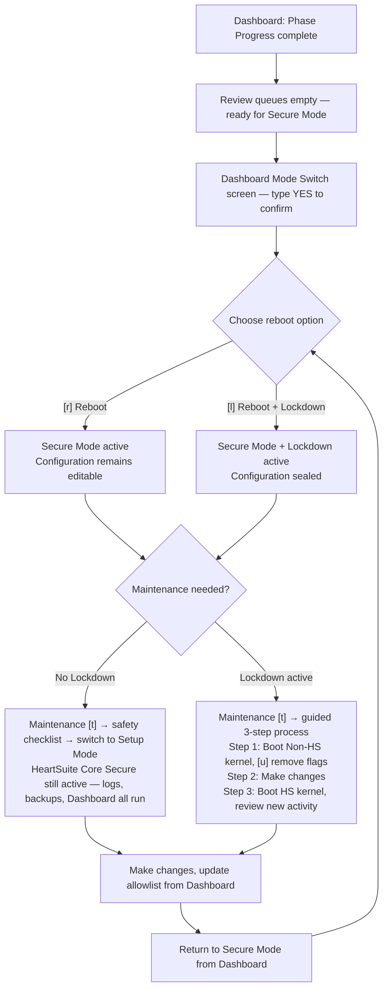

**Overview**: Moving from observation to enforcement blocks every program not on the allowlist — including any you forgot to approve. The Dashboard guides the transition through a precondition checklist and a deliberate confirmation. Lockdown seals the allowlist after the switch: no program or user, including root, can modify it while the server is running.

## System States

HeartSuite Core Secure has two modes: Setup Mode and Secure Mode. Both run on the HeartSuite Core Secure kernel. Lockdown is a separate decision you make after activating Secure Mode — it seals the configuration with filesystem immutability. Both running Secure Mode without Lockdown and running Secure Mode with Lockdown are valid configurations depending on your security requirements. Lockdown can only be applied within Secure Mode; it is not a separate mode. Booting the original Non-HS kernel is not a HeartSuite Core Secure mode at all; it is the system running without HeartSuite Core Secure.

| | HeartSuite Core Secure kernel loaded | Enforcement | Logging | Backups | Dashboard and features |
|---|---|---|---|---|---|
| **Setup Mode** | Yes | No — logs only | Yes | Yes | Dashboard and all features available |
| **Secure Mode** | Yes | Yes — blocks | Yes | Yes | Dashboard and all features available |
| **Secure Mode + Lockdown** | Yes | Yes — blocks | Yes | Yes | Dashboard and all features available; configuration sealed with filesystem immutability |
| **Non-HS kernel** *(not a HeartSuite Core Secure mode)* | No — HeartSuite Core Secure absent | No | No | No | File-only tools only (see [Protecting During Maintenance](../maintenance/protecting-during-maintenance/)) |

In Setup Mode and Secure Mode, HeartSuite Core Secure's kernel module is active. Backups, logging, and the Dashboard all function normally in both. Booting the Non-HS kernel means HeartSuite Core Secure is completely absent — the HS kernel is not loaded, no enforcement or logging takes place, and backups do not run.

The Dashboard provides orientation for these states. The indicator at the top displays the current protection state, and the Suggested Next Step guides you toward the appropriate action.

### Trust Graduation Across Modes

Each mode defines a different trust boundary. In Setup Mode, you are trusted to teach the allowlist — anything not on the allowlist is logged but not blocked. In Secure Mode, trust is withdrawn from running programs regardless of UID; any program, including one running as root, is gated by the allowlist. With Lockdown applied, your ability to change the allowlist at runtime is also withdrawn — configuration is sealed until the next reboot. Maintenance reopens that window deliberately, and booting the Non-HS kernel for Lockdown recovery requires physical presence — a keyboard and monitor, a serial port, or your cloud provider's serial console — preventing a remote attacker from triggering it.

### Protection State

The indicator at the top of the Dashboard reflects the current system state:

| State | Indicator text |
|---|---|
| Setup Mode | **SETUP MODE** — logging only, nothing is blocked |
| Secure Mode (no Lockdown) | **SECURE MODE** — Lockdown not applied |
| Secure Mode + Lockdown | Silent (blank) |
| Non-HS kernel | **NON-HS KERNEL** — HeartSuite Core Secure is not active. No enforcement. No logging. No backups. |

## Setup Mode and Secure Mode

At some point, you need to switch to Secure Mode to prevent malicious programs from starting, or to restrict the files and network destinations such programs may access. Secure Mode activation (Phase 7) is locked until all prior phases (2 through 6) are finished. The Dashboard tracks your progress through these phases and will indicate when Secure Mode activation is available as the Suggested Next Step.

> [!NOTE]
> The Dashboard prevents Secure Mode activation until all preconditions are met — including completion of all setup phases and the System Setup screen steps. If any precondition is not satisfied, the Mode Switch screen (`[m]`) displays "Mode switch is not available yet" and lists what remains.

If you have not added the necessary access permissions or network address permissions to allowlist entries, HeartSuite Core Secure will actively block programs from accessing those files and network addresses when you switch to Secure Mode.

Once HeartSuite Core Secure has been configured, consider continuing in Setup Mode for several days. During that time, the review queues will capture additional file and network access activity — giving you a more complete allowlist before enforcement begins.

When installing new software, you must return to Setup Mode. For example, the Debian package manager `dpkg` creates temporary directories during installation. In Secure Mode, this generates a permission error and the installation halts. The temporary directory is removed before it can be added to an allowlist entry. Switch to Setup Mode before using `dpkg`, add any additional access permissions needed, then return to Secure Mode.



## Switching Between Modes

### Dashboard-First Mode Switch

The Dashboard is where you switch modes. When all preconditions are met, the Suggested Next Step will offer Secure Mode activation. The precondition checklist includes:

- All review queues are empty (Programs `[p]`, File Access `[f]`, Internet Access `[i]`)
- Boot configuration is complete (System Setup screen)
- Phase 7 is unlocked (phases 2 through 6 complete)

When preconditions are satisfied, the Dashboard presents the activation option.

### Activating Secure Mode

From the Dashboard, select the Mode Switch screen (`[m]`). The screen displays a precondition checklist, an observation period summary, and a review of your allowlist. When all preconditions are met, type `YES` (case-sensitive) to confirm activation.

> [!SCREENSHOT]
> **Screenshot needed**: Mode Switch screen (`[m]`) — show the screen with all preconditions met (green checkmarks throughout), the observation period summary visible, and the YES confirmation prompt ready for input. Capture the full terminal screen so the SETUP MODE indicator at the top is visible.

After confirming, the Dashboard offers two reboot options:

- `[r]` **Reboot** — enforcement active, configuration remains editable
- `[l]` **Reboot + Lockdown** — enforcement active, configuration sealed with filesystem immutability

Both are valid configurations depending on your security requirements. HeartSuite Core Secure will boot in Secure Mode from that point forward until you switch back to Setup Mode.

### Returning to Setup Mode

From the Dashboard, use the Mode Switch screen (`[m]`) to return to Setup Mode for maintenance. You must return to Setup Mode before installing packages or making configuration changes that Secure Mode would block.

### Switching Mode from a Non-HS Kernel

When booted into a Non-HS kernel, set the mode before rebooting to the HeartSuite Core Secure kernel:

```bash
# sudo hs-mode-switch setup
```

## Lockdown: Securing Your System in Secure Mode

Lockdown seals HeartSuite Core Secure's configuration with filesystem immutability, preventing tampering during production operation. The Dashboard displays the current Lockdown status and provides the Suggested Next Step for managing it.

Lockdown is a separate decision you make after activating Secure Mode. Both running Secure Mode without Lockdown and running Secure Mode with Lockdown are valid configurations — the choice depends on how strictly you want to lock down the system. The table below summarises what changes when you apply Lockdown.

| | Secure Mode | Secure Mode + Lockdown |
|---|---|---|
| Blocks unauthorised programs, file access, and network access | Yes | Yes |
| Logging | Yes | Yes |
| Backups | Yes | Yes |
| Can root edit allowlist entries or HeartSuite Core Secure config files? | Yes | **No** — immutable; attempts to write are blocked by the kernel until the seal is removed via Maintenance |
| Can an attacker with root tamper with security settings? | Possible | **No** — protected by immutability |
| Can you modify files made immutable by Lockdown? | Yes | **No** — until the seal is removed via the Maintenance screen on the Non-HS kernel |
| Are file editors and broadly-scoped tools (`rm`, `cp`, `mv`) restricted? | No | **Yes** — automatically. Editors are sealed; `rm`, `cp`, and `mv` are replaced with restricted copies scoped to the paths your system uses them on. Restored automatically when you enter Maintenance. |
| Can Lockdown be engaged in Setup Mode? | N/A | No — Secure Mode is required first |
| How long does Lockdown last? | N/A | Until the next reboot |
| How do you exit Lockdown? | N/A | Boot the Non-HS kernel (physical presence required — keyboard and monitor, serial port, or cloud serial console — select from GRUB manually), or run `HS_unlock.sh` after a reboot without Lockdown |

### What Lockdown Does

Once Lockdown is engaged, HeartSuite Core Secure seals five things at once, all using `chattr +i`. The Lockdown setup screen shows the full inventory before you confirm, with per-category counts and a `[v] View full inventory` action per category. Restoration is automatic when you enter Maintenance.

The five categories Lockdown seals:

- **HeartSuite configuration** — your allowlist files, the mode state file, and the kernel image directory. Defends against allowlist tampering and kernel swap by an attacker who escalates to root.
- **System integrity** — shared libraries (`/usr/lib/`), systemd unit directories, the SSH server config, and sudo policy. Defends against shared-library injection (a modified `libc.so` backdooring every program loading it), malicious systemd units installed to fire on next boot, and SSH or sudo policy weakened by a brief root compromise.
- **Authentication state** — the account database (`/etc/passwd`, `/etc/shadow`, `/etc/group`) and no-login shells. Defends against an escalated attacker creating accounts, changing passwords, or converting service accounts into interactive logins.
- **Boot-window and shell persistence** — cron and anacron configuration, environment defaults, and root's shell profiles. Defends against an attacker scheduling a script to run after a reboot but before Lockdown re-engages, and against bash-profile backdoors fired on the next root login.
- **Maintenance tools** — file editors (`nano`, `vim`, `sed`, `ed`) made non-executable, and `rm`/`cp`/`mv` replaced with restricted copies whose write access is limited to the paths the kernel saw those tools used for during Setup Mode. Defends against a compromised approved program leveraging admin tools that run with their own broad scope, not the caller's.

If the HeartSuite kernel ever fails to load on a future boot — for example, an accidental boot of the original kernel, a corrupted module, or a missing dependency — the startup script automatically isolates the primary network interface and removes all Lockdown immutable flags so the administrator can recover. This is a documented recovery path, not a security bypass: the unprotected machine is taken off the network before any seals are removed.

Once Lockdown is engaged, the HeartSuite Core Secure kernel disables `chattr` entirely — no user or program, including root, can change the immutability flags. This means no allowlist entries, configuration files, or protected directories can be modified, deleted, or added while Lockdown is active.

Lockdown lasts until the next time your server is booted; there is no direct way to turn Lockdown off. Lockdown cannot be engaged in Setup Mode; if you attempt to do so, an error message is written to the kernel log. The filesystem immutability applied by Lockdown via `chattr +i` is a flag stored on disk, not in kernel memory. This means that immutable flags set during Lockdown persist across reboots, including reboots into the Non-HS kernel. If you boot the Non-HS kernel for maintenance after Lockdown was active, you must run `hs-unlock` before attempting to modify any files that were made immutable.

### Automatic Lockdown on Boot

Lockdown can be configured to re-engage automatically on every HeartSuite Core Secure kernel boot. When you choose `[l]` Reboot + Lockdown from the Mode Switch screen, the startup script applies Lockdown each time the HeartSuite Core Secure kernel starts. Once enabled, rebooting will always engage Lockdown before you can prevent it.

The Dashboard's Maintenance screen (`[t]`) detects automatic re-engagement and presents a guided choice: `[d]` Disable automatic Lockdown re-engagement or `[k]` Keep it. You do not need to edit any scripts manually. To disengage Lockdown when automatic re-engagement is active, boot to the Non-HS kernel; this procedure is discussed in [Protecting During Maintenance](../maintenance/protecting-during-maintenance/).

### Restoring Mutability After Lockdown

Files and directories may be made mutable again once Lockdown is no longer active. The Dashboard's Maintenance screen (`[t]`) handles this automatically during the guided maintenance process — Step 1 of 3 offers `[u]` Remove immutable flags. For manual recovery outside the maintenance wizard, run `HS_unlock.sh` from the CLI.

If you try to write to an immutable file without removing the flags first, you will encounter the error "could not open <filename> file; errno:1."

Selecting the Non-HS kernel from GRUB is intentionally manual — it requires physical presence at the machine: a keyboard and monitor, a serial port, or your cloud provider's serial console. An attacker cannot trigger it remotely, even as root. Before you reboot, the Maintenance screen (`[t]`) displays the exact GRUB entry to select — you do not need to know it in advance. Returning to HeartSuite after maintenance is automatic: the HS kernel is always the GRUB default, so a reboot brings you back without any GRUB interaction.

### Lockdown Commands

These are the actual scripts Lockdown uses. Most users never invoke them directly — the Dashboard's `[m]` Mode Switch and `[t]` Maintenance screens run them for you.

- **`HS_lockdown.sh`** — runs when you press `[m]` Mode Switch → `[l]` Reboot + Lockdown, and again automatically on every boot. It seals HeartSuite Core Secure's configuration with `chattr +i`, disables file editors, replaces `rm`/`cp`/`mv` with restricted copies, then engages Lockdown via the kernel.
- **`HS_unlock.sh`** — reverses `HS_lockdown.sh`. The Maintenance screen runs this for you when you press `[u]` as Step 1 of the Lockdown maintenance flow. Run it yourself only for recovery outside the Dashboard.
- **`hs-unlock-progs`** — internal helper called by `HS_unlock.sh`. Not invoked directly in normal use.
