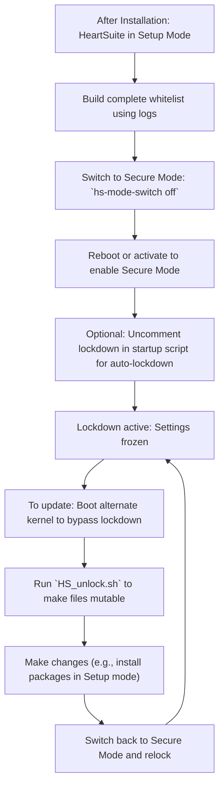

**Overview**: Start in Setup mode (logs but allows) to build permissions, then switch to Secure mode (blocks unauthorized actions).

## Setup vs Secure Mode

At some point, you need to switch to Secure mode in order to prevent malicious programs from starting, or at least to restrict the files and remote computers such programs may access. You activate Secure mode using the hs-mode-switch program, as explained below. Before switching to Secure mode however, you must have successfully run the hs-os-boot-setup.py script, as explained above, repeatedly until you have received the message, “Great! Your OS and its related programs are now whitelisted.”. Characteristically, the message will appear after running the script three or four times.

> [!WARNING]
> As stated above, if you fail to setup HeartSuite properly using the **hs-os-boot-setup.py** script multiple times, your computer will not boot or shutdown when you change to Secure mode; instead, it will merely hang!

Moreover, if you fail to add needed access permissions or network address permissions to whitelist entries, HeartSuite will actively block programs from accessing needed files and network addresses when you change to Secure mode.

Once HeartSuite has been configured as desired, it would behoove you to continue using it in Setup mode for some time, such as a few days or even a week or so. During that time, you will be able to use the logs to gather more information about file and network access activity. This information could prove invaluable for further whitelist entry configuration before moving to Secure mode.

Please note that, at times, you must revert to Setup mode when installing new software. For example, the Debian package manager, `dpkg`, creates temporary directories when installing packages. In Secure mode, this behavior will generate a permission error and cause the program to halt. By the time you have seen the error however, the temporary directory has been removed; therefore, it cannot be added to a whitelist entry. Thus, the simple solution is to use `dpkg` in Setup mode, then add any additional access permissions needed, then return to Secure mode.



## Switching Between Modes

To switch to Secure mode, you instruct the `hs-mode-switch` program to switch to secure mode:

```bash
# sudo /.hs/sys/hs-mode-switch off
```

This program will verify that you, in fact, wish to switch to Secure mode. Specifically, it will display a warning message and require that you signify your intent to activate Secure mode by typing the word ‘YES’, in all capital letters:

After switching to secure mode, you must then either reactivate HeartSuite, by running the `activate_HS` program, or reboot. This final step is necessary for Secure mode to be activated. Thereafter, HeartSuite will always boot in Secure mode until you use the `hs-mode-switch` program to change back to Setup mode, which you must do before installing packages.

You can view the result of trying to activate Secure mode by reading the kernel log:

If a problem occurs, you can view the error condition in the kernel log:

You may switch back to Setup mode anytime by using the `hs-mode-switch` program again:

```bash
# sudo /.hs/sys/hs-mode-switch setup
```

**Overview**: Lockdown freezes HeartSuite settings to prevent tampering—great for production.

## Lockdown: Securing Your System in Secure Mode

The `hs-lockdown` program protects HeartSuite settings during Secure mode. In particular, HeartSuite prevents any changes to the whitelist entries and other settings once lockdown is initiated. Moreover, the `HS_lockdown.sh` script starts the `hs-lockdown` program and also protects others files and directories from tampering by attackers during lockdown. Technically speaking, lockdown lasts until the next time your server is booted; there is no direct way to turn lockdown off. Please note that Lockdown cannot be engaged in Setup mode; if you try to do so, an error message is merely written to the kernel log.

Included in the HeartSuite installation is a systemd service unit named `heartsuite.service`. This service unit executes a shell script named `HS_startup.sh` at startup. The `HS_startup.sh` script executes the `activate_HS` program, which is the program that actually activates HeartSuite. Thus, this sequence of events starts HeartSuite automatically after booting. The `HS_startup.sh` script also contains a line that invokes the `HS_lockdown.sh` script immediately after activating HeartSuite, but, by default, the line is commented out. In order to engage lockdown immediately after booting in Secure mode, you must first uncomment this line. Once the line is uncommented, the startup script will always call the lockdown script. In that situation, rebooting will always engage lockdown before you can prevent it. In order to disengage lockdown, you must boot to an alternate kernel; this procedure will be discussed in the section below, “Protecting Your Server During Maintenance.”

The essence of lockdown involves protecting files and directories from being changed. This protection is achieved by first making a file or directory immutable. Files and directories can be made immutable programmatically or by use of the command line tool, chattr. You can view whether particular files and directories are immutable using the lsattr command line tool. The chattr tool can also be used to make files and directories mutable again. Lockdown merely disables chattr functionality; therefore, no changes in mutability can be made once lockdown is engaged.

Although the `hs-lockdown` program supplied with HeartSuite can be executed directly, we urge you to run it indirectly. Specifically, we strongly recommend that you execute the `HS_lockdown.sh` script. This script provides a list of files and directories that you should consider protecting with lockdown. The script makes files and directories immutable using `chattr`, then executes the `hs-lockdown` program. Please feel free to edit this script to meet your needs, but keep in mind that once the `hs-lockdown` program has been executed, no changes in mutability may be made.

Files and directories may be made mutable again once lockdown is no longer active. The program `hs-unlock-progs`, also supplied with HeartSuite, switches all HeartSuite files back to being mutable so that you can make further configuration changes. The script `HS_unlock.sh` runs the `hs-unlock-progs` program and then makes other files and directories mutable again. In essence, this script is the counterpart to the `HS_lockdown.sh` script. Thus, any files or directories that are made immutable with the `HS_lockdown.sh` script should be returned to a mutable state using the `HS_unlock.sh` script before making changes to your server. If you forget to run the `HS_unlock.sh` script after lockdown ends and then try to write to a file made immutable by the `HS_lockdown.sh` script, you will encounter the error, “could not open <filename> file; errno:1.” The fix is simple: run the `HS_unlock.sh` script, then try your program again.

Notably, you must have either physical or serial port access to your server in order to reboot to the original kernel—which means that attackers can't remotely reboot to the original kernel, thus providing another layer of defense.