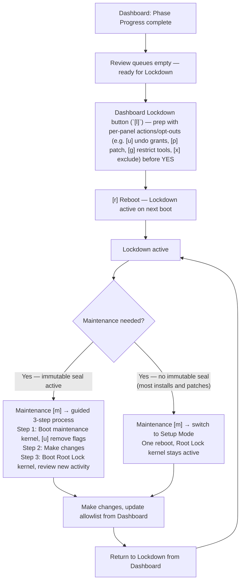

**Overview**: When you lock down from Setup Mode, the kernel blocks every program not on the allowlist (including any you forgot to approve). The Dashboard guides the activation through a precondition checklist and a deliberate confirmation. Lockdown seals the allowlist: no program or user, including root, can modify it while the server is running.

## System states

Root Lock by HeartSuite has two modes: Setup Mode and Lockdown. Both run on the Root Lock kernel. Lockdown seals the configuration with filesystem immutability. Both running Lockdown without the immutable seal and running Lockdown with the seal are valid configurations depending on your security requirements. Booting the original maintenance kernel is not a Root Lock mode at all; it is the machine running without Root Lock.

| | Root Lock kernel loaded | Blocking | Logging | Backups | Dashboard and features |
|---|---|---|---|---|---|
| **Setup Mode** | Yes | No: logs only | Yes | Yes | Dashboard and all features available |
| **Lockdown** | Yes | Yes: blocks | Yes | Yes | Dashboard and all features available |
| **Lockdown + sealed** | Yes | Yes: blocks | Yes | Yes | Dashboard and all features available; configuration sealed with filesystem immutability |
| **maintenance kernel** *(not a Root Lock mode)* | No: Root Lock absent | No | No | No | File-only tools only (see [Protecting During Maintenance](../maintenance/protecting-during-maintenance/)) |

In Setup Mode and Lockdown, the Root Lock kernel is loaded. Backups, logging, and the Dashboard all function normally in both. Booting the maintenance kernel means Root Lock is completely absent (no blocking or logging takes place, and backups do not run).

The indicator at the top of the Dashboard shows the current protection state, and the Suggested Next Step tells you what to do next.

### Trust graduation across modes

Each mode defines a different trust boundary. In Setup Mode, you are trusted to teach the allowlist — anything not on the allowlist is logged but not blocked. In Lockdown, trust is withdrawn from running programs regardless of which user runs them; any program, including one running as root, must be on the allowlist. With the immutable seal applied, your ability to change the allowlist at runtime is also withdrawn — configuration is sealed until the next reboot. Maintenance reopens that window on purpose. Booting the maintenance kernel takes a keyboard and monitor, a serial port, or the cloud serial console. SSH is not enough.

### Protection state

The indicator at the top of the Dashboard reflects the current protection state:

| State | Indicator text |
|---|---|
| Setup Mode | **SETUP MODE**: logging only, nothing is blocked |
| Lockdown (no immutable seal) | **LOCKDOWN**: immutable seal not applied |
| Lockdown + sealed | Silent (blank) |
| maintenance kernel | **maintenance kernel**: Root Lock not active. No blocking. No logging. No backups. |

## Setup Mode and Lockdown

At some point, you need to lock down to prevent malicious programs from starting, or to restrict the files and network destinations those programs can reach. Lockdown activation (Phase 7) is locked until all prior phases (2 through 6) are finished. The Dashboard tracks your progress through these phases and will indicate when Lockdown activation is available as the Suggested Next Step.

> [!NOTE]
> The Dashboard prevents Lockdown activation until all preconditions are met — including completion of all setup phases and the System Setup steps. If any precondition is not satisfied, the Lockdown button (`[l]`) displays "Lockdown is not available yet" and lists what remains.

If you have not added the necessary access permissions or network address permissions to allowlist entries, Root Lock will block programs from accessing those files and network addresses when you activate Lockdown.

Once Root Lock is set up, consider continuing in Setup Mode for several days. During that time, the review queues will capture additional file and network access activity — giving you a more complete allowlist before activating Lockdown.

When installing new software, you must return to Setup Mode. For example, the Debian package manager `dpkg` creates temporary directories during installation. In Lockdown, this generates a permission error and the installation halts. The temporary directory is removed before it can be added to an allowlist entry. Switch to Setup Mode before using `dpkg`, add any additional access permissions needed, then re-engage Lockdown.


```mermaid
graph TD
    A["Dashboard: Phase Progress complete"] --> B["Review queues empty — ready for Lockdown"];
    B --> C["Dashboard Lockdown button (`[l]`) — prep with per-panel actions/opt-outs (e.g. [u] undo grants, [p] patch, [g] restrict tools, [x] exclude) before YES"];
    C --> D["[r] Reboot — Lockdown active on next boot"];
    D --> E["Lockdown active"];
    E --> G{Maintenance needed?};
    G --> |"Yes — immutable seal active"| I["Maintenance [m] → guided 3-step process\nStep 1: Boot maintenance kernel, [u] remove flags\nStep 2: Make changes\nStep 3: Boot Root Lock kernel, review new activity"];
    G --> |"Yes — no immutable seal\n(most installs and patches)"| O["Maintenance [m] → switch to Setup Mode\nOne reboot, Root Lock kernel stays active"];
    I --> J["Make changes, update allowlist from Dashboard"];
    O --> J;
    J --> N["Return to Lockdown from Dashboard"];
    N --> E;
```

## Switching between modes

### Dashboard-first Lockdown activation

The Dashboard is where you activate Lockdown. When all preconditions are met, the Suggested Next Step will offer Lockdown activation. The precondition checklist includes:

- All review queues are empty (Programs `[p]`, File Access `[f]`, Internet Access `[i]`)
- Boot configuration is complete (System Setup)
- Phase 7 is unlocked (phases 2 through 6 complete)

When preconditions are satisfied, the Dashboard presents the activation option.

### Activating Lockdown

From the Dashboard, select the Lockdown button (`[l]`). The Dashboard shows a precondition checklist, an observation period summary, and a review of your allowlist. Before the final confirmation, the prep shown during Lockdown activation (on the Lockdown screen) offers per-panel actions and opt-outs:

- `[u]` undo auto-narrowed install write grants (also surfaces for kmod directory and broad write grants by priority)
- `[p]` patch HeartSuite install paths into the Lockdown seal configuration
- `[g]` restrict `rm`/`cp`/`mv` to their observed directories (captures usage from Setup; mitigates GTFOBins-style abuse of maintenance tools)
- `[x]` exclude specific write-conflict paths from the seal
- plus SSH hardening (`[h]`, `[r]`/`[j]`) and inbound permit selection (`[o]`/`[a]`)

The commitment summaries and the separate Lockdown Inventory view (`[l]`) are read-only. Adjustments happen via the prep actions on the activation screen, not via the inventory. When all preconditions are met, type `YES` (case-sensitive) to confirm activation.


(The diagram shows the checklist and review state; the actual activation flow uses the prep actions listed above rather than interactive views on the inventory. The inventory and commitment panels are read-only.)

After confirming, the Dashboard offers one reboot option:

- `[r]` **Reboot** — Lockdown active on next boot

Lockdown is applied on the next reboot and persists — to make changes, use the Dashboard's Maintenance (`[m]`), which guides you through booting the maintenance kernel and removing the seal.

> [!NOTE]
> **Serial console after this reboot (and after Maintenance return):** open the serial console (for example AWS EC2 Serial Console, `virsh console`, or your provider's serial). When you see **Press Enter to start.** (you may also see `[press ENTER to login]`), press **Enter once**. The Dashboard opens. That key does not confirm Lockdown or Maintenance — the mode change already finished at boot. Waiting with no key is normal; the machine is ready.

### Returning to Setup Mode

From the Dashboard, use the Lockdown button (`[l]`) to return to Setup Mode for maintenance. You must return to Setup Mode before installing packages or making configuration changes that Lockdown would block.

### Switching mode from a Non-HS Kernel

When booted into the maintenance kernel, set the mode before rebooting to the Root Lock kernel:

```bash
# sudo hs-mode-switch on
```

## Lockdown: sealing the system

Lockdown seals Root Lock's configuration with filesystem immutability, so a compromised root account cannot tamper with the allowlist while the system runs. The seal is system-wide: configuration, system files, accounts, scheduled tasks, and the maintenance tools themselves — all sealed in one step. The Dashboard displays the current Lockdown status and provides the Suggested Next Step for managing it.

Lockdown is applied automatically as part of activating Lockdown from the Dashboard. Once engaged, it persists until you exit through the Dashboard's Maintenance (`[m]`), which guides you through booting the maintenance kernel to remove the seal. The table below shows what changes between Lockdown without the immutable seal and Lockdown with the seal.

| | Lockdown | Lockdown + sealed |
|---|---|---|
| Blocks unauthorised programs, file access, and network access | Yes | Yes |
| Logging | Yes | Yes |
| Backups | Yes | Yes |
| Can root edit allowlist entries or Root Lock config files? | Yes | **No** — immutable; attempts to write are blocked by the kernel until the seal is removed via Maintenance |
| Can an attacker who already has remote root tamper with security settings? | Possible | **No** — protected by immutability |
| Can you modify files made immutable by Lockdown? | Yes | **No** — until the seal is removed via the Maintenance on the maintenance kernel |
| Are file editors and broadly-scoped tools (`rm`, `cp`, `mv`) restricted? | No | **Yes** — automatically. Editors are sealed; `rm`, `cp`, and `mv` are replaced with restricted copies scoped to the paths your system uses them on. Restored automatically when you enter Maintenance. |
| Can the immutable seal be engaged in Setup Mode? | N/A | No — Lockdown is required first |
| How long does the seal last? | N/A | Until immutable flags are removed through the maintenance journey — the seal persists across reboots and re-engages automatically on every Root Lock kernel boot |
| How do you exit the seal? | N/A | Use the Dashboard's Maintenance (`[m]`) — it sets the GRUB default to the Maintenance entry (maintenance kernel / Setup Mode destination) automatically before rebooting, guides you through removing the seal on the maintenance kernel, then returns to the Root Lock kernel. Console access (keyboard and monitor, serial port, or cloud serial console) is required only if automatic GRUB configuration does not apply. |

### What Lockdown does

Once Lockdown is engaged, Root Lock seals five things at once, all using `chattr +i`. Before you confirm, the Dashboard shows the paths that will be sealed, grouped by category with counts. The list is shown for review only. The Maintenance restores mutability for the necessary tools automatically.

The five categories Lockdown seals:

- **HeartSuite configuration** — your allowlist files, the mode state file, and the kernel image directory. Defends against allowlist tampering and kernel swap by an attacker who escalates to root.
- **System integrity** — shared libraries (`/usr/lib/`), systemd unit directories, the SSH server config, and sudo policy. Defends against shared-library injection (a modified `libc.so` backdooring every program loading it), malicious systemd units installed to fire on next boot, and SSH or sudo policy weakened by a brief root compromise.
- **Authentication state** — the account database (`/etc/passwd`, `/etc/shadow`, `/etc/group`) and no-login shells. Defends against an attacker who already has root creating accounts, changing passwords, or converting service accounts into interactive logins.
- **Scheduled tasks and login scripts** — cron and anacron configuration, environment defaults, and root's shell profiles. Defends against an attacker scheduling a script to run after a reboot but before Lockdown re-engages, and against bash-profile backdoors that run on the next root login.
- **Maintenance tools** — file editors (`nano`, `vim`, `sed`, `ed`) made non-executable, and `rm`/`cp`/`mv` replaced with restricted copies whose write access is limited to the paths the kernel saw those tools used for during Setup Mode. Defends against a compromised approved program leveraging admin tools that run with their own broad scope, not the caller's.

> [!NOTE]
> During maintenance on the maintenance kernel, the Dashboard and the `hs-manage-allowlist` tool may show temporary "write" grants covering some of the paths that Lockdown normally seals. These grants exist only for work performed while the immutable seal is removed; they have no effect on normal operation under Lockdown. The exact paths sealed by default appear in the inventory shown during activation (read-only; use the prep actions on the Lockdown activation screen before confirming to adjust specific grant categories such as via `[u]` undos or `[x]` excludes) or in the [Compliance Quick Reference](../compliance-quick-reference/).

If the Root Lock kernel fails to load, the startup script isolates the primary network interface and removes all immutable flags. The machine is then without Root Lock protection and without network access. Recovery requires booting to the maintenance kernel from physical or serial-console access, repairing or replacing the failed kernel, and re-engaging Lockdown through the maintenance journey.

Once Lockdown is on, root cannot change the immutability flags. The kernel disables `chattr`. This means no allowlist entries, configuration files, or protected directories can be modified, deleted, or added while Lockdown is active.

Lockdown persists across reboots — the HeartSuite startup script re-engages it automatically each time the Root Lock kernel starts. The only way to remove it is to boot the maintenance kernel and follow the maintenance journey. Lockdown cannot be engaged in Setup Mode; if you try, an error message is written to the kernel log. The filesystem immutability applied by Lockdown via `chattr +i` is a flag stored on disk, not in kernel memory. This means that immutable flags set during Lockdown persist across reboots, including reboots into the maintenance kernel. If you boot the maintenance kernel for maintenance after Lockdown was active, the Dashboard's Maintenance wizard runs `HS_unlock.sh` for you via `[u]` Remove Flags. For recovery outside the Dashboard, run `HS_unlock.sh` before attempting to modify any files that were made immutable.

### What this closes off

Two of the five seals close attacks that are easy to miss.

**Compromised programs cannot borrow another program's tools.** When an approved web server runs `rm`, the deletion uses `rm`'s permissions, not the web server's. `rm` legitimately needs broad access during maintenance — so its allowlist is broad. A compromised approved program could otherwise borrow that breadth. Lockdown replaces `rm` with `limited_rm`, whose own write paths cover only what the system was observed using `rm` for during Setup Mode. Same for `cp` and `mv`.

**Nothing planted before the reboot survives it.** Lockdown engages after boot — there's a brief gap between the system coming up and the seal taking hold. Without sealing cron, anacron, environment defaults, and root's shell profiles, an attacker who already had root before a reboot could plant a script to run in that gap. With those files sealed during the prior Lockdown, the script never reaches them — and on the next boot, nothing has changed.

### Automatic Lockdown on boot

By default, the HeartSuite startup script re-engages Lockdown automatically on every Root Lock kernel boot. Once active, rebooting will always engage Lockdown before you can prevent it.

During Maintenance Step 1, the Dashboard presents a guided choice: `[d]` Disable automatic Lockdown re-engagement or `[k]` Keep it. You do not need to edit any scripts manually. To disengage Lockdown when automatic re-engagement is active, boot to the maintenance kernel; this procedure is discussed in [Protecting During Maintenance](../maintenance/protecting-during-maintenance/).

### Restoring mutability after Lockdown

You can make files and directories mutable again once Lockdown is no longer active. The Dashboard's Maintenance (`[m]`) handles this automatically during the guided maintenance process — Step 1 of 3 offers `[u]` Remove immutable flags. For recovery outside the Dashboard, run `HS_unlock.sh`.

If you try to write to an immutable file without removing the flags first, you will encounter the error "could not open <filename> file; errno:1."

Before rebooting, the Maintenance (`[m]`) sets the GRUB default to the Maintenance entry (Non-HS / Setup Mode destination) automatically — no GRUB menu interaction is required. If automatic GRUB configuration does not apply (Alpine or an unsupported bootloader), the Dashboard displays the exact entry to select manually, which requires console access: a keyboard and monitor, a serial port, or your cloud provider's serial console. Returning to the Root Lock kernel after maintenance is also automatic: the Dashboard restores the Root Lock kernel as the GRUB default before rebooting back, so no GRUB interaction is needed on the return trip either.

### Lockdown commands

These are the actual scripts Lockdown uses. Most users never invoke them directly — the Dashboard's `[l]` Lockdown button and `[m]` Maintenances run them for you.

- **`HS_lockdown.sh`** — runs when you apply Lockdown from the Dashboard, and automatically on every Root Lock kernel boot when auto-engagement is enabled. It seals Root Lock's configuration with `chattr +i`, disables file editors, replaces `rm`/`cp`/`mv` with restricted copies, then engages Lockdown via the kernel.
- **`HS_unlock.sh`** — reverses `HS_lockdown.sh`. The Maintenance runs this for you when you press `[u]` as Step 1 of the Lockdown maintenance flow. Run it yourself only for recovery outside the Dashboard.
- **`hs-unlock-progs`** — internal helper called by `HS_unlock.sh`. Not invoked directly in normal use.

Setup is complete. When you need to install software, update configuration, or recover from Lockdown, see [Maintenance](../maintenance/).
