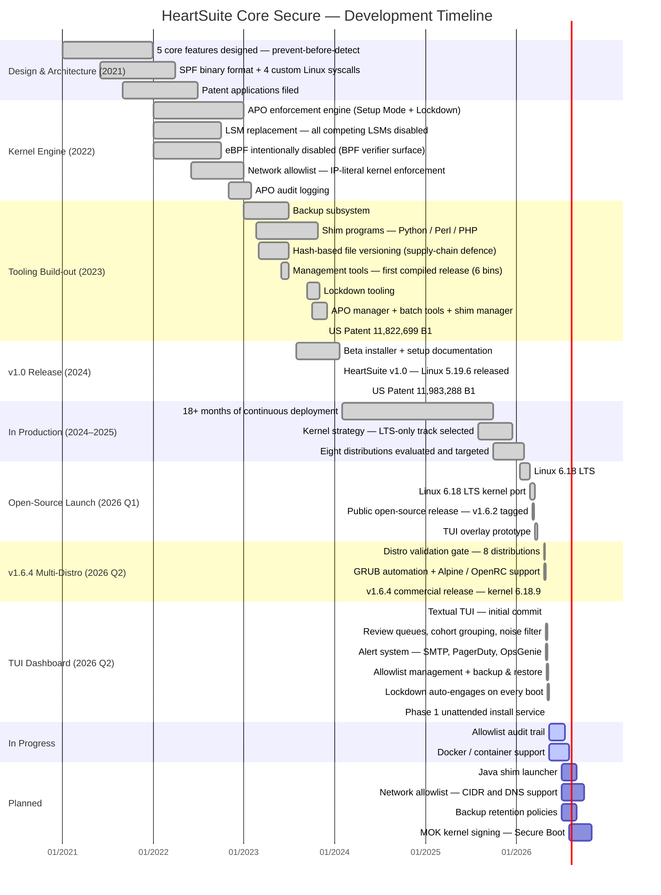

Traditional endpoint security detects threats after they execute. HeartSuite takes the opposite approach: it prevents malware from executing in the first place—at the kernel level, where not even root can override the controls. Even if malware is downloaded to a HeartSuite server, the architecture prevents it from running its harmful commands. That stops zero-day attacks before any signature, rule, or heuristic could catch them.

The five core features that make this possible—program allowlist, Setup Mode and Lockdown, File Backup and Versioning, and Secure Script Launchers—were designed together as a single coherent architecture, not assembled from separate tools. This page traces how that architecture was built, validated, and hardened over time.

## Development Timeline

## Feature Details by Status


{}

### Design & Architecture (2021)

> [!NOTE]
> **Five Core Features Designed — Prevent-Before-Detect Architecture** (~2021)  
> The five core features that define HeartSuite were designed together as a single architecture before any kernel code was written: program allowlist (APO), Setup Mode and Lockdown, File Backup and Versioning, and Secure Script Launchers for interpreted code. The design goal was to stop malware from executing at all—not to detect it after the fact. This "prevent-before-detect" approach is what separates HeartSuite from traditional endpoint security.

> [!NOTE]
> **SPF (Secure Permission Format) Binary File Format** (~2021–2022)  
> A purpose-built binary record format for storing allowlist entries. SPF files hold per-program permissions, read/write path grants, network IP allowlist entries, and runtime process tracking data. The kernel parses SPF records directly with no userspace intermediary on the enforcement path.

> [!NOTE]
> **Four Custom Linux System Calls** (~2021–2022)  
> HeartSuite adds four system calls to the Linux kernel: one to activate enforcement (with configurable monitoring mode and cache size), one to execute interpreted scripts under allowlist control, one to engage Lockdown (reboot-only-reversible), and one to halt the backup subsystem.

> [!NOTE]
> **Patent Applications Filed** (~2021–2022)  
> The inventions behind APO enforcement and OS-level sandboxing were filed with the USPTO. Issued as US 11,822,699 B1 (November 2023) and US 11,983,288 B1 (May 2024).

---

### Kernel Engine (2022)

> [!NOTE]
> **APO Enforcement Engine — Setup Mode + Lockdown** (2022)  
> HeartSuite modifies five upstream kernel subsystems with enforcement hooks: program execution gating, file naming operations (create, rename, delete), file access control, outbound network restrictions, and process cleanup on exit. In Setup Mode, violations are logged but not blocked. In Lockdown, programs without an allowlist entry cannot execute, and programs with one cannot exceed it.

> [!NOTE]
> **LSM Replacement — HeartSuite Is the Only Security Module** (2022)  
> HeartSuite does not layer on top of the Linux Security Module framework—it replaces it. AppArmor, TOMOYO, Landlock, and several other LSMs are all disabled at build time. HeartSuite implements its own path-based enforcement in their place, eliminating the interaction complexity and potential bypass paths that arise when multiple security modules run alongside each other.

> [!NOTE]
> **eBPF Intentionally Disabled** (2022)  
> BPF system calls are disabled at build time. This is a deliberate security decision: BPF verifier vulnerabilities have historically bypassed the exact kernel hooks HeartSuite relies on for enforcement. Disabling eBPF closes that attack surface permanently. The operational trade-off is that standard eBPF-based forensics tools cannot run on the HS host kernel. The supported architecture for eBPF-class observability is an adjacent monitoring host running a standard kernel, receiving HS kernel logs via syslog. For full forensic depth, operators boot a non-HS kernel, perform analysis, and boot back—consistent with HS's physical-access trust model.

> [!NOTE]
> **FUSE and OverlayFS Disabled by Default** (2022)  
> Both filesystem types are disabled at build time as they are potential sandbox bypass paths. OverlayFS is under review for container deployments.

> [!NOTE]
> **Network Allowlist — IP-Literal Kernel Enforcement** (2022)  
> Outbound network connections are checked by the kernel against the IP entries in a program's allowlist entry. The allowlist is literal-IP-only: no CIDR ranges, no DNS resolution, no wildcards. Each destination IP must be enumerated explicitly. IPv4 and IPv6 addresses are separate entries. For services behind round-robin DNS or CDNs, operators route egress through a fixed-IP forward proxy that is itself allowlisted.

> [!NOTE]
> **LRU Sandbox Cache — Scales to Thousands of Concurrent Instances** (2022)  
> Only one allowlist entry needs to be loaded into kernel memory per running program, regardless of how many concurrent instances are running. The cache uses a configurable LRU policy (default: 25 entries, minimum: 10) with timestamp-based eviction. Memory overhead stays flat even on heavily loaded servers.

> [!NOTE]
> **APO Log Infrastructure** (late 2022)  
> All kernel-intercepted events—program launches, file access attempts, and outbound connection attempts—are recorded as structured log entries. These feed the TUI review queues and the alert daemon. The integrity of the logging surface is continuously verified by CI.

> [!NOTE]
> **kmod and kexec Attack Paths Closed by Default** (2022)  
> Kernel module loaders are absent from the shipped allowlist seed, so they cannot execute under Lockdown by default. If a binary has no allowlist entry, it cannot run—no explicit policy needed. The boot partition is made recursively immutable under Lockdown. Revoking Lockdown requires physical or serial console access to select an alternate kernel; attackers cannot trigger it remotely.

---

### Tooling Build-out (2023)

> [!NOTE]
> **Backup Subsystem** (January 2023)  
> The in-kernel backup-on-write subsystem comes online. When a file in a monitored directory is closed after a write, the kernel automatically invokes the backup tool. Only the HeartSuite backup binary can access the backup store; no other program has an allowlist entry for it, making the backup archive inaccessible to malware.

> [!NOTE]
> **Shim Programs — Python, Perl, PHP** (February 2023)  
> Four Secure Script Launchers extend allowlist gating to interpreted code. When a script is launched through an HS shim, the kernel checks that the *script path itself* has an allowlist entry—not just the interpreter binary. This prevents a malicious Python script from running simply because the Python interpreter is approved.

> [!NOTE]
> **Hash-Based File Versioning** (~mid-2023)  
> Each backed-up file version is stored in a hash-named directory. Version hashes prevent supply-chain attacks: a modified file produces a different hash, making the tampered version distinguishable from any approved version. The version manager retrieves any specific version by hash.

> [!NOTE]
> **Management Tools — First Compiled Release** (June 2023)  
> Six production binaries compiled in a single release: `hs-APO-cache-size`, `hs-monitor-state`, `hs-backup`, `hs-version-manager`, `hs-shim-manager`, and `hs-backup-config-manager`.

> [!NOTE]
> **Lockdown Tooling** (September–October 2023)  
> `HS_lockdown.sh` applies immutability to critical paths across seven categories: HeartSuite config and tooling, the allowlist database, system authentication files, SSH configuration, the boot partition, systemd unit directories, and cron directories. This closes the attack path where an attacker schedules a script at next boot to re-widen permissions. Lockdown is reboot-only-reversible—there is no runtime command that clears it.

> [!NOTE]
> **APO Manager + Batch Tools** (October 2023)  
> The allowlist manager and a suite of batch population tools finalize. `add_start_and_shutdown_programs.py` automates the Setup Mode workflow: it parses kernel log events and promotes them into allowlist entries, reducing manual setup to edge cases.

> [!NOTE]
> **US Patent 11,822,699 B1 — Issued** (November 21, 2023)  
> *Preventing Surreptitious Access to File Data by Malware.* Covers the core APO enforcement model: removing plenary power from applications and enforcing per-program file and network access through kernel modifications.

---

### v1.0 Release (2024)

> [!NOTE]
> **HeartSuite v1.0 — Linux 5.19.6** (January 20, 2024)  
> First full production release: compiled kernel, tools, installer, systemd service units, and operator documentation. Shipped to beta customers on Debian 11.

> [!NOTE]
> **Setup Documentation** (November 2023)  
> Comprehensive operator guide covering the full lifecycle: installation, Setup Mode log-to-allowlist workflow, shim configuration, automatic file backup setup, mode switching, licensing, Lockdown, maintenance, cache size adjustment, and the complete tool inventory.

> [!NOTE]
> **Two Distribution Models**  
> HeartSuite ships as a complete system (kernel + userspace tools + installer) or as kernel-only source for integration into existing systems or custom distribution builds.

> [!NOTE]
> **US Patent 11,983,288 B1 — Issued** (May 14, 2024)  
> *Operating System Enhancements to Prevent Surreptitious Access to User Data Files.* Covers the OS-level enforcement architecture: mediated file access, version-hash isolation, and the five HeartSuite security rules as operationalized through kernel modifications.

---

### In Production (2024–2025)

> [!NOTE]
> **18 Months of Continuous Production Deployment** (2024–2025)  
> HeartSuite v1.0 shipped in January 2024 and ran in production continuously through 2025 without a kernel change. Real deployments shaped the tooling, the allowlist workflow, and operator documentation. By the time v1.6 was scoped, the core architecture had already proven itself under live conditions—not in a lab.

> [!NOTE]
> **LTS-Only Kernel Strategy — No Chasing Releases** (2025)  
> A full compatibility report was produced for Linux 6.12, then set aside: 6.12 is not an LTS kernel. HeartSuite commits only to long-term support kernels, so operators are never forced onto a short-maintenance-window base. 6.18 LTS was selected as the next target.

> [!NOTE]
> **Eight Linux Distributions — Evaluated and Targeted** (late 2025)  
> Before writing a line of installer code, every target distribution was evaluated for init system, bootloader, kernel packaging, and service management differences. The result: a v1.6.4 installer that works correctly on eight distributions by design, not as an afterthought.

---

### Open-Source Launch — v1.6.2 (2026 Q1)

> [!NOTE]
> **Decision: Target Linux 6.18 LTS** (January–February 2026)  
> Following the 6.12 compatibility analysis, 6.18 was selected as the porting target: it is a long-term support kernel with a stable maintenance window that matches HeartSuite's release cadence.

> [!NOTE]
> **Linux 6.18 LTS Kernel Port** (March 2026)  
> Full port from the 5.19.6 line to Linux 6.18 LTS, covering hook relocations and syscall ABI changes. Documented as a reference for future kernel version upgrades.

> [!NOTE]
> **Public Open-Source Release — v1.6.2** (March 5–11, 2026)  
> HeartSuite Core Secure published under AGPL-3.0. Includes kernel source, tools, porting guides, internal security checklists, and CONTRIBUTING documentation.

> [!NOTE]
> **TUI Overlay Prototype** (March 18–26, 2026)  
> First working Textual TUI overlay: naming overlay, log viewer, tree parser, and Layer 1 CLI tools. Category colors and three-pane dashboard layout established.

---

### v1.6.4 Multi-Distro Release (April 2026)

> [!NOTE]
> **Multi-Distro Validation Gate — 8 Distributions** (April 22–26, 2026)  
> Validated on Debian 12, Debian 13 (Trixie), Ubuntu 24.04, Fedora 41, Rocky 9.7, CentOS Stream 9, Alpine 3.21, and openSUSE Tumbleweed. A cross-distro release gate runs after every kernel update.

> [!NOTE]
> **GRUB Automation + Alpine / OpenRC Support** (April 23–29, 2026)  
> Installer sets HeartSuite kernel as GRUB default and reboots automatically. Falls back to console instructions on Alpine/extlinux. Both systemd and OpenRC service unit variants ship.

> [!NOTE]
> **v1.6.4 Commercial Release — Kernel 6.18.9** (April 26, 2026)  
> Tag `hs-v1.6.4-kernel-6.18.9`: "HeartSuite v1.6.4 on Linux kernel 6.18.9 — commercial release baseline."

---

### TUI Dashboard (April–May 2026)

> [!NOTE]
> **Textual TUI Dashboard** (April 28, 2026)  
> Root-only, SSH-compatible, keyboard-first management console. No graphical environment required. All six setup phases trackable from a single screen.

> [!NOTE]
> **Three Review Queues — Programs, File Access, Internet Access**  
> Cohort-first traversal, inline help overlays, sidebar with cohort groupings. Ghost files display with a "no longer exists" label. Approved items leave the queue permanently.

> [!NOTE]
> **Alert System — SMTP, Syslog, PagerDuty, OpsGenie** (April–May 2026)  
> Guided six-phase configuration. Alert daemon runs as a background service. Supports RFC 5424 syslog, PagerDuty Events API v2, and OpsGenie native format.

> [!NOTE]
> **Lockdown Engages Automatically on Every Boot** (May 2026)  
> From the moment HeartSuite activates, Lockdown is always on. Five path categories are sealed unconditionally—there is no configuration switch to skip it. The only way to lift Lockdown is to reboot into a non-HeartSuite kernel; no runtime command can clear it.

> [!NOTE]
> **Phase 1 Unattended Install Service** (May 2026)  
> A systemd oneshot service (with OpenRC shim) chains the allowlist approval loop across reboots without requiring an active operator session. Setup Mode completes automatically: the service pre-seeds allowlist entries, tracks phase state, and signals readiness—no console session required between reboots.

> [!NOTE]
> **Allowlist Management, Backup & Restore, Maintenance Wizard**  
> Per-entry allowlist removal, bulk stale-entry cleanup, backup timeline view with date-based restore, and a two-path maintenance wizard (simple update vs. new-program approval cycle).

---

### Infrastructure + CI (2026)

> [!NOTE]
> **Formal Verification Framework** (May 2026)  
> A multi-gate verification framework covers build checks, static analysis, syscall smoke testing on both allow and deny paths, memory safety testing, cross-distro validation across all 8 supported distributions, post-Lockdown mount refusal verification, and a source-surface manifest that ensures no enforcement hook is silently removed or disabled.

> [!NOTE]
> **Always-On UI Audit Log + Safe Error Handling** (May 2026)  
> All UI actions logged to a rotating file. Silent error handling eliminated across the UI and core layers. A CI walker enforces this on every commit.

{}
{}

> [!WARNING]
> **Allowlist Audit Trail**  
> Design complete (May 12, 2026). Each allowlist entry will show how, when, and by whom it was approved—giving operators a full history of every access decision. Backend extension and UI rendering are in progress.

> [!WARNING]
> **Docker / Container Support**  
> OverlayFS support is being added as a loadable module for container hosts. HeartSuite-internal error codes are being mapped to standard POSIX error codes for container-compatible output.

> [!WARNING]
> **File-Access Consequence Text**  
> The file review screen currently understates the scope of a file-access permission — naming the file rather than the parent directory that the allowlist entry actually covers. Fix specified; not yet applied.

> [!WARNING]
> **Lockdown Screen — Final UX Form**  
> Now that Lockdown is automatic, the inventory screen has no decision left to confirm. Open question: standalone viewing surface, or fold into the Lockdown button ceremony?

{}
{}

### User-Facing Features

> [!NOTE]
> **Java Shim Launcher**  
> The five shipped Secure Script Launchers cover Python 2, Python 3, Perl, and PHP. A Java launcher is planned: Java scripts and applications would receive the same per-script APO enforcement that Python/Perl/PHP enjoy today. Without it, Java deployments are APO-gated at the JVM binary level only, not at the individual `.jar` or script level.

> [!NOTE]
> **Network Allowlist — CIDR and DNS Support**  
> The current network allowlist is literal-IP-only: no CIDR ranges, no DNS resolution, no wildcards. Adding CIDR support would allow a subnet to be expressed as a single entry rather than enumerating every IP individually—significant for cloud deployments where destination IPs are dynamic or managed via DNS.

> [!NOTE]
> **Backup Retention — Configuration Backend Integration**  
> Tiered retention policy UI is designed (7-day full / 90-day daily / monthly). The backup configuration tool needs per-directory retention subcommands before the UI can connect.

> [!NOTE]
> **Multi-File Selection in Restore**  
> Version manager currently restores one file at a time. Multi-file and directory-level restore selection planned.

> [!NOTE]
> **MOK Kernel Signing — Secure Boot Compatibility**  
> Azure Gen2 VMs and other Secure Boot-enabled hosts block unsigned kernels. MOK (Machine Owner Key) signing lets operators enrol the HeartSuite kernel without disabling Secure Boot. Enrolment flow not yet designed.

---

### Testing & Verification

> [!NOTE]
> **Kernel Self-Tests + Filesystem Test Suite**  
> Two additional test suites are defined in the verification framework and deferred pending resource allocation.

> [!NOTE]
> **Extended Fuzz Testing**  
> Fuzz testing of the allowlist record parser and the custom system call interfaces is planned as a future verification gate.

{}


## Community-Driven Development

Join the conversation—suggest features, report issues, or discuss the architecture.

### Get Started

[Get Started](/docs/) | [Open an Issue](https://github.com/HeartSecuritySuite/heartsuite-docs/issues/new)
