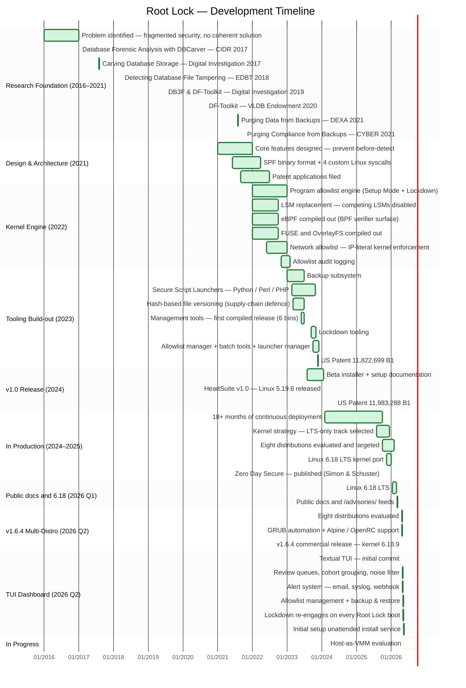

Traditional endpoint security detects threats after they execute. Root Lock by HeartSuite takes the opposite approach: it prevents malware from executing in the first place — at the kernel, per program, including as root.

In Lockdown, anything not on the allowlist is blocked before it can act. Root cannot change the allowlist while the machine is running. Recovery is the maintenance kernel via physical or serial-console access. See [Circumvention and recovery](../introduction/how-it-compares/#circumvention-and-recovery).

Even if malware is downloaded to a Root Lock server, it cannot run as a new program unless that program is already on the allowlist. A zero-day inside an already-allowlisted program (`nginx`, `python3`) still runs; it can only use the file paths and outbound addresses that program was approved for.

The core features that make this possible — program allowlist, Setup Mode and Lockdown, File Backup and Versioning, and Secure Script Launchers — were designed together as a single architecture, not assembled from separate tools. This page traces how that architecture was built, validated, and hardened over time.

The foundations reach back to 2016: security had become an incoherent patchwork of disconnected tools with no unified design. Years of academic research followed — seven peer-reviewed papers on database security, forensics, and cryptographic erasure — culminating in *Zero Day Secure*, the book that articulates the problem Root Lock is built to solve.

## Development timeline (2016–2026)

```mermaid
%%{init: {'theme':'base', 'themeVariables': {'doneTaskBkgColor':'#d4f4dd','doneTaskBorderColor':'#2a7a40','sectionBkgColor':'#eee','sectionBkgColor2':'#eee','taskBkgColor':'#eee','taskBorderColor':'#888','gridColor':'#888'}}}%%
gantt
    title Root Lock — Development Timeline
    dateFormat YYYY-MM-DD
    axisFormat %m/%Y

    section Research Foundation (2016–2021)
    Problem identified — fragmented security, no coherent solution :done, 2016-01-01, 2016-12-31
    Database Forensic Analysis with DBCarver — CIDR 2017         :done, 2017-01-04, 2017-01-05
    Carving Database Storage — Digital Investigation 2017        :done, 2017-08-01, 2017-08-02
    Detecting Database File Tampering — EDBT 2018                :done, 2018-03-26, 2018-03-27
    DB3F & DF-Toolkit — Digital Investigation 2019               :done, 2019-07-01, 2019-07-02
    DF-Toolkit — VLDB Endowment 2020                             :done, 2020-08-31, 2020-09-01
    Purging Data from Backups — DEXA 2021                        :done, 2021-08-01, 2021-08-02
    Purging Compliance from Backups — CYBER 2021                 :done, 2021-10-03, 2021-10-04

    section Design & Architecture (2021)
    Core features designed — prevent-before-detect     :done, 2021-01-01, 2021-12-31
    SPF binary format + 4 custom Linux syscalls        :done, 2021-06-01, 2022-03-31
    Patent applications filed                          :done, 2021-09-01, 2022-06-30

    section Kernel Engine (2022)
    Program allowlist engine (Setup Mode + Lockdown)   :done, 2022-01-01, 2022-12-31
    LSM replacement — competing LSMs disabled          :done, 2022-01-01, 2022-09-30
    eBPF compiled out (BPF verifier surface)           :done, 2022-01-01, 2022-09-30
    FUSE and OverlayFS compiled out                    :done, 2022-01-01, 2022-09-30
    Network allowlist — IP-literal kernel enforcement  :done, 2022-06-01, 2022-12-31
    Allowlist audit logging                            :done, 2022-11-01, 2023-01-31

    section Tooling Build-out (2023)
    Backup subsystem                                  :done, 2023-01-01, 2023-06-30
    Secure Script Launchers — Python / Perl / PHP     :done, 2023-02-20, 2023-10-25
    Hash-based file versioning (supply-chain defence) :done, 2023-03-01, 2023-07-01
    Management tools — first compiled release (6 bins) :done, 2023-06-01, 2023-07-01
    Lockdown tooling                                  :done, 2023-09-11, 2023-10-31
    Allowlist manager + batch tools + launcher manager :done, 2023-10-01, 2023-11-30
    US Patent 11,822,699 B1                           :done, 2023-11-21, 2023-11-22

    section v1.0 Release (2024)
    Beta installer + setup documentation              :done, 2023-07-31, 2024-01-20
    HeartSuite v1.0 — Linux 5.19.6 released           :done, 2024-01-20, 2024-01-21
    US Patent 11,983,288 B1                           :done, 2024-05-14, 2024-05-15

    section In Production (2024–2025)
    18+ months of continuous deployment        :done, 2024-02-01, 2025-09-30
    Kernel strategy — LTS-only track selected         :done, 2025-08-01, 2025-12-15
    Eight distributions evaluated and targeted        :done, 2025-10-01, 2026-01-31
    Linux 6.18 LTS kernel port                        :done, 2025-11-15, 2025-12-31
    Zero Day Secure — published (Simon & Schuster)    :done, 2025-10-01, 2025-10-02

    section Public docs and 6.18 (2026 Q1)
    Linux 6.18 LTS          :done, 2026-01-15, 2026-02-24
    Public docs and /advisories/ feeds                :done, 2026-03-05, 2026-03-12

    section v1.6.4 Multi-Distro (2026 Q2)
    Eight distributions evaluated                     :done, 2026-04-22, 2026-04-26
    GRUB automation + Alpine / OpenRC support         :done, 2026-04-23, 2026-04-29
    v1.6.4 commercial release — kernel 6.18.9         :done, 2026-04-26, 2026-04-27

    section TUI Dashboard (2026 Q2)
    Textual TUI — initial commit                      :done, 2026-04-28, 2026-04-29
    Review queues, cohort grouping, noise filter      :done, 2026-04-28, 2026-05-07
    Alert system — email, syslog, webhook             :done, 2026-04-28, 2026-05-07
    Allowlist management + backup & restore           :done, 2026-05-04, 2026-05-10
    Lockdown re-engages on every Root Lock boot       :done, 2026-05-07, 2026-05-12
    Initial setup unattended install service          :done, 2026-05-12, 2026-05-14

    section In Progress
    Host-as-VMM evaluation                            :active, 2026-05-14, 2026-09-30
```

## Feature details by status


{}

### Research foundation (2016–2021)

> [!NOTE]
> **Problem Identified — Fragmented Security Landscape** (2016)  
> Security had become an incoherent patchwork of disconnected tools, each addressing a narrow concern with no unified design. That diagnosis — and the conviction that a single principled architecture could replace the patchwork — became the founding motivation behind Root Lock. No code yet: only the problem statement and the conviction that a coherent solution was possible.

> [!NOTE]
> **Database Forensic Analysis with DBCarver** (January 4, 2017)  
> First published paper. DBCarver reconstructs database content from disk images without relying on log files or system metadata, using page carving to recover both live and deleted data. Published at the 8th Biennial Conference on Innovative Data Systems Research (CIDR 2017). Co-authors: Alexander Rasin, Tanu Malik, Hugo Jehle, Jonathan Grier.

> [!NOTE]
> **Carving Database Storage to Detect and Trace Security Breaches** (August 2017)  
> Shows how storage-layer carving can identify and trace unauthorized database modifications that are invisible to the application tier. Published in *Digital Investigation*, Volume 22 Supplement. Co-authors: Alexander Rasin, Boris Glavic, Jacob D. Furst, Lucas Bressan, Jonathan Grier.

> [!NOTE]
> **Detecting Database File Tampering through Page Carving** (March 2018)  
> Proposes a method to detect direct modifications to database files that bypass standard DBMS security mechanisms—attacks that sit below the software layer and are invisible to the application. Published at the 21st International Conference on Extending Database Technology (EDBT 2018, Vienna). Co-authors: Alexander Rasin, Tanu Malik, Jacob D. Furst, Jonathan Grier.

> [!NOTE]
> **DB3F & DF-Toolkit: Database Forensic File Format and Toolkit** (July 2019)  
> Introduces a standardized file format (DB3F) and toolkit for forensic interaction with database storage layers, enabling consistent abstracted access to deleted or unallocated data. Published in *Digital Investigation*, Volume 29 Supplement. Co-authors: Alexander Rasin, Rebecca Jacob, Jonathan Grier.

> [!NOTE]
> **DF-Toolkit: Interacting with Low-Level Database Storage** (August 2020)  
> Formalizes the toolkit for direct, abstracted access to DBMS storage—establishing the research infrastructure for broader forensic and compliance work. Published in the *Proceedings of the VLDB Endowment*, Volume 13, Issue 12 (VLDB 2020). Co-authors: James Wagner, Alexander Rasin, Tanu Malik, Jonathan Grier.

> [!NOTE]
> **Purging Data from Backups by Encryption** (2021)  
> Presents a cryptographic erasure framework for targeted data destruction in database backups to meet compliance regulations—addressing the fundamental problem that backups cannot be edited without destroying their integrity. Published at the International Conference on Database and Expert Systems Applications (DEXA 2021). Co-authors: Nick Scope, Alexander Rasin, James Wagner, Ben Lenard.

> [!NOTE]
> **Purging Compliance from Database Backups by Encryption** (CYBER 2021 / February 2022)  
> Extends the cryptographic erasure approach to broader compliance scenarios. Presented at CYBER 2021 (October 2021); published in *Journal of Data Intelligence*, Volume 3, Issue 1 (February 2022). Co-authors: Nick Scope, Alexander Rasin, Ben Lenard, James Wagner.

---

### Design & architecture (2021)

> [!NOTE]
> **Core features designed — prevent-before-detect architecture** (~2021)  
> The core features that define Root Lock were designed together as a single architecture before any kernel code was written: program allowlist, Setup Mode and Lockdown, File Backup and Versioning, and Secure Script Launchers for interpreted code. The design goal was to stop malware from executing at all—not to detect it after the fact. This "prevent-before-detect" approach is what separates Root Lock from traditional endpoint security.

> [!NOTE]
> **SPF (Secure Permission Format) Binary File Format** (~2021–2022)  
> A purpose-built binary record format for storing allowlist entries. SPF files hold per-program permissions, read/write path grants, network IP allowlist entries, and runtime process tracking data. The kernel parses SPF records directly with no userspace intermediary on the enforcement path.

> [!NOTE]
> **Four Custom Linux System Calls** (~2021–2022)  
> HeartSuite adds four system calls to the Linux kernel: one to activate enforcement (with configurable monitoring mode and cache size), one to execute interpreted scripts under allowlist control, one to engage Lockdown (reboot-only-reversible), and one to halt the backup subsystem.

> [!NOTE]
> **Patent Applications Filed** (~2021–2022)  
> The inventions behind program-allowlist enforcement and OS-level sandboxing were filed with the USPTO. Issued as US 11,822,699 B1 (November 2023) and US 11,983,288 B1 (May 2024).

---

### Kernel engine (2022)

> [!NOTE]
> **Program allowlist engine — Setup Mode + Lockdown** (2022)  
> Root Lock modifies five upstream kernel subsystems with enforcement hooks: program execution gating, file naming operations (create, rename, delete), file access control, outbound network restrictions, and process cleanup on exit. In Setup Mode, violations are logged but not blocked. In Lockdown, programs without an allowlist entry cannot execute, and programs with one cannot exceed it.

> [!NOTE]
> **LSM replacement — Root Lock is the security module** (2022)  
> Root Lock does not layer on top of the Linux Security Module framework — it replaces it. AppArmor, TOMOYO, Landlock, and several other LSMs are disabled at build time. Root Lock implements its own path-based enforcement in their place, eliminating the interaction complexity and potential bypass paths that arise when multiple security modules run alongside each other.

> [!NOTE]
> **eBPF intentionally disabled** (2022)  
> BPF system calls are disabled at build time. BPF verifier vulnerabilities have historically bypassed the exact kernel hooks Root Lock relies on for enforcement. Disabling eBPF closes that path permanently.
>
> Local eBPF tooling is not a fit by design: the BPF syscall is how attackers hide, reach root, and bypass host controls. Observe the Root Lock host from adjacent infrastructure via network taps or log forwarding. For on-host forensics, use strace and `/proc` inspection.

> [!NOTE]
> **FUSE and OverlayFS intentionally disabled** (2022)  
> Both filesystem types are disabled at build time because attackers use them to shadow protected directories or escape controls. This is a design choice to remove the path rather than layer policy on top of it. Containers fit as OCI images built and run off-host, as the [Container-host install](../introduction/containers-and-microvms/) for a long-lived image set, or as untrusted workloads in per-task microVMs with Root Lock as the guest kernel.

> [!NOTE]
> **Current 6.18 commercial kernel**  
> The 2022 design above is the 5.19 line. On the current 6.18 commercial kernel those interfaces are compiled in; “not a fit” is allowlist and mount policy, not a missing syscall. Workload notes: [System Requirements](../introduction/system-requirements/#software-compatibility-notes).

> [!NOTE]
> **Network Allowlist — IP-Literal Kernel Enforcement** (2022)  
> Outbound network connections are checked by the kernel against the IP entries in a program's allowlist entry. The allowlist is literal-IP-only: no CIDR ranges, no DNS resolution, no wildcards. Each destination IP must be enumerated explicitly. IPv4 and IPv6 addresses are separate entries. For services behind round-robin DNS or CDNs, route egress through a fixed-IP forward proxy that is itself allowlisted.

> [!NOTE]
> **LRU Sandbox Cache — Scales to Thousands of Concurrent Instances** (2022)  
> Only one allowlist entry needs to be loaded into kernel memory per running program, regardless of how many concurrent instances are running. The cache uses a configurable LRU policy (default: 25 entries, minimum: 10) with timestamp-based eviction. Memory overhead stays flat even on heavily loaded servers.

> [!NOTE]
> **Allowlist log infrastructure** (late 2022)  
> All kernel-intercepted events—program launches, file access attempts, and outbound connection attempts—are recorded as structured log entries. These feed the Dashboard review queues and the alert daemon.

> [!NOTE]
> **kmod and kexec Attack Paths Closed by Default** (2022)  
> Kernel module loaders are absent from the shipped allowlist seed, so they cannot execute under Lockdown by default. If a binary has no allowlist entry, it cannot run — no explicit policy needed. The boot partition is made recursively immutable under Lockdown. Revoking Lockdown requires physical or serial-console access to select an alternate kernel; attackers cannot trigger it remotely.

---

### Tooling build-out (2023)

> [!NOTE]
> **Backup Subsystem** (January 2023)  
> The in-kernel backup-on-write subsystem comes online. When a file in a monitored directory is closed after a write, the kernel automatically invokes the backup tool. Only the HeartSuite backup binary can access the backup store; no other program has an allowlist entry for it, making the backup archive inaccessible to malware.

> [!NOTE]
> **Secure Script Launchers — Python, Perl, PHP** (February 2023)  
> Four Secure Script Launchers extend allowlist gating to interpreted code. When a script is launched through a launcher, the kernel checks that the *script path itself* has an allowlist entry—not just the interpreter binary. This prevents a malicious Python script from running simply because the Python interpreter is approved.

> [!NOTE]
> **Hash-Based File Versioning** (~mid-2023)  
> Each backed-up file version is stored in a hash-named directory. Version hashes prevent supply-chain attacks: a modified file produces a different hash, making the tampered version distinguishable from any approved version. The version manager retrieves any specific version by hash.

> [!NOTE]
> **Lockdown Tooling** (September–October 2023)  
> `HS_lockdown.sh` applies immutability to critical paths across seven categories: HeartSuite config and tooling, the allowlist database, system authentication files, SSH configuration, the boot partition, systemd unit directories, and cron directories. This closes the attack path where an attacker schedules a script at next boot to re-widen permissions. Lockdown is reboot-only-reversible—there is no runtime command that clears it.

> [!NOTE]
> **Allowlist manager + batch tools** (October 2023)  
> The allowlist manager and batch population tools finalize. During Setup Mode, kernel log events can be promoted into allowlist entries so most of the initial inventory does not have to be typed by hand.

> [!NOTE]
> **US Patent 11,822,699 B1 — Issued** (November 21, 2023)  
> *Preventing Surreptitious Access to File Data by Malware.* Covers the core program-allowlist enforcement model: removing plenary power from applications and enforcing per-program file and network access through kernel modifications.

---

### v1.0 release (2024)

> [!NOTE]
> **HeartSuite v1.0 — Linux 5.19.6** (January 20, 2024)  
> First full production release: compiled kernel, tools, installer, systemd service units, and documentation. Shipped to beta customers on Debian 11.

> [!NOTE]
> **Two Distribution Models**  
> HeartSuite ships as a complete system (kernel + userspace tools + installer) or as kernel-only source for integration into existing systems or custom distribution builds.

> [!NOTE]
> **US Patent 11,983,288 B1 — Issued** (May 14, 2024)  
> *Operating System Enhancements to Prevent Surreptitious Access to User Data Files.* Covers the OS-level enforcement architecture: mediated file access, version-hash isolation, and the five HeartSuite security rules as operationalized through kernel modifications.

---

### In production (2024–2025)

> [!NOTE]
> **18 Months of Continuous Production Deployment** (2024–2025)  
> HeartSuite v1.0 shipped in January 2024 and ran in production through 2025. Real deployments shaped the tooling, the allowlist workflow, and documentation.

> [!NOTE]
> **LTS-Only Kernel Strategy — No Chasing Releases** (2025)  
> A full compatibility report was produced for Linux 6.12, then set aside: 6.12 is not an LTS kernel. Root Lock commits only to long-term support kernels, so you are never forced onto a short-maintenance-window base. 6.18 LTS was selected as the next target.

> [!NOTE]
> **Eight Linux distributions — evaluated and targeted** (late 2025)  
> Before writing a line of installer code, every target distribution was evaluated for init system, bootloader, kernel packaging, and service management differences. That work produced the v1.6.4 installer. Current support and lab tiers: [Distro Compatibility](../kernel-hardening/distro-compatibility-matrix/).

> [!NOTE]
> **Linux 6.18 LTS Kernel Port** (late 2025)  
> Full port from the 5.19.6 line to Linux 6.18 LTS.

> [!NOTE]
> **Zero Day Secure — book published** (~October 2025)  
> *Zero Day Secure: Why Modern Operating Systems Can't Stop Malware and How to Fix Them*, published by Simon & Schuster (ISBN 9781968865078). The book presents the architectural argument that Root Lock implements in code: that operating systems must be redesigned to prevent malware execution at the kernel level, not detect it after the fact.

---

### Public docs and 6.18 — v1.6.2 (2026 Q1)

> [!NOTE]
> **Documentation and advisory transparency — v1.6.2 onward** (March 2026)  
> Public documentation site and machine-readable advisory feeds at `/advisories/` (CONFIG-gate SBOM, OSV, CycloneDX). Root Lock kernel corresponding source is available on written GPL request via support@heartsecsuite.com.

---

### v1.6.4 multi-distro release (April 2026)

> [!NOTE]
> **Eight distributions evaluated** (April 22–26, 2026)  
> The v1.6.4 installer was exercised across Debian, Ubuntu, Fedora, Rocky, CentOS Stream, Alpine, and openSUSE. For which of those are Supported, In lab, or Experimental today, use [Distro Compatibility](../kernel-hardening/distro-compatibility-matrix/).

> [!NOTE]
> **GRUB Automation + Alpine / OpenRC Support** (April 23–29, 2026)  
> Installer sets Root Lock kernel as GRUB default and reboots automatically. Falls back to console instructions on Alpine/extlinux. Both systemd and OpenRC service unit variants ship.

> [!NOTE]
> **v1.6.4 Commercial Release — Kernel 6.18.9** (April 26, 2026)  
> Tag `hs-v1.6.4-kernel-6.18.9`: "HeartSuite v1.6.4 on Linux kernel 6.18.9 — commercial release baseline."

---

### TUI Dashboard (April–May 2026)

> [!NOTE]
> **Textual TUI Dashboard** (April 28, 2026)  
> Root-only, SSH-compatible, keyboard-first management console. No graphical environment required. The six-row Lockdown Checklist is trackable from the Dashboard.

> [!NOTE]
> **Three Review Queues — Programs, File Access, Internet Access**  
> Cohort-first traversal, inline help overlays, sidebar with cohort groupings. Ghost files display with a "no longer exists" label. Approved items leave the queue permanently.

> [!NOTE]
> **Alert system — email, syslog, webhook** (April–May 2026)  
> Alert Settings (`[e]`) has two tabs: Email and Fleet. Email is SMTP. Fleet is syslog, webhook, and Node ID. The alert daemon runs as a background service. Webhook delivery can target PagerDuty Events API v2 and OpsGenie when you paste those HTTPS endpoints.

> [!NOTE]
> **Lockdown re-engages on every Root Lock boot** (May 2026)  
> You review queues in Setup Mode, then type `YES` to activate Lockdown. Once Lockdown is on, five path categories are sealed, and `HS_lockdown.sh` re-engages that seal on every Root Lock kernel boot. The path out is Maintenance (`[m]`) and the maintenance kernel, via physical or serial-console access if automatic GRUB configuration does not apply.

> [!NOTE]
> **Initial Setup Unattended Install Service** (May 2026)  
> A systemd oneshot service (with an OpenRC equivalent) chains the allowlist approval loop across reboots without an active console session. Initial setup completes automatically: the service pre-seeds allowlist entries, tracks setup state, and signals readiness—no console session required between reboots.

> [!NOTE]
> **Allowlist Management, Backup & Restore, Maintenance Wizard**  
> Per-entry allowlist removal, bulk stale-entry cleanup, backup timeline view with date-based restore, and a two-path maintenance wizard (simple update vs. new-program approval cycle).

{}
{}

### Host-as-VMM evaluation

Root Lock as the **guest** kernel inside a per-task VM or microVM (Kata, Firecracker, or plain KVM) is **shipped**. The Container-host install for a long-lived, steady image set is also shipped. See [Containers and microVMs](../introduction/containers-and-microvms/) and [AI agent sandboxes](../introduction/deployment-scenarios/#ai-agent-and-automation-sandboxes).

What is still under evaluation: **host-as-VMM** — a Root Lock host that allowlists only the microVM stack and keeps untrusted work in throwaway guests. A Root Lock kernel as the KVM *host* is not a supported product role.

Shared-kernel Docker, containerd, or Podman as the default on a Standard-host install remains a poor fit: new mounts and image pulls after Lockdown still need a maintenance window. Continuous scheduling is not the design.

{}
{}

No delivery dates are committed for the items below.

### User-facing features

**Java launcher.** Four Secure Script Launchers ship today: Python 2, Python 3, Perl, and PHP. A Java launcher is planned so `.jar` files and Java applications receive the same per-script allowlist entry that Python/Perl/PHP scripts get. Until then, Java is gated at the JVM binary only.

**Network allowlist — CIDR and DNS.** The network allowlist is still literal IPv4/IPv6 only: no CIDR ranges, no DNS resolution, no wildcards. CIDR would let a subnet be one entry. Until then, enumerate each IP or route egress through a fixed-IP forward proxy that is itself allowlisted.

**Backup retention.** Versions are never automatically deleted today. A tiered retention policy (7-day full / 90-day daily / monthly) is planned.

**Multi-file selection in restore.** The version manager restores one file at a time from the CLI. Dashboard Timeline already supports date-filtered batch restore. Multi-file and directory-level restore from the version manager is planned.

{}


[Get Started](/docs/) · [support@heartsecsuite.com](mailto:support@heartsecsuite.com)
