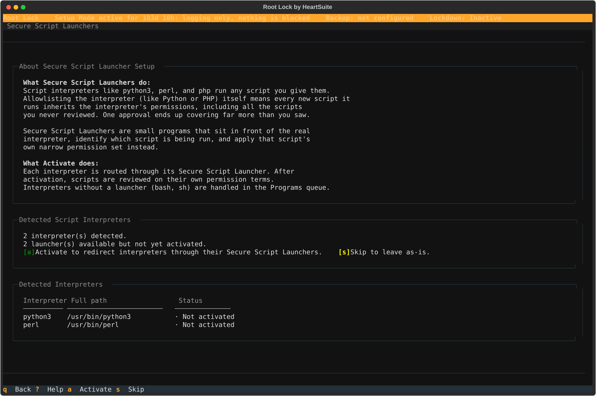

**Overview**: An interpreter like Python, Perl, or PHP executes many different scripts — without additional control, a single allowlist entry for the interpreter applies to all of them equally. Secure Script Launchers identify the specific script being executed and apply a separate allowlist entry for it, giving each script its own file and network permissions. The Launchers (`[s]`) shows detected interpreters and activates launchers in one step.

## Activating launchers

From the Dashboard, select Launchers (`[s]`). The Dashboard shows two sections:

- **Script Launcher Status** — how many interpreters were detected and how many launchers are pending activation
- **Detected Interpreters** — the list of interpreter paths found in the activity log, with their current launcher status

When launchers are pending, the Dashboard shows:

```text
2 interpreter(s) found across 47 log event(s).
2 launcher(s) available but not yet activated.

[a] Activate   [s] Skip
```



Press `[a]` to activate all pending launchers at once. Root Lock by HeartSuite registers each interpreter with its Secure Script Launcher — from this point forward, every call to that interpreter automatically routes through the launcher, applying per-script permissions.

After activation, the Dashboard confirms which launchers were activated:

```text
Activated 2 Secure Script Launcher(s): python3, perl.
Each interpreter now routes through its launcher. Scripts using
these interpreters will be reviewed on their own permission terms.
```

Press `[q]` to return to the Dashboard. The Lockdown Checklist marks **4. Secure Script Launchers** complete.

## If no script interpreters are detected

If none of the known interpreters have appeared in the activity log yet, the Dashboard shows:

```text
No script interpreter log events detected.
None of the known interpreters have appeared in the activity log yet.

Proceed without activating launchers.
```

Secure Script Launchers is not required if your system does not use script interpreters. The checklist row then reads **Not applicable**.

## Skipping launcher setup

Press `[s]` to skip without activating. Root Lock notifies you:

```text
Skipped. Interpreters without a Secure Script Launcher
activated will be blocked under Lockdown.
```

Skip does not mark the checklist row complete. The Suggested Next Step stays on Launchers (`[s]`) while interpreters are still pending. You can return to Launchers at any time to activate them before Lockdown.

## Testing a launcher directly

Before or after Dashboard activation, you can run a script through a specific launcher directly to verify it works under its own permissions:

```bash
# hs-python-launcher /path/to/your-script.py
```

This applies the script's allowlist entry rather than the interpreter's. Running the same script with `python3` directly uses the interpreter's broader permissions. This is useful for verifying per-script permissions in isolation before relying on them in Lockdown.

After activating launchers, return to the Dashboard. The Suggested Next Step directs you to [file access allowlisting](../../allowlisting/allowlisting-basics/) via the File Access queue (`[f]`) if that queue still has items.
