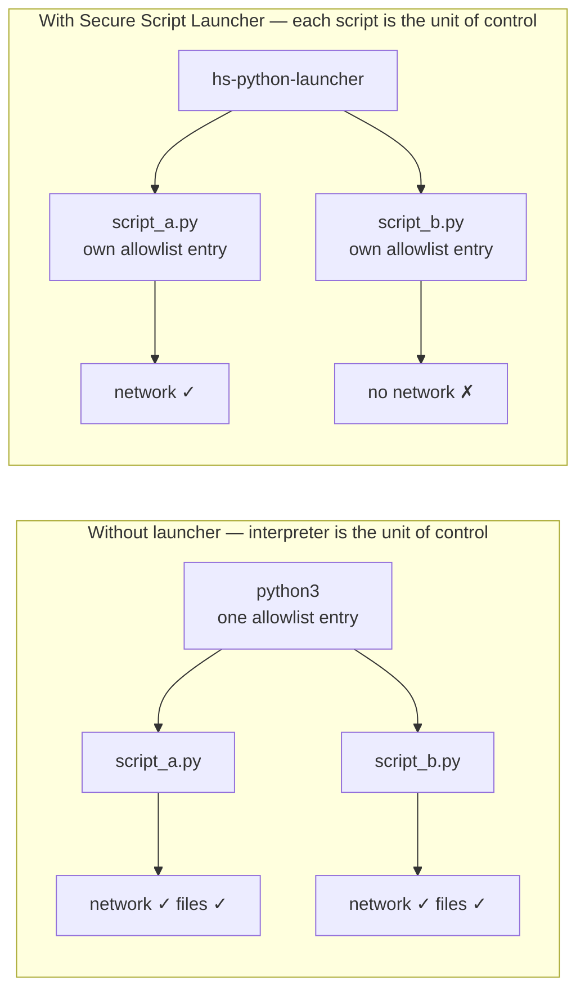

**Overview**: Without Secure Script Launchers, every script run by an interpreter (Python, Perl, PHP) shares the interpreter's permissions. If `python3` is allowed to access the network, every Python script inherits that access. Secure Script Launchers solve this by giving each script its own allowlist entry.

## Why Allowlisting the Interpreter Is Not Enough

Interpreter programs (Python, PHP, Perl, Bash) execute code from files. When you allowlist `python3`, you grant permissions to the interpreter — and every script it runs inherits those permissions. A malicious Python script would have the same file and network access as your legitimate scripts.

## Per-Script Allowlist Entries

Secure Script Launchers create a wrapper that applies the individual script's allowlist entry instead of the interpreter's:

- Each script is treated like a standalone program with its own permissions
- One script can have network access while another cannot
- Interpreters can be blocked entirely — only allowlisted scripts run

## Using Launchers

HeartSuite Core Secure provides Secure Script Launchers for each supported interpreter (e.g., `hs-python-launcher`). Once activated via the Dashboard's Launchers screen (`[l]`), every call to that interpreter automatically routes through the launcher — applying per-script permissions without any change to how you run scripts.

See [Configuring Script Launchers](../configuring-launchers/) for the activation steps.