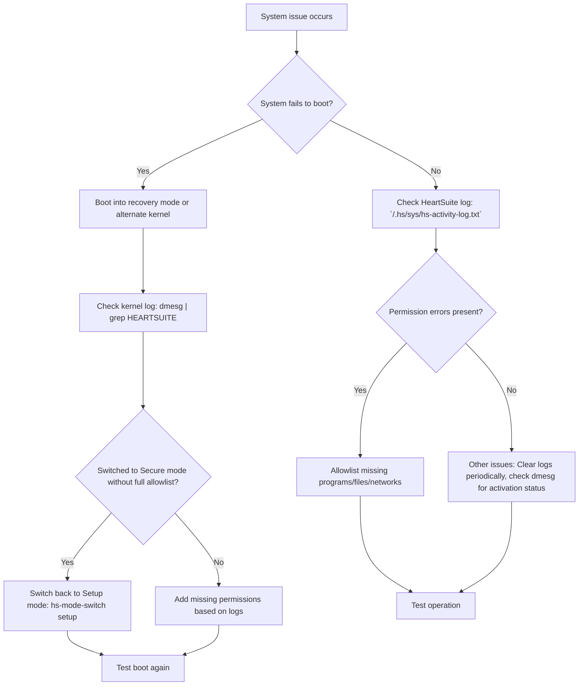

**Overview**: If issues arise, use the Dashboard for system status, alerts, and suggested next steps, or check logs for errors. Clear logs periodically to avoid clutter.



## Log Management

While running, HeartSuite always attempts to capture permission errors to the HeartSuite log, `/.hs/sys/hs-activity-log.txt`. Initially, it will report programs that are executed and that are not allowlisted. The Dashboard surfaces these as structured alerts with suggested next steps.

Because error messages can quickly accumulate in the HeartSuite log, a simple utility permits you to easily clear the log. Run the following command as root to clear the log:

```bash
# /.hs/sys/empty_HS_log.sh
```

Further, by leaving your server running continuously, the HeartSuite and kernel logs will eventually capture information about the programs executed in conjunction with systemd timers and cron jobs.

## Kernel Log Analysis

Depending on your distro, some permission error messages may not appear in the HeartSuite log; instead, they are placed in the kernel log. You can easily obtain the kernel log with the following command, which may require root privilege:

```bash
# dmesg
```

In order to readily extract only the HeartSuite messages, use grep:

```bash
# dmesg | grep HEARTSUITE
```
