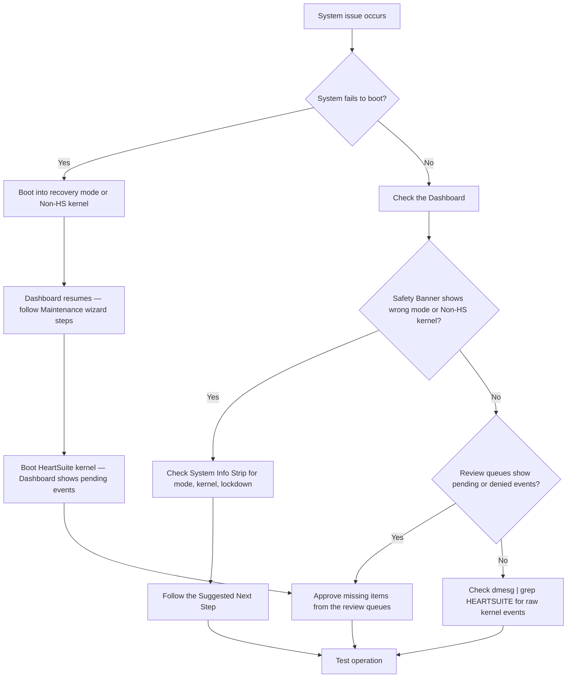

**Overview**: If issues arise, start with the Dashboard — the Safety Banner shows the current system state, and the Suggested Next Step tells you what to do. The kernel log is available for advanced diagnostics when needed.



## Dashboard-First Diagnostics

The Dashboard is the primary diagnostic tool. Before checking log files, review:

- **Safety Banner**: Confirms the current system state. If it shows "SETUP MODE", "SECURE MODE -- Lockdown not applied", or "NON-HS KERNEL", you immediately know what protection level is active.
- **System Info Strip**: Shows kernel type (`HS` or `Non-HS`), current mode with uptime, and lockdown status.
- **Pending/Denied counts**: In Setup Mode, these are pending events awaiting review. In Secure Mode, these are denied actions that may need allowlisting.
- **Suggested Next Step**: Provides a single, actionable recommendation based on the current system state.

> [!TIP]
> If you suspect a program is being blocked, check the Dashboard first. Denied events appear as structured counts in the Pending/Denied panel, grouped by category (Programs, File reads, File writes, Network). For example, if `nano` is blocked from executing, the Dashboard shows `Programs: 1 denied` and the Programs queue (`[p]`) presents the event with full metadata for approval.

## Log Management

HeartSuite captures all permission events and presents them through the Dashboard's three review queues: Programs (`[p]`), File Access (`[f]`), and Internet Access (`[i]`). The Dashboard shows pending event counts for each queue and groups events by category, so you always know what needs attention. The Maintenance screen (`[t]`) provides guided workflows for common maintenance tasks.

The review queues are the primary way to see and resolve events. The underlying activity log is a temporary buffer — once all three review queues are empty, the Dashboard automatically clears the log on its next refresh. No manual action is required.

Allow several days to a week of observation in Setup Mode. Systemd timers, cron jobs, and infrequent services generate events only when they run — the review queues accumulate these automatically.

## Kernel Log (Advanced)

The Dashboard's review queues automatically collect events from both the HeartSuite activity log and the kernel log. During normal operation, you do not need to read `dmesg` directly.

The kernel log is useful for advanced troubleshooting — for example, confirming kernel-level activation or correlating HeartSuite events with other kernel messages:

```bash
dmesg | grep HEARTSUITE
```

The Dashboard presents the same event data with metadata enrichment and grouping. The Dashboard is accessible on both the HeartSuite kernel and the Non-HS kernel — on the Non-HS kernel, the Safety Banner shows "NON-HS KERNEL" and enforcement is inactive.

## Reporting Issues

If you encounter a bug, open an issue on GitHub using the [Bug Report template](https://github.com/HeartSecuritySuite/heartsuite-core-secure/issues/new?template=bug-report.md). Include your HeartSuite version, kernel version, the Safety Banner state, and steps to reproduce. For security vulnerabilities, email support@heartsecsuite.com — we're happy to help.
