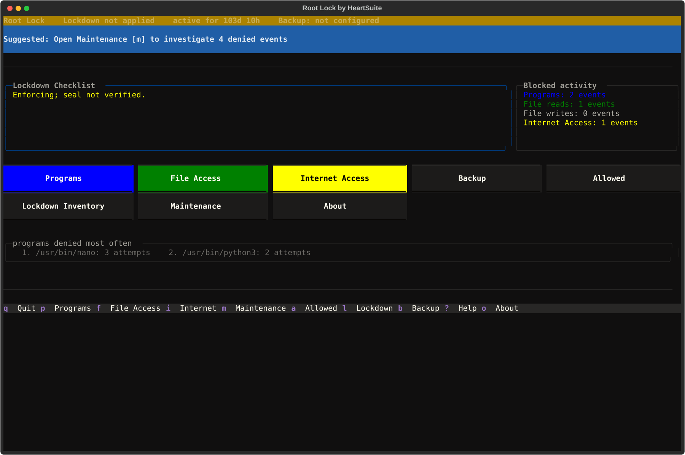

**Overview**: When something stops working under Lockdown, the cause is usually a missing allowlist entry, a different mode or kernel than expected (Setup Mode vs Lockdown, immutable seal, or the maintenance kernel), or a kernel issue.

Root Lock by HeartSuite shows which one on the Dashboard. The indicator at the top shows the current protection state, and the Suggested Next Step tells you what to do.

Installer and Dashboard logs live under `/var/log/heartsuite/`. Use the provider **serial console** to `cat` them. AWS **Get system log** is a buffered serial snapshot — it is not CloudWatch. CloudWatch, Cloud Logging, and Log Analytics need the **platform** logging agent plus IAM; Root Lock does not install that agent. Paths and the three cloud surfaces are listed in [Appendices → Log files](../appendices/#log-files).

## Where to start

The Dashboard is the primary diagnostic tool. Before checking log files, review:

- **Protection state** (indicator at the top): Confirms the current protection level. If it shows "SETUP MODE", "LOCKDOWN — immutable seal not applied", "Lockdown applied", or "maintenance kernel", you immediately know what protection level is active. "Lockdown applied" is Lockdown with the immutable seal.
- **Status line at the bottom**: Shows the kernel indicator ("Root Lock" or "maintenance kernel"), current mode with uptime, and lockdown status.
- **Pending/Denied counts**: In Setup Mode, these are pending items awaiting approval. In Lockdown, these are denied actions that may need allowlisting.
- **Suggested Next Step**: Provides a single, actionable recommendation based on the current system state.

> [!TIP]
> If you suspect a program is being blocked, check the Dashboard first. Denied items appear as counts on the Dashboard, grouped by category (Programs, File reads, File writes, Network). For example, if `nano` is blocked from executing, the Dashboard shows `Programs: 1 denied` and the Programs queue (`[p]`) presents it with full metadata for approval.



## Log management

Root Lock logs activity and presents it through the Dashboard's three review queues: Programs (`[p]`), File Access (`[f]`), and Internet Access (`[i]`). The Dashboard shows pending counts for each queue and groups items by category, so you always know what needs attention. The Maintenance (`[m]`) provides guided workflows for common maintenance tasks.

The review queues are how you see and resolve what needs attention. The underlying activity log is a temporary buffer — once all three review queues are empty **and** Secure Script Launchers is not still pending, the Dashboard automatically clears the log on its next refresh. No manual action is required.

For compliance, SIEM integration, or long-term retention, enable **Syslog** on Alert Settings → Fleet. Denial lines and aggregated alerts then go to the journal under ident `heartsuite` (alert lines use the message prefix `heartsuite-alert:`). Approvals are in `/var/log/heartsuite/allowlist-audit.log`. See [SIEM and Fleet Integration](../alerts/siem-integration/). Formal compliance evidence is covered in the SOC 2 and compliance reference documents.

Allow several days to a week of observation in Setup Mode. Systemd timers, cron jobs, and infrequent services appear in the review queues only when they run — the review queues accumulate these automatically.

## Kernel log

The Dashboard's review queues automatically collect entries from both the Root Lock activity log and the kernel log. During normal operation, you do not need to read `dmesg` directly.

The kernel log is useful for advanced troubleshooting in three situations: a program fails but the Dashboard shows zero pending or denied items for it; the Root Lock activity log has been cleared or rotated; or you need to correlate Root Lock entries with other kernel messages:

```bash
dmesg | grep HEARTSUITE
```

The Dashboard presents the same information with metadata enrichment and grouping. The Dashboard runs on the Root Lock kernel. On the maintenance kernel the TUI is Maintenance standalone, not the Dashboard; the strip reads `maintenance kernel: Root Lock not active    No blocking · No logging · No backups`. Express return is meant to get you off that kernel quickly.

## Reporting issues

If you encounter a product bug, email [support@heartsecsuite.com](mailto:support@heartsecsuite.com) with your Root Lock version, kernel version (`uname -r`), the protection state shown at the top of your Dashboard, and steps to reproduce. For documentation issues, use [heartsuite-docs issues](https://github.com/HeartSecuritySuite/heartsuite-docs/issues). For security vulnerabilities, email support@heartsecsuite.com — do not use public issue trackers.
