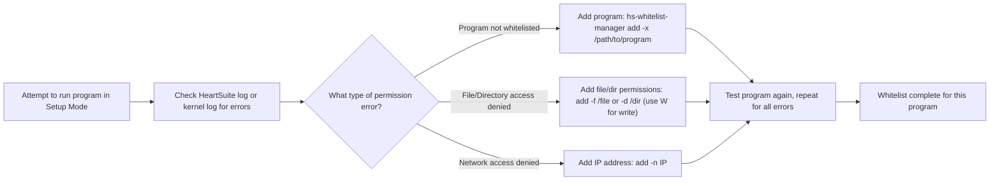

**Overview**: Whitelisting tells HeartSuite which programs are safe to run and what they can access—without this, nothing works.

# Whitelisting Overview

HeartSuite requires whitelisting programs to allow them execution and access permissions. Start with the basics, then dive into using logs for fine-tuning, and explore batch tools for efficiency.

## Key Guides
- [Whitelisting Basics](whitelisting-basics/) - Introduction to adding programs and permissions.
- [Using the HeartSuite Log](using-heart-suite-log/) - Monitor and resolve access errors via the HeartSuite activity log.
- [Using the Kernel Log](using-kernel-log/) - Alternative log access for permission errors.
- [Batch Whitelisting Tools](batch-whitelisting-tools/) - Scripts and utilities for bulk whitelisting.
