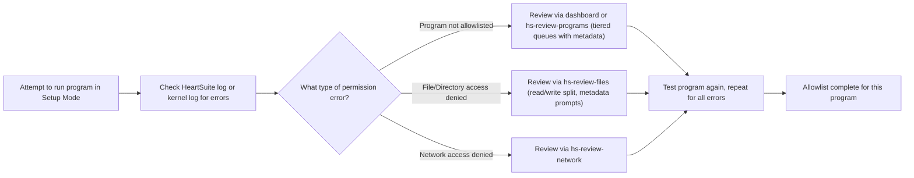

**Overview**: Allowlisting tells HeartSuite which programs are safe to run and what they can access—without this, nothing works.

# Allowlisting Overview

HeartSuite requires allowlisting programs to allow them execution and access permissions. Start with the basics, then dive into using logs for fine-tuning, and explore batch tools for efficiency.

## Key Guides
- [Allowlisting Basics](allowlisting-basics/) - Introduction to adding programs and permissions.
- [Using the HeartSuite Log](using-heart-suite-log/) - Monitor and resolve access errors via the HeartSuite activity log (cross-ref to tiered hs-review tools).
- [Using the Kernel Log](using-kernel-log/) - Alternative log access for permission errors.
- [Batch Allowlisting Tools](batch-allowlisting-tools/) - Scripts and utilities for bulk allowlisting.
