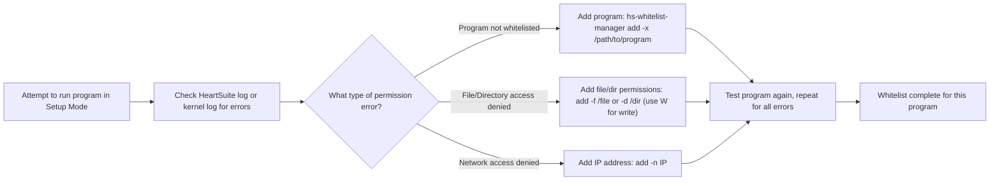

**Overview**: Whitelisting tells HeartSuite which programs are safe to run and what they can access—without this, nothing works.



## Begin Whitelisting Programs After Installation

While running, HeartSuite always attempts to capture permission errors to the HeartSuite log, `/.hs/sys/hs-activity-log.txt`. Initially, it will report programs that are executed and that are not whitelisted. whitelist entry. For example, if you run the nano program before whitelisting it, the HeartSuite log will contain the following entry:

```text
[Setup Notice - Add program to Whitelist?] Not Whitelisted: /usr/bin/nano
```

After observing this message, you can whitelist the nano program manually, as root, as follows:

```bash
# sudo /.hs/sys/hs-whitelist-manager add -x /usr/bin/nano
```

--OR, IF RUNNING AS ROOT--

```bash
# /.hs/sys/hs-whitelist-manager add -x /usr/bin/nano
```

### Granting File Access Permissions

If you then run nano again, HeartSuite will start reporting access permission errors for all files that nano accesses and the IP address of any remote servers that it connects to. Please note that nano, like most programs, relies on shared libraries to execute; accordingly, those libraries will be listed in the HeartSuite log as files accessed without permission. For example, after whitelisting nano on a Debian server and running it again, the following file access permission errors were generated:

```text
[Setup Notice - Add to Whitelist?] File Access Attempt Logged: Program: /usr/bin/nano; File: /etc/ld.so.cache
```

In fact, additional file access permission error messages were generated, but they are not shown in the example for the sake of brevity. In order to grant nano access permissions to those files, you must add file permissions to the whitelist entry for nano. Specifically, you must add either the directories in which the files are located or the complete file paths themselves. In fact, you can include one directory or file path at the time the whitelist entry for nano is created. For example, to add the directory /usr/lib to the whitelist entry when it is created, you would use a modified version of the prior command:

```bash
# sudo /.hs/sys/hs-whitelist-manager add -x /usr/bin/nano -d /usr/lib
```

Thereafter, you can add more directories and file paths to the nano whitelist entry in two ways. One way uses the program name, the other uses the program's whitelist entry number. For example, to add the /etc directory to the nano whitelist entry, use the following command after the nano whitelist entry has been created:

```bash
# sudo /.hs/sys/hs-whitelist-manager add -x /usr/bin/nano -d /etc
```

Otherwise, you can extract the whitelist entry number using the list command, coupled with a simple grep:

In this example, because HeartSuite has assigned the temporary record number 276 to the nano whitelist entry, you can use the record number as follows to add the /etc directory:

```bash
# /.hs/sys/hs-whitelist-manager add -r 276 -d /etc
```

> [!TIP]
> Whitelist entry numbers change if you remove items – always check the latest list.

**Tip**: Use directories for broad access (e.g., /usr/lib for libraries) or files for precise control (e.g., a specific script).

### Granting Write Permissions

Noticeably, all of these examples grant read-only file access to files. In order to grant write permission (which includes read permission, as well) you must prefix either the directory name or file path with a capital ‘W’. For example, to permit the nano program to write to a file named setup.sh in the home directory of user ‘admin’, use the following command:

```bash
# sudo /.hs/sys/hs-whitelist-manager add -x /usr/bin/nano \
-f W/home/admin/setup.sh
```

To grant nano permission to write to all files in admin’s home directory, use this command instead:

```bash
# /.hs/sys/hs-whitelist-manager add -x /usr/bin/nano \
-d W/home/admin
```

### Granting Network Access Permissions

The same procedures apply to learning which remote servers a program attempts to access, as well as permitting the program to access particular remote servers. This edition of HeartSuite is strictly limited to specific IPv4 and IPv6 addresses, it cannot regulate network access using address ranges or domain names. Address ranges and domain name-based access, however, are planned for later editions.

#### Example: Whitelisting wget

For example, suppose that a whitelist entry is created for the wget program without adding any network permissions. Then, the program is used to obtain an HTML document from a website, as follows:

```bash
# wget https://example.com/agreement.html
```

The following permission error message concerning network access appears in the log file:

```text
[Setup Notice - Add to Network Whitelist?] Network Connection Attempt Logged by /usr/bin/wget; IP: 45.60.22.168
```

You can add this IP address to the whitelist entry for wget as follows:

```bash
# sudo /.hs/sys/hs-whitelist-manager add -x /usr/bin/wget -n 45.60.22.168
```

– or –

```bash
# /.hs/sys/hs-whitelist-manager list | grep wget
# /.hs/sys/hs-whitelist-manager add -r 277 -n 192.142.166.196
# /.hs/sys/hs-whitelist-manager list | grep wget
277
/usr/bin/wget
# /.hs/sys/hs-whitelist-manager add -r 277 -n 192.142.166.196
```

The next time you run the same wget command, there will be no permission error message in the log for this IP address access.

Use **hs-os-boot-setup.py** or add manually with **hs-whitelist-manager** (see --help for examples).

Please note that any program added to the whitelist database using the **hs-os-boot-setup.py** script is granted access permissions allowing it to access every file, or directory, specified in log messages. Therefore, it is strongly recommended that you use the **hs-os-boot-setup.py** script cautiously. Specifically, we recommend that you use it before any adding programs that do not come with your distro. We have found that it can take several days, possibly a week, to capture all of the relevant log messages involving processes run by systemd timers and cron jobs. Once this essential information is captured, we strongly recommend that you switch to other means. Primarily, we strongly recommend that you add access permissions manually so that you can tailor access permissions to a “need-to-access” basis only. If you have several programs that require similar permissions, you can use one of our other scripts, which you can also modify easily for your needs. Finally, you can use the **hs-whitelist-manager** tool to review the access permissions of all programs and restrict them on the basis of need-to-access.