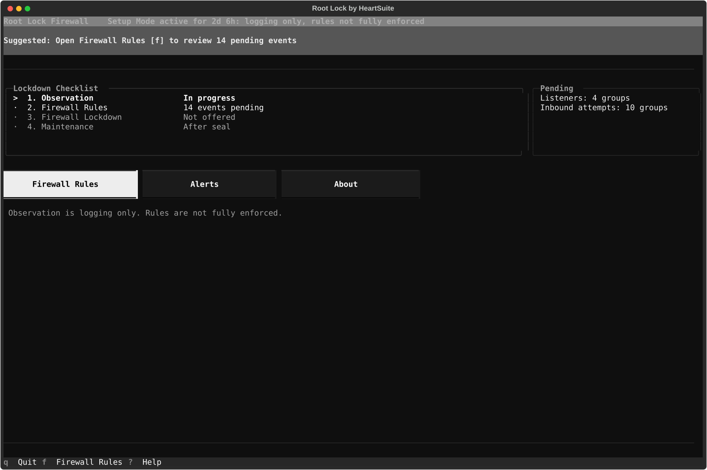
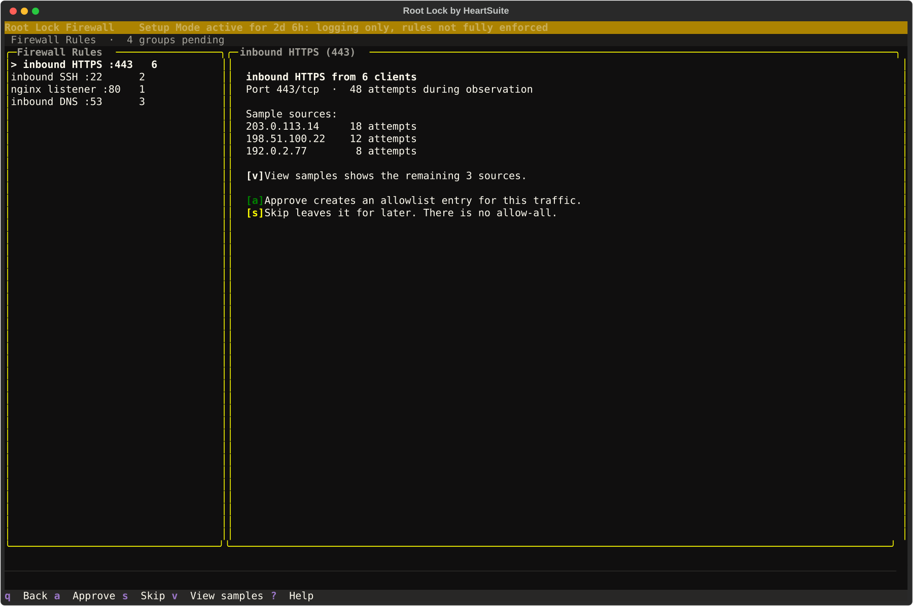
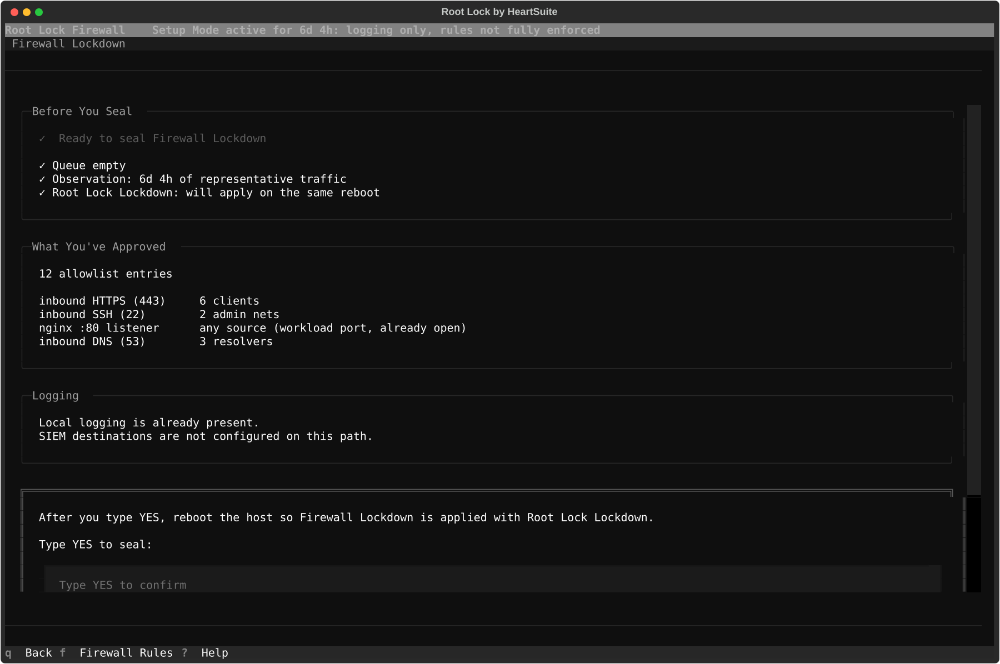

> **Prototype**: Keys, strip text, and ceremony steps shown here are the intended appliance path and may change. The screenshots are docs mock-ups of that path, not a capture of the shipping Root Lock TUI (`[f]` is still File Access there).

Root Lock Firewall ships as the closed image. You boot it, open the serial or local console, and the Dashboard is the interface.

## 1. First boot is observation

The merged system strip reports traffic observation: logging only, rules not fully enforced. That is the honest state: what is listening and what is arriving.

The Suggested Next Step points at pending firewall events.

## 2. Open Firewall Rules

From the Dashboard, open **Firewall Rules** with `[f]`.

Each pending event is something that already happened on this box during observation: a listener, an inbound attempt, a repeated source.

Firewall Rules groups related events when they share a service or origin so you are not paging through identical lines. View samples with `[v]` before approving a group.

`[a]` Approve creates an allowlist entry for that traffic. `[s]` Skip leaves it for later. `[s]` is Skip, not Seal. There is no blind "allow all pending."

An approval is a decision you make. The Dashboard does not confirm a suggestion it already chose.

## 3. Empty the queue before you seal

An empty queue is required. The Suggested Next Step offers **Seal Firewall** with `[l]` only when the precondition checklist also passes.

Most appliances need several days of representative traffic before that offer is earned. A development host that never saw production clients will under-teach the allowlist.

The image already leaves a small set of ports open to any source (workload ports, and the SSH port even when no administrative SSH listener is running). Observation does not produce those. Seal keeps them. Narrow them through Maintenance after you know the workload.

`[l]` opens Firewall Lockdown. Advance with `[y]` to see the review: rule counts, samples, and what the box already has for logging. Logging and SIEM destinations are not configured on this path.

## 4. Type YES, then reboot the host

The confirmation word is `YES` — uppercase, case-sensitive.

After you confirm, reboot from the console or hypervisor so Firewall Lockdown is applied with Root Lock Lockdown. The Dashboard does not reboot the host. `[r]` shows reboot instructions after the seal is accepted.

After reboot the strip is quiet when both seals are in place. Mutate keys are absent from Firewall Rules and from inventory. Absence is the signal that the set is sealed.

## 5. Inventory is read-only

After reboot, `[l]` opens the same Firewall Lockdown surface as inventory. It shows the allowlist that is in effect, and whether Root Lock Lockdown is present.

Advisories can flag a rule that is broader than the traffic that earned it. Edit through Maintenance.

## 6. Change only through Maintenance

To change a sealed rule, open **Maintenance** with `[m]`. Enter reduced posture with `[e]`, then type `YES`.

Edit or re-observe on Firewall Rules, then seal again with `[l]`, `YES`, and a host reboot. Unsealing does not reboot. SSH from a laptop is not the recovery path. Console or serial is.

See [Root Lock Firewall overview](../firewall-overview/) for the observe → approve → seal grammar, and [Protection limits](../limits/#physical-access-and-the-console) for the console recovery path.
