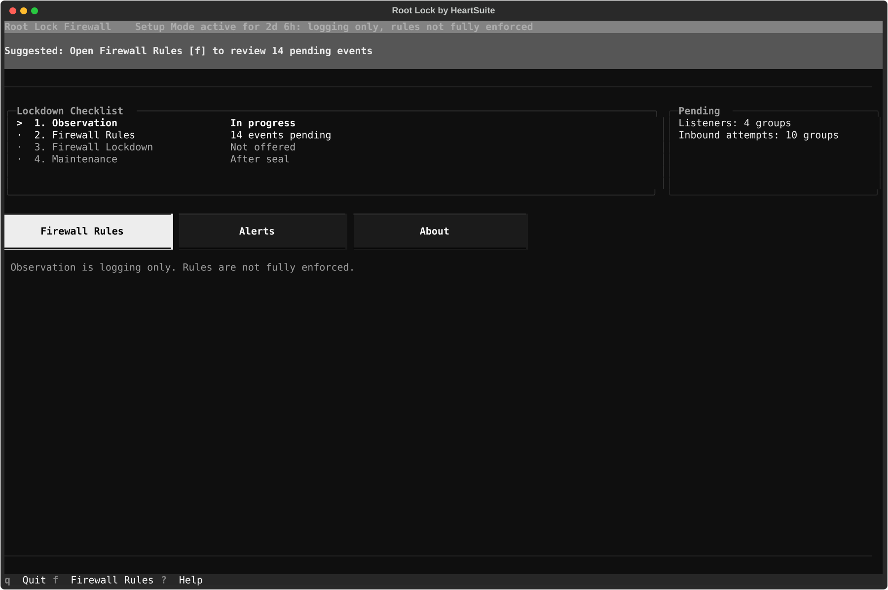
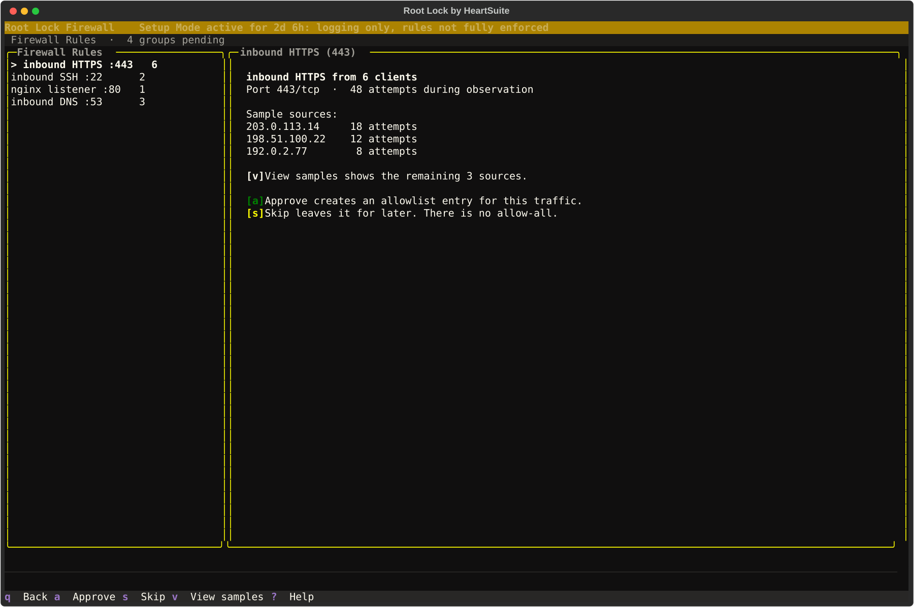
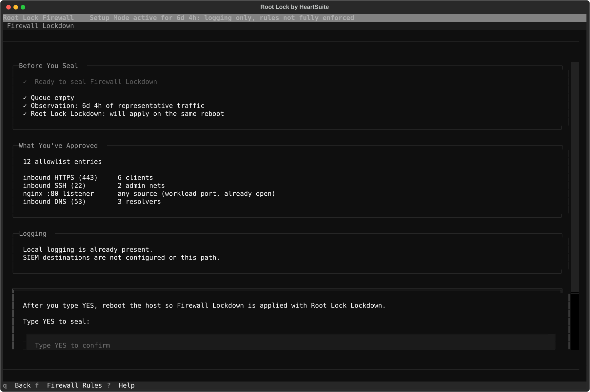

> **Prototype**: Keys, strip text, and ceremony steps shown here are the intended appliance path and may change. The screenshots are docs mock-ups of that path, not a capture of the shipping Root Lock TUI (`[f]` is still File Access there).

HeartSuite Firewall ships as the closed image. You boot it, open the serial or local console, and the Dashboard is the interface.

## 1. First boot is observation

The System Info Strip reports traffic observation: logging only, rules not fully enforced. In this state the Dashboard shows you what is listening and what is arriving before the allowlist is enforced.

The Suggested Next Step points at pending firewall events.

## 2. Open Firewall Rules

From the Dashboard, open **Firewall Rules** with `[f]`.

Each pending event is something that already happened on this box during observation: a listener, an inbound attempt, a repeated source.

Firewall Rules groups related events when they share a service or origin so you are not paging through identical lines. View samples with `[v]` before approving a group.

`[a]` Approve creates an allowlist entry for that traffic, and `[s]` Skip leaves it for later (`[s]` is Skip, not Seal). Each approval is a decision you make rather than a confirmation of a choice the Dashboard already made, which is why there is no blind "allow all pending."

## 3. Empty the queue before you seal

The Suggested Next Step offers **Seal Firewall** with `[l]` only when the queue is empty and the precondition checklist also passes.

Most appliances need several days of representative traffic before that offer appears. An allowlist taught on a development host that never saw production clients will be missing the traffic those clients send.

The image already leaves a small set of ports open to any source (workload ports, and the SSH port even when no administrative SSH listener is running). Those ports never appear as review events, and sealing keeps them open, so narrow them through Maintenance once you know what the workload needs.

`[l]` opens Firewall Lockdown. Advance with `[y]` to see the review: rule counts, samples, and what the box already has for logging. Logging and SIEM destinations are not configured on this path.

## 4. Type YES, then reboot the host

The confirmation word is `YES` — uppercase, case-sensitive.

After you confirm, reboot from the console or hypervisor so Firewall Lockdown is applied with Root Lock Lockdown. The Dashboard does not reboot the host itself; once the seal is accepted, `[r]` shows the reboot instructions.

After reboot the strip is quiet when both seals are in place, and the keys that change rules are gone from Firewall Rules and from inventory. Their absence is how you know the set is sealed.

## 5. Inventory is read-only

After reboot, `[l]` opens the same Firewall Lockdown surface as inventory. It shows the allowlist that is in effect, and whether Root Lock Lockdown is present.

Advisories can flag a rule that is broader than the traffic that earned it; to narrow that rule, go through Maintenance.

## 6. Change only through Maintenance

To change a sealed rule, open **Maintenance** with `[m]`. Enter reduced posture with `[e]`, then type `YES`.

Edit or re-observe on Firewall Rules, then seal again with `[l]`, `YES`, and a host reboot. Unsealing does not reboot the host. Recovery runs on the console or serial console, not over SSH from a laptop.

See [HeartSuite Firewall overview](../firewall-overview/) for the observe → approve → seal grammar, and [Protection limits](../limits/#physical-access-and-the-console) for the console recovery path.
