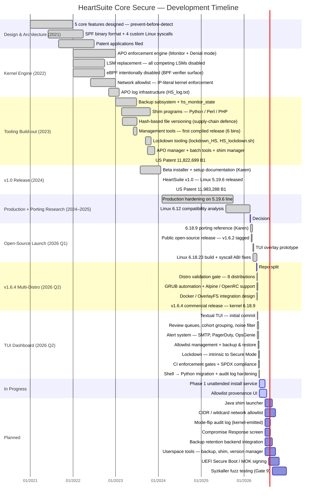

# Roadmap

Traditional endpoint security detects threats after they execute. HeartSuite takes the opposite approach: it prevents malware from executing in the first place—at the kernel level, where not even root can override the controls. Even if malware is downloaded to a HeartSuite server, the architecture prevents it from running its harmful commands. That stops zero-day attacks before any signature, rule, or heuristic could catch them.

The five core features that make this possible—Application Permission Orders, Monitor and Denial Modes, Lockdown, File Backup and Versioning, and Secure Script Launchers—were designed together as a single coherent architecture, not assembled from separate tools. This page traces how that architecture was built, validated, and hardened over time.

Last updated: {{ .Lastmod.Format "2006-01-02" }}

## Development Timeline

## Feature Details by Status




### Design & Architecture (2021)

> [!NOTE]
> **Five Core Features Designed — Prevent-Before-Detect Architecture** (~2021)  
> The five core features that define HeartSuite were designed together as a single architecture before any kernel code was written: Application Permission Orders (APO), Monitor and Denial Modes, Lockdown, File Backup and Versioning, and Secure Script Launchers for interpreted code. The design goal was to stop malware from executing at all—not to detect it after the fact. This "prevent-before-detect" approach is what separates HeartSuite from traditional endpoint security.

> [!NOTE]
> **SPF (Secure Permission Format) Binary File Format** (~2021–2022)  
> A purpose-built binary record format for storing APO records. SPF files use structured records with typed metafields and data fields: `HS_SANDBOX_RECORD` holds per-program permissions; `HS_SANDBOX_FILES` holds read/write path grants; `HS_NET_LOCATIONS` holds IP allowlist entries; `HS_SANDBOX_PROCESS_RECORD` tracks runtime process state; `HS_SANDBOX_INTERP_CODE_LOOKUP` maps interpreter PIDs to script APO entries. The kernel parses SPF records directly via `SPF_kernel.c`.

> [!NOTE]
> **Four Custom Linux System Calls** (~2021–2022)  
> HeartSuite adds four syscalls to the Linux kernel: `hs_activate_hs` (starts enforcement with a configurable monitor mode and cache size), `hs_execve` (executes an interpreted script with APO-gated sandboxing), `hs_lockdown_hs` (engages Lockdown—reboot-only-reversible), and `hs_stop_backup` (halts the backup subsystem). These occupy slots 451–454 in Linux 5.19.6 and 470–473 in the 6.18 port.

> [!NOTE]
> **Patent Applications Filed** (~2021–2022)  
> The inventions behind APO enforcement and OS-level sandboxing were filed with the USPTO. Issued as US 11,822,699 B1 (November 2023) and US 11,983,288 B1 (May 2024).

---

### Kernel Engine (2022)

> [!NOTE]
> **APO Enforcement Engine — Monitor Mode + Denial Mode** (2022)  
> Five upstream kernel files are modified with HeartSuite enforcement hooks: `fs/exec.c` (execution gating), `fs/namei.c` (~17 injection points covering mkdir, rmdir, rename, unlink, and path creation), `fs/open.c` (file access control + backup trigger), `net/socket.c` (outbound network restrictions), and `kernel/exit.c` (sandbox cleanup on process exit). The core enforcement logic lives in `fs/hs_sandbox_caching.c`. In Monitor Mode, violations are logged but not blocked. In Denial Mode, programs without an APO record cannot execute, and programs with a record cannot exceed it.

> [!NOTE]
> **LSM Replacement — HeartSuite Is the Only Security Module** (2022)  
> HeartSuite does not layer on top of the Linux Security Module framework—it replaces it. AppArmor, SELinux (as LSM), TOMOYO, Landlock, Yama, SafeSetID, LoadPin, and the kernel Lockdown LSM are all disabled at build time. HeartSuite implements its own path-based enforcement in their place. This eliminates the interaction complexity and potential bypass paths that arise when multiple LSMs run alongside each other.

> [!NOTE]
> **eBPF Intentionally Disabled** (2022)  
> `CONFIG_BPF_SYSCALL=n` and `CONFIG_BPF_JIT=n` are set at build time. This is a deliberate security decision: BPF verifier CVEs have historically bypassed VFS hooks entirely—the exact hooks HeartSuite relies on for enforcement. Disabling eBPF closes that attack surface permanently. The operational trade-off is that standard eBPF-based forensics tools (bpftrace, Tetragon, Falco, Pixie, Tracee) cannot run on the HS host kernel. The supported architecture for eBPF-class observability is an adjacent monitoring host running a standard kernel, receiving HS kernel logs via syslog. For full forensic depth, operators boot a non-HS kernel, perform analysis, and boot back—a procedure consistent with HS's physical-access trust model.

> [!NOTE]
> **FUSE and OverlayFS Disabled** (2022)  
> `CONFIG_FUSE_FS=n` and `CONFIG_OVERLAY_FS=n` are set by default. Both are potential sandbox bypass paths—FUSE because it redirects filesystem operations to userspace where kernel hooks may not fire; OverlayFS because it can interpose between a process and its files in ways that complicate path-based enforcement. OverlayFS is under review for container deployments (see feature/v2-experimental).

> [!NOTE]
> **Network Allowlist — IP-Literal Kernel Enforcement** (2022)  
> Outbound network connections are checked in `net/socket.c` via `HS_net_location_permitted()`, which performs a byte-for-byte comparison against the IP entries in a program's APO record. The allowlist is literal-IP-only: no CIDR ranges, no DNS resolution, no wildcards, no masks. Each destination IP must be enumerated explicitly. IPv4 and IPv6 addresses are separate entries. For services behind round-robin DNS or CDNs, operators route egress through a fixed-IP forward proxy that is itself allowlisted.

> [!NOTE]
> **LRU Sandbox Cache — Scales to Thousands of Concurrent Instances** (2022)  
> Only one APO record needs to be loaded into kernel memory per running program, regardless of how many concurrent instances of that program are running. The cache uses an LRU policy with a configurable size (default: 25 records, minimum: 10) and timestamp-based eviction. Mutex-protected for thread safety. This design keeps memory overhead flat even on heavily loaded servers.

> [!NOTE]
> **APO Log Infrastructure** (late 2022)  
> `HS_log.txt` and `HS_log_empty.txt` created as the persistent audit trail for all kernel-intercepted events. Every exec, file access, and network connection attempt generates a structured `HS_EVENT` line in the kernel log. These events feed the TUI review queues and the alert daemon. The integrity of the log surface is verified by the enforcement-manifest gate: the 25 call sites that emit `HS_EVENT` entries are snapshotted and checked on every CI run.

> [!NOTE]
> **kmod and kexec Attack Paths Closed by Default** (2022)  
> `modprobe`, `kmod`, and `insmod` are absent from the shipped APO seed lists, so they cannot execute under Denial Mode by default. The module-drop attack path is closed without any explicit policy: if a binary has no APO record, it cannot run. The `kexec` binary is also absent from the shipped APO; additionally, `/boot` is made recursively immutable under Lockdown (`chattr -R +i`). Revoking Lockdown requires physical or serial console access to select an alternate kernel—attackers cannot trigger it remotely.

---

### Tooling Build-out (2023)

> [!NOTE]
> **Backup Subsystem + `hs_monitor_state`** (January 2023)  
> The in-kernel backup-on-write subsystem and its configuration (`hs_backup_config.spf`) come online. When a file in a monitored directory is closed after a write, the kernel invokes `hs-backup` via `call_usermodehelper`—only the HeartSuite binary can access the backup store; no other program has an APO entry for it. `hs_monitor_state.bin` is created as the authoritative byte-level mode indicator read by both the kernel (`activate_HS`) and the TUI.

> [!NOTE]
> **Shim Programs — Python, Perl, PHP** (February 2023)  
> `hs_python2`, `hs_python3`, `hs_perl`, and `hs_php` extend APO gating to interpreted code. When a script is launched through an HS shim, the kernel checks that the *script path itself* has an APO record—not just the interpreter binary. This prevents a malicious Python script from running simply because the Python interpreter is approved. Direct `execve` of the interpreter binary bypasses the shim; installer-time deployment of the shim as the default launcher is what makes the control effective.

> [!NOTE]
> **Hash-Based File Versioning** (~mid-2023)  
> Each backed-up file version is stored in a hash-named subdirectory under its sandbox root. Version hashes prevent supply-chain attacks: a modified file produces a different hash, making the tampered version distinguishable from any approved version. `hs-version-manager` retrieves any specific version by hash.

> [!NOTE]
> **Management Tools — First Compiled Release** (June 2023)  
> Six production binaries compiled in a single release: `hs-APO-cache-size`, `hs-monitor-state`, `hs-backup`, `hs-version-manager`, `hs-shim-manager`, and `hs-backup-config-manager`.

> [!NOTE]
> **Lockdown Tooling** (September–October 2023)  
> `lockdown_HS`, `hs-unlock-progs`, `HS_lockdown.sh`, and `HS_unlock.sh` implemented. `HS_lockdown.sh` applies `chattr +i` to 23 critical paths across seven categories: HeartSuite config and tooling, APO database, system authentication files (`/etc/passwd`, `/etc/shadow`, `/etc/sudoers`), SSH config, boot partition (`/boot/`), systemd unit directories, and cron directories. This closes the "schedule a script at next boot to re-widen permissions" attack path at each surface an attacker would reach for. Lockdown is set via a kernel syscall (`hs_lockdown_hs`) that writes a static integer; there is no clearing syscall—the only reset is a kernel reboot.

> [!NOTE]
> **APO Manager + Batch Tools** (October 2023)  
> `hs-app-perm-orders-manager` (C binary), `batch_record_add.py`, `init_base_records.sh`, `realpath_generator.py`, and `extract_program_names.py` finalized. `add_start_and_shutdown_programs.py` automates the Monitor Mode workflow: it parses `HS_EVENT` lines from the kernel log and promotes them into APO records, reducing manual setup to edge cases.

> [!NOTE]
> **US Patent 11,822,699 B1 — Issued** (November 21, 2023)  
> *Preventing Surreptitious Access to File Data by Malware.* Covers the core APO enforcement model: removing plenary power from applications and enforcing per-program file and network access through kernel modifications.

---

### v1.0 Release (2024)

> [!NOTE]
> **HeartSuite v1.0 — Linux 5.19.6-HeartSuite-1.0** (January 20, 2024)  
> First full production release: compiled kernel, tools tarball, installer (`HeartSuite_install.sh`), systemd service units, and operator documentation. Shipped to beta customers on Debian 11.

> [!NOTE]
> **Setup Documentation — HeartSuite_Setup_Debian_v1.md** (November 2023)  
> Comprehensive operator guide covering the full lifecycle: installation, Monitor Mode log-to-APO workflow, shim configuration, automatic file backup setup, mode switching, licensing, Lockdown engagement, maintenance procedures, cache size adjustment, and the complete tool inventory.

> [!NOTE]
> **Two Distribution Models**  
> HeartSuite ships in two forms: the complete system (kernel + userspace tools + installer, for fresh deployments) and kernel-only source (for integration into existing systems or custom distribution builds). Major kernel-line moves require coordinated updates to both.

> [!NOTE]
> **US Patent 11,983,288 B1 — Issued** (May 14, 2024)  
> *Operating System Enhancements to Prevent Surreptitious Access to User Data Files.* Covers the OS-level enforcement architecture: mediated file access, version-hash isolation, and the five HeartSuite security rules as operationalized through kernel modifications.

---

### Production Hardening + Porting Research (2024–2025)

> [!NOTE]
> **Production Hardening on 5.19.6 Line** (2024–2025)  
> HeartSuite v1.0 runs in production environments. Operator feedback drives tooling refinements, APO workflow improvements, and documentation updates.

> [!NOTE]
> **9 Trust Boundaries Formally Documented** (2024–2025)  
> The attack-surface map enumerates every edge across which untrusted input becomes privileged action: the four custom HS syscalls (B1), the five hooked upstream syscalls (B2), the shim-launcher APO check (B3), the operator-to-kernel-state path via `.spf` and `.bin` files (B4), Lockdown immutability via `chattr` (B5), the boot-path service chain (B6), the kernel-to-backup-userspace `call_usermodehelper` (B7), the install-time host path (B8), and the subscription activation server (B9). B1 and B2 are the load-bearing surfaces: every enforcement decision reduces to "did the right hook fire and consult the right flag?"

> [!NOTE]
> **Linux 6.12 Compatibility Analysis** (2025)  
> A full compatibility report and porting plan are produced for Linux 6.12.1. Decision: skip 6.12 (not LTS) and target 6.18 LTS instead.

---

### Open-Source Launch — v1.6.2 (2026 Q1)

> [!NOTE]
> **6.18.9 Kernel Porting Reference Document** (March 2026)  
> Documents every hook change from 5.19.6 to 6.18: EXEC-001 moved from `bprm_execve()` to `alloc_bprm()`, syscall slots renumbered from 451–454 to 470–473, and `const struct path` type qualifier incompatibility resolved. Authored by Karen.

> [!NOTE]
> **Public Open-Source Release — v1.6.2** (March 5–11, 2026)  
> HeartSuite Core Secure published under AGPL-3.0. Includes kernel source, tools, porting guides, internal security checklists, and CONTRIBUTING documentation.

> [!NOTE]
> **TUI Overlay Prototype** (March 18–26, 2026)  
> First working Textual TUI overlay: naming overlay, log viewer, tree parser, and Layer 1 CLI tools. Category colors and three-pane dashboard layout established.

> [!NOTE]
> **Linux 6.18.23 Build** (March–April 2026)  
> Three build iterations required. Issues resolved: Debian seed config had 3 776 modules vs. 13 target modules (HS-DEV-003); syscall ABI drift across 7 binaries on openSUSE Tumbleweed (Gate 0 added retroactively as ABI parity check); `const struct path` incompatibility fixed (HS-DEV-006/007/008).

---

### v1.6.4 Multi-Distro Release (April 2026)

> [!NOTE]
> **Repository Split** (April 21, 2026)  
> TUI overlay and installer move to the sibling public `heartsuite` repo. Kernel, tools, and porting docs remain in `heartsuite-core-secure`. The `main` branch is archived; development continues on `kernel-6.18`.

> [!NOTE]
> **Multi-Distro Validation Gate — 8 Distributions** (April 22–26, 2026)  
> Validated on Debian 12, Debian 13 (Trixie), Ubuntu 24.04, Fedora 41, Rocky 9.7, CentOS Stream 9, Alpine 3.21, and openSUSE Tumbleweed. A cross-distro release gate runs after every kernel update.

> [!NOTE]
> **GRUB Automation + Alpine / OpenRC Support** (April 23–29, 2026)  
> Installer sets HeartSuite kernel as GRUB default and reboots automatically. Falls back to console instructions on Alpine/extlinux. Both systemd and OpenRC service unit variants ship.

> [!NOTE]
> **Docker / OverlayFS Integration Design** (April 24, 2026)  
> `CONFIG_OVERLAY_FS=m` added for container hosts. Docker capability stack analysed; HS-internal error codes mapped to POSIX errno for container output. Gate 11 (post-Lockdown mount refusal) designed and verified.

> [!NOTE]
> **v1.6.4 Commercial Release — Kernel 6.18.9** (April 26, 2026)  
> Tag `hs-v1.6.4-kernel-6.18.9`: "HeartSuite v1.6.4 on Linux kernel 6.18.9 — commercial release baseline."

---

### TUI Dashboard (April–May 2026)

> [!NOTE]
> **Textual TUI Dashboard** (April 28, 2026)  
> Root-only, SSH-compatible, keyboard-first management console. No X11 or Wayland required. All six setup phases trackable from a single screen.

> [!NOTE]
> **Three Review Queues — Programs, File Access, Internet Access**  
> Cohort-first traversal, inline help overlays, sidebar with cohort groupings. Ghost files display with "no longer exists" label. APO-approved items leave the queue permanently.

> [!NOTE]
> **Alert System — SMTP, Syslog, PagerDuty, OpsGenie** (April–May 2026)  
> Guided six-phase configuration. Alert daemon as `heartsuite-alert.service`. RFC 5424 syslog, PagerDuty Events API v2, OpsGenie native format.

> [!NOTE]
> **Lockdown — Intrinsic to Secure Mode** (May 2026)  
> `HS_startup.sh` engages `HS_lockdown.sh` unconditionally on every successful `activate_HS`. Five categories sealed automatically. The kernel-side `HS_lockdown_state` integer is set via `hs_lockdown_hs` syscall; there is no clearing syscall—only a reboot resets it.

> [!NOTE]
> **Allowlist Management, Backup & Restore, Maintenance Wizard**  
> Per-entry allowlist removal, bulk stale-entry cleanup, backup timeline view with date-based restore, and a two-path maintenance wizard (simple update vs. new-program approval cycle).

---

### Infrastructure + CI (2026)

> [!NOTE]
> **13-Gate Verification Framework**  
> A formal gate taxonomy covering: ABI parity (Gate 0), config parity (Gate 0.5), checkpatch (Gate 1), sparse (Gate 2), clean compile (Gate 3), syscall smoke allow/deny paths (Gates 4/4b), LTP subset (Gate 5), KASAN+UBSAN (Gate 6), cross-distro matrix (Gate 7), post-Lockdown mount refusal (Gate 11), perf trend (Gate 12), and source-surface manifest + lint (Gate 13). Gates 8 (kselftests), 9 (syzkaller), and 10 (xfstests) are defined but deferred.

> [!NOTE]
> **Enforcement-Disable Defense — CI Lint + Manifest Snapshot** (May 2026)  
> Phase 2.x gates: 25 enforcement call sites snapshotted in `tests/manifest/enforcement_manifest.txt`; commented-enforcement linter (Patterns A–E) rejects any new `// HS_*` comment-out shape; lockdown manifest (34 paths) + unlock manifest (34 paths) asserted for symmetry; 4 state-flag reads/writes snapshotted.

> [!NOTE]
> **Shell → Python Migration + SPDX Compliance** (May 2026)  
> All installer `.sh` scripts converted to `.py` equivalents. SPDX headers applied throughout; REUSE compliance verified. License transitioned from AGPL-3.0 to BUSL-1.1.

> [!NOTE]
> **Always-On UI Audit Log + Safe Error Handling** (May 2026)  
> All UI actions logged to a rotating file. Silent `except` blocks eliminated across `src/ui/` and `src/core/`. CI AST walker enforces the no-silent-except rule on every commit.




> [!WARNING]
> **Phase 1 Unattended Install Service — Code Implementation**  
> Design complete (DD-050): a `heartsuite-phase1.service` oneshot systemd unit (plus OpenRC shim) chains the APO approval loop across reboots without requiring an active TUI session. The service unit file, `heartsuite-phase1-loop.py` runner, APO pre-seeding script, and phase sentinel are the outstanding deliverables.

> [!WARNING]
> **Allowlist Provenance UI**  
> Design brief complete (May 12, 2026). Each allowlist entry will show how, when, and by whom it was approved—stored in `allowlist-origins.json`. Backend extension and UI rendering are pending.

> [!WARNING]
> **File-Access Consequence Text (DD-044 Gap 1)**  
> The non-ghost-file code path in `review_content.py` names the wrong scope ("these files" instead of the parent directory stored in the APO record). One-line fix specified; not yet applied.

> [!WARNING]
> **Lockdown Screen — Final UX Form**  
> Now that Lockdown is automatic, the five-category inventory screen has no decision left to confirm. Open question: standalone viewing surface, or fold into the Lockdown button ceremony?




### User-Facing Features

> [!ABSTRACT]
> **Java Shim Launcher**  
> The five shipped shim programs cover Python 2, Python 3, Perl, and PHP. A Java launcher is planned: Java scripts and applications would receive the same per-script APO enforcement that Python/Perl/PHP enjoy today. Without it, Java deployments are APO-gated at the JVM binary level only, not at the individual `.jar` or script level.

> [!ABSTRACT]
> **CIDR / Wildcard Network Allowlist**  
> The current network allowlist is literal-IP-only: no CIDR ranges, no DNS, no wildcards. `convert_to_wildcard.py` exists as a tooling hint, but the kernel comparator (`data_matches()` in `SPF_kernel_helper_functions.c`) has no mask or suffix semantics. Adding CIDR support would allow `10.0.0.0/8` as a single entry rather than requiring each IP to be enumerated—significant for cloud deployments where destination IPs are dynamic.

> [!ABSTRACT]
> **Mode-Flip Audit Log (Kernel-Emitted)**  
> When the kernel switches between Monitor and Denial modes, `set_monitor_mode` currently emits no log line. A security governance best practice is to log every state transition with `from_state`, `to_state`, the triggering process PID and comm, and a timestamp—so that an unexpected mode flip is visible after the fact. This is a new kernel-side log emission, not a TUI feature.

> [!ABSTRACT]
> **Compromise Response Screen**  
> Accessible from the dashboard when a non-HS kernel is detected. Guides through: forensic scan, allowlist audit, restore from backup, and controlled return to Lockdown. Design brief exists; not yet implemented.

> [!ABSTRACT]
> **Backup Retention — `hs-backup-config-manager` Integration**  
> Tiered retention policy UI is designed (7-day full / 90-day daily / monthly). The kernel-side `hs-backup-config-manager` needs per-directory retention subcommands before the UI can connect.

> [!ABSTRACT]
> **Multi-File Selection in Restore**  
> Version manager currently restores one file at a time. Multi-file and directory-level restore selection planned.

> [!ABSTRACT]
> **UEFI Secure Boot / MOK Signing**  
> Azure Gen2 VMs default to Trusted Launch (Secure Boot on), blocking unsigned kernels — a confirmed customer blocker. MOK enrolment flow not yet designed.

---

### Kernel / Userspace Tools

> [!ABSTRACT]
> **`hs-backup` — Userspace Versioning & Rollback**  
> In-kernel backup-on-write is complete. The userspace versioning and rollback tool is not finished.

> [!ABSTRACT]
> **`hs-shim-manager`, `hs-version-manager`, `hs-app-perm-orders-manager` (C binary)**  
> Source exists in `tools/`; not in the shipped PROGRAMS list. Needed to replace their current script-driven equivalents.

---

### Testing & Verification

> [!ABSTRACT]
> **Syzkaller Fuzz Testing (Gate 9)**  
> The four custom HS syscalls and the SPF parser are the highest-value fuzz targets. Syzkaller is defined in the gate taxonomy but deferred. The SPF parser handles variable-length, operator-produced records with no existing fuzz harness; KASAN+UBSAN (Gate 6) catches memory bugs on known inputs but not on malformed ones.

> [!ABSTRACT]
> **Per-Function Deny-Return Contract**  
> The enforcement manifest tracks which call sites exist, but not whether each deny path returns `-EACCES` (or another deny code) vs. `0`. A silent `return -EACCES → return 0` regression inside an enforcement function would be invisible to the current manifest gate. Requires a per-function contract authored alongside Karen + a generator extension.

> [!ABSTRACT]
> **kselftests + xfstests (Gates 8 & 10)**  
> Defined in the gate taxonomy; deferred pending resource allocation.




## Community-Driven Development

Join the conversation—suggest features, report issues, or discuss the architecture.

[Discord/GitHub links here via config params.links]

### Get Started
[Get Started](/docs/) | [Open an Issue](https://github.com/HeartSecuritySuite/heartsuite-docs/issues/new)
