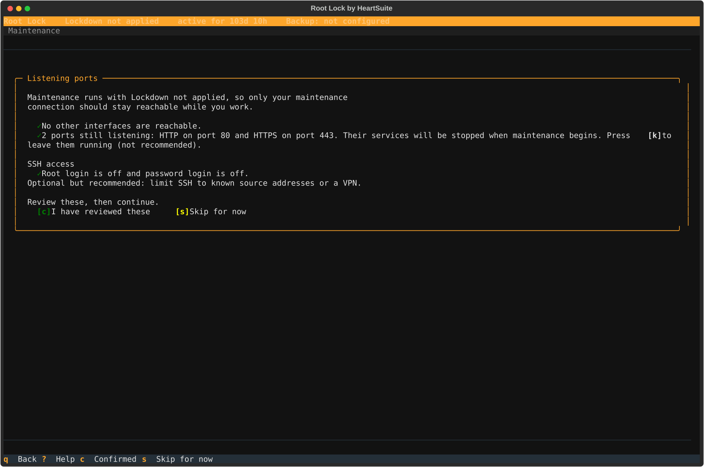

**Overview**: Every maintenance window is an attack window — blocking is temporarily suspended, and anything an attacker can reach during that period is unprotected.

Maintenance is the period when you temporarily reduce Root Lock by HeartSuite's protection to install packages or edit files. The Dashboard's Maintenance (`[m]`) guides you from the safety checklist through re-engaging Lockdown. Replacing the Root Lock kernel is a different path: [Updating Root Lock](../updating-heartsuite/).

After Lockdown, **unsealing** is the console step. You select **Maintenance: unseal and return to Root Lock** at the boot menu. The seal lifts automatically, and the machine returns to the Root Lock kernel in Setup Mode, so there are no flags to remove by hand on the maintenance kernel. Once you are back in Setup Mode, you install packages, edit configuration, and run Ansible over SSH.

A one-reboot switch that stays on the Root Lock kernel applies only when the strip already says **Lockdown not applied**, which means the seal is missing — not the usual state after a completed Lockdown.

**Patch one host already in Lockdown**

1. Open Maintenance (`[m]`) from the Dashboard while Lockdown is applied.
2. At the console, reboot and pick **Maintenance: unseal and return to Root Lock**. SSH cannot make this pick.
3. You land in Setup Mode on the Root Lock kernel. Install OS and application patches over SSH.
4. Review the new queue items and approve only what you will keep, because every approved entry can run under Lockdown.
5. Open Lockdown (`[l]`) and type `YES`.

**Many hosts:** reprovision from an updated image instead of opening a console on every node. See [Enterprise Adoption Guide — Operational model for fleets](../../kernel-hardening/enterprise-adoption-guide/#operational-model-for-fleets) and [How do I patch many hosts that are already in Lockdown?](../../faqs/).

## Starting maintenance

From the Dashboard in Lockdown, select Maintenance (`[m]`). The Dashboard detects whether the immutable seal is active and presents the correct path.

### Safety checklist

Before any mode change, Maintenance presents a safety checklist. The Dashboard auto-detects system state where possible and shows the status of each item:

- **Network isolation** — disable network interfaces or restrict firewall rules to prevent remote access during maintenance
- **Server processes** — shut down daemons (e.g., web servers) to close attack vectors
- **SSH access** — no root login, key-based auth only, source IP restriction

The Dashboard shows green checkmarks for items that pass and amber warnings for items that need attention. Press `[c]` Confirmed to proceed or `[s]` Skip to continue without completing the checklist. If you skip, the Dashboard displays a persistent reminder throughout the maintenance period — it does not disappear until you re-engage Lockdown.

The safety checklist matters most when you are about to lift the seal, because Root Lock is not loaded during the maintenance kernel boot. Once you are in Setup Mode the Root Lock kernel is loaded again, so logging and backups continue.

## After Lockdown: unseal from the console

This is the path when Lockdown is applied. Physical or serial-console access is required to pick the boot-menu entry (keyboard and monitor, a serial port, or your cloud provider's serial console — AWS EC2 Serial Console, GCP Serial Console, Azure Serial Console, DigitalOcean Console). Confirm that access before you start. SSH cannot unseal: sshd on the Root Lock kernel never clears the `chattr +i` seal, which `HS_unlock.sh` removes on the maintenance boot that the GRUB pick starts. After the seal lifts, you install packages and edit files over SSH or with Ansible.

After the safety checklist, Maintenance tells you to reboot from the **console**. It does not offer `[r]` Reboot on this path — the boot-menu choice has to happen at the console.

1. Open the console and restart the machine there.
2. At the boot menu, select **Maintenance: unseal and return to Root Lock**. Do not select the branded Root Lock kernel. If a boot menu password was set, this entry asks for it: at the GRUB prompt, the user name is `root` and the password is the boot menu password you set. The Root Lock entry does not ask.
3. The seal lifts automatically (`HS_unlock.sh`). The machine restarts on its own and returns to the Root Lock kernel in Setup Mode.
4. On the serial console, press **Enter** when you see **Press Enter to start.** (see [Lockdown](../../lockdown/)).

The boot menu appears a second time during that automatic return. Let it be: reboot is already in motion and there is nothing to select.

You are then in Setup Mode on the Root Lock kernel:

- Blocking is off; logging and backups are on.
- New activity appears in the review queues.
- Maintenance (`[m]`) is hidden — you can already install software and edit files.

Make your changes — install packages and edit configuration. When finished, lock down again from Lockdown (`[l]`). Review and approve the new queue items before you type `YES`. The activation flow is in [Lockdown](../../lockdown/).

To replace Root Lock itself, do not wait on this kernel for the bundle. From a terminal in this Setup Mode window run `bash heartsuite-install.sh` and type `YES`. See [Updating Root Lock](../updating-heartsuite/).

If you accidentally select the Root Lock kernel at the first boot menu instead of the Maintenance entry, the Dashboard detects that and sends you back to reboot and select the correct entry.

> [!WARNING]
> Between selecting the Maintenance entry and the automatic return, Root Lock is not loaded, so the safety checklist is what protects the host during that interval.

Until the automatic return, the host runs ordinary Linux and ordinary attacks work against it. By default only the console reaches it: the NIC stays down on that kernel unless you chose a live or firewall route in Maintenance.

## When the seal is not applied

If the strip says **Lockdown not applied**, Maintenance offers a switch to Setup Mode that stays on the Root Lock kernel. Type `YES` (case-sensitive). The Dashboard then offers `[r]` Reboot.

After that reboot:

- Root Lock switches from blocking to logging only
- The Root Lock kernel remains active
- Backups continue running
- The existing allowlist is preserved
- New activity is logged, not blocked — it will appear in the review queues when you lock down again

This path is for an unfinished or drifted seal, not for a host that already shows **Lockdown applied**.

## After the window is open

Once you are in Setup Mode, SSH and Ansible can install packages and edit files on that host. The console trip is only to lift the seal.

- **One host, many services.** One unseal covers every program on that machine.
- **Many hosts already in Lockdown.** Ansible cannot lift the seal. The official `heartsecurity.root_lock` role leaves mode unchanged when `hs_state` is unset or `setup`. In-place patches still need the console path on each sealed host. For a fleet, reprovision from an updated image instead — see [Enterprise Adoption Guide](../../kernel-hardening/enterprise-adoption-guide/#operational-model-for-fleets) and [Central Policy](../../alerts/central-policy-management/).
- **Detaching the disk.** Stopping a cloud VM and attaching its volume to another instance is hypervisor access, not a supported patch procedure. That mount is how a lost boot menu password is cleared, because the boot menu itself cannot reset it. Treat it as the same class as serial-console access: break-glass, and restrict it in cloud IAM. See [Circumvention and recovery](../../introduction/how-it-compares/#circumvention-and-recovery).

## What to install

The maintenance window is how you add new software after Lockdown. Install the packages you will keep. Skip compilers and package-install helpers that executed only for this window unless they must stay on the host, because every entry you approve can run under Lockdown. See [Allowlisting Basics](../../allowlisting/allowlisting-basics/).

When the change is done, review the new queue items, then lock down again from Lockdown (`[l]`). Do not leave the host in Setup Mode to install tools you will not keep.

## Manual recovery outside Maintenance

When Lockdown makes files immutable using `chattr +i`, those flags are stored at the filesystem level and persist across reboots — including a reboot that reaches the maintenance kernel.

Modifying a file that was made immutable during a previous Lockdown session fails with an error such as "could not open <filename> file; errno:1."

The console Maintenance entry runs `HS_unlock.sh` for you. For recovery outside the Dashboard, run `HS_unlock.sh`.
